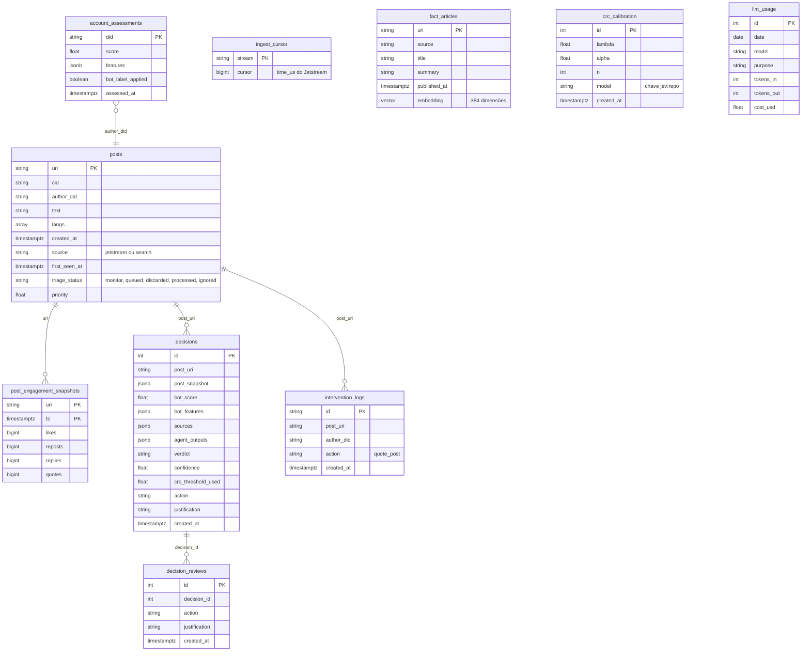
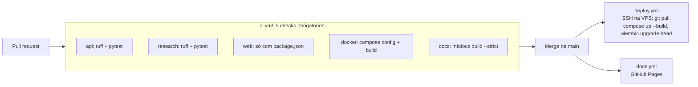

# Dados, Infraestrutura e Deploy

## Modelo de dados

O banco é Postgres 16 com a extensão `pgvector`. O esquema é versionado com **Alembic**
(`api/migrations/`); cada issue cria a própria migration. As tabelas abaixo refletem `app/db/orm/`.



| Tabela | Escrita por | Função |
|---|---|---|
| `posts` | `JetstreamConsumer`, `SearchPoller`, `EngagementRefresher`, worker | Posts coletados e estado de triagem. `processed` e `ignored` são finais e não são sobrescritos pelo refresher |
| `post_engagement_snapshots` | `EngagementRefresher` | Série temporal usada para calcular velocidade de propagação |
| `ingest_cursor` | `JetstreamConsumer` | Cursor para retomar o firehose após reinício (recua 5 s por segurança) |
| `account_assessments` | `BotScoringService`, `AccountLabelService` | Cache do bot score por conta, válido por 24 h, e se a conta já recebeu o rótulo `provavel-bot` |
| `decisions` | `PipelineService` e `InterventionQueue` | Log de decisões (RF13, RNF06): post, bot score, fontes, saídas do verificador, veredito, limiar CRC e ação. O `action` só muda na rodada de intervenção |
| `decision_reviews` | `POST /v1/decisions/{id}/review` | Revisão posterior sem alterar o registro original |
| `intervention_logs` | `InterventionService` | Base das travas anti-loop e dos limites diários |
| `fact_articles` | `FeedIngestor` | Acervo RSS das agências com embedding para busca vetorial |
| `crc_calibration` | `ensure_calibration_seeded`, `research/experiments/calibrate_crc.py` | Limiar CRC por chave de modelo |
| `llm_usage` | `LiteLLMModel` | Controle do orçamento diário de LLM (`DAILY_LLM_BUDGET_USD`) |

## API HTTP

Todas as rotas de negócio ficam sob `/v1` e são finas: a lógica está nos serviços. A documentação
gerada (OpenAPI) está em [`docs/api/openapi.json`](../api/openapi.json) e no guia de uso.

| Método e rota | Função |
|---|---|
| `GET /health` | Liveness: não toca banco, LLM nem Bluesky |
| `GET /v1/decisions` | Lista decisões |
| `GET /v1/decisions/{id}` | Detalha uma decisão |
| `POST /v1/analyze` | Executa o pipeline para um post sob demanda |
| `POST /v1/decisions/{id}/review?review_action=confirmar\|reverter` | Registra revisão; ao reverter uma decisão `INTERVENE`, nega o rótulo Ozone |

## Configuração

Toda a configuração passa por `app/core/config.py` (`Settings`, via variáveis de ambiente ou `api/.env`).
Os grupos principais:

| Grupo | Variáveis (padrão) |
|---|---|
| Bluesky | `BLUESKY_HANDLE`, `BLUESKY_APP_PASSWORD`, `BLUESKY_SESSION_PATH`, contexto do fio (`THREAD_CONTEXT_MAX_POSTS=4`) |
| Verificação | `VERIFICATION_BACKEND` (código: `llm`; operação: `jev`), `JEV_MODEL_REPO`, `JEV_SERVER_URL`, `CRC_ALPHA=0.05`, `JEV_ALLOW_UNCALIBRATED=false` |
| LLM (redação e backend `llm`) | `LLM_MODEL_NAME`, `LLM_API_KEY` / `OPENROUTER_API_KEY`, `DAILY_LLM_BUDGET_USD=1.0` |
| Evidências | `GOOGLE_FACTCHECK_API_KEY`, `SEARXNG_*`, `RSS_CHECKERS_ENABLED`, `RSS_ENABLED_SOURCES`, `RSS_POLL_SECONDS=3600` |
| Triagem | `TRIAGE_THRESHOLD_RELEVANCE`, `TRIAGE_THRESHOLD_BOT`, `TRIAGE_THRESHOLD_FALSEHOOD`, `WORKER_PIPELINE_BATCH_SIZE=5`, `WORKER_TICK_SECONDS=30` |
| Intervenção | `INTERVENTION_DRY_RUN=true`, `INTERVENTION_ROUND_MINUTES=15`, silêncio 0h–7h (Brasília), `DAILY_MAX_INTERVENTIONS`, `DAILY_WRITE_POINTS_BUDGET`, `PIPELINE_MIN_FOLLOWERS_FOR_INTERVENTION=1000` |
| Rótulo | `PIPELINE_LABELER_ENABLED=false`, `OZONE_LABELER_*`, `ACCOUNT_LABEL_THRESHOLD=0.9`, `ACCOUNT_LABEL_HYSTERESIS=0.1`, `ACCOUNT_LABEL_MIN_POSTS=20` |
| Feature flags | `PIPELINE_BOT_SCORING_ENABLED`, `PIPELINE_VERIFICATION_ENABLED`, `PIPELINE_INTERVENTION_ENABLED` |

Segredos (`api/.env`, App Passwords, chaves de API) **nunca** vão para o repositório.

## Ambientes

=== "Desenvolvimento"

    `docker-compose.yml` na raiz sobe `db`, `searxng`, `jev`, `api` (com `--reload`) e `worker`,
    montando `api/app` como volume. O `api` espera `db`, `jev` e `searxng` saudáveis.

    ```bash
    make setup   # api/.env + uv sync
    make up      # sobe a pilha
    make test    # pytest
    make lint    # ruff check + format --check
    ```

=== "Produção"

    `deploy/docker-compose.prod.yml` adiciona o labeler e a borda HTTPS:

    ```mermaid
    flowchart LR
        N((Internet)) --> CF[Cloudflare DNS]
        CF --> CD[Caddy<br/>HTTPS automático]
        CD --> API[api]
        CD --> OZ[ozone]
        OZ --> OZD[ozone-daemon]
        OZ --> OZDB[(ozone-db<br/>Postgres 14)]
        API --> DB[(db<br/>pgvector)]
        WK[worker] --> DB
        WK --> JEV[jev]
        API --> JEV
        WK --> SX[searxng]
    ```

    Recomendação de VPS: 4 vCPU, 8 GB de RAM e 40 GB de SSD para a pilha essencial; 8 vCPU, 16 GB
    e 60–80 GB com o Ozone. O procedimento do labeler está no `OZONE_RUNBOOK.md` e a decisão em
    [ADR 0011](../adr/0011-deploy-vps-caddy-cloudflare.md).

### Volumes

| Volume | Conteúdo |
|---|---|
| `contraria-db-data` | Dados do Postgres |
| `contraria-model-cache` | Pesos do Hugging Face (o modelo é pré-baixado no build da imagem) |
| `contraria-app-data` | Sessão persistida do Bluesky (`/srv/data/bluesky.session`) |

## Integração e entrega contínuas



A `main` é protegida: só recebe código por PR com os checks verdes, inclusive para administradores.
O `docs.yml` publica este site com `mkdocs build --strict`, então links quebrados falham o build.

## Stack tecnológica

| Camada | Tecnologia |
|---|---|
| Linguagem e API | Python 3.12, FastAPI, Uvicorn, Pydantic v2, `pydantic-settings` |
| Gerenciamento de dependências | `uv` (lockfile), `ruff` (lint e formatação), `pytest` e `pytest-asyncio` |
| Banco | Postgres 16, `pgvector`, SQLAlchemy 2, Alembic, `psycopg` 3 |
| Bluesky | SDK `atproto`, `websockets` (Jetstream), `curl-cffi` |
| Classificação local | PyTorch + Transformers (mDeBERTa-v3 NLI), `scikit-learn` (pré-filtro TF-IDF) |
| Embeddings | `sentence-transformers` (`paraphrase-multilingual-MiniLM-L12-v2`, 384 d) |
| LLM | LiteLLM (OpenRouter e outros provedores) |
| Evidências | `httpx`, `feedparser`, `ddgs`, SearXNG, `trafilatura`, `beautifulsoup4`, `lxml` |
| Infra | Docker Compose, Caddy, Cloudflare, Ozone, GitHub Actions |
| Documentação | MkDocs Material, Mermaid |
