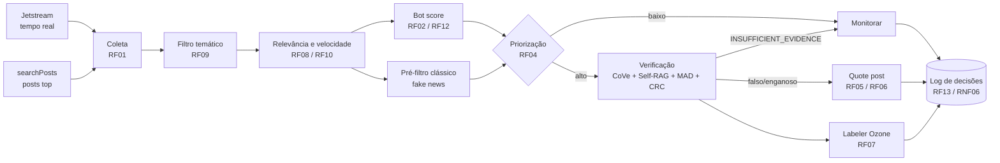

# Arquitetura

## Pipeline



## Organização do código

```
ContrarIA/
├── api/                 # FastAPI + worker (mesma imagem)
│   └── app/
│       ├── main.py      # HTTP: /health, decisões, verificação sob demanda
│       ├── worker.py    # loop do pipeline
│       ├── core/        # config, logging
│       ├── routers/v1/  # camada HTTP fina
│       ├── schemas/     # contratos Pydantic
│       ├── domain/      # entidades e regras puras (contrato entre duplas)
│       ├── services/    # casos de uso: coleta, triagem, verificação, intervenção
│       ├── models/      # portas + implementações de LLM e classificadores
│       ├── clients/     # adapters de I/O: Bluesky, Ozone, fontes de evidência
│       ├── repositories/
│       ├── db/          # ORM (SQLAlchemy) + migrations (Alembic)
│       └── prompts/     # prompts versionados (promotor_v1.txt, ...)
├── research/            # datasets, treino do pré-filtro, benchmarks
├── deploy/              # Caddy + compose de produção + Ozone
├── web/                 # painel React (pós-MVP)
└── docs/                # este site (MkDocs)
```

Padrão herdado do [Medscriba](https://github.com/Medscriba/medscriba): `domain/` não conhece framework; `models/` e `clients/evidence/` expõem **portas abstratas**, então cada dupla desenvolve contra a interface com fakes nos testes, e as issues de integração só ligam as pontas.
