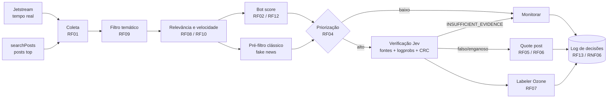

# Arquitetura

## Pipeline


```mermaid
flowchart LR
    J[Jetstream<br/>tempo real] --> C[Coleta<br/>RF01]
    S[searchPosts<br/>posts top] --> C
    C --> T[Filtro temático<br/>RF09]
    T --> R[Relevância e velocidade<br/>RF08 / RF10]
    R --> B[Bot score<br/>RF02 / RF12]
    R --> F[Pré-filtro clássico<br/>fake news]
    B --> P{Priorização<br/>RF04}
    F --> P
    P -- baixo --> M[Monitorar]
    P -- alto --> V[Verificação Jev<br/>fontes + logprobs + CRC]
    V -- INSUFFICIENT_EVIDENCE --> M
    V -- falso/enganoso --> I[Quote post<br/>RF05 / RF06]
    V --> L[Labeler Ozone<br/>RF07]
    I --> D[(Log de decisões<br/>RF13 / RNF06)]
    L --> D
    M --> D
```

## Organização do código

```
ContrarIA/
├── api/                 # FastAPI, worker e serviço Jev (imagens Docker)
│   └── app/
│       ├── main.py      # HTTP: /health, decisões, verificação sob demanda
│       ├── worker.py    # loop do pipeline
│       ├── jev_server.py # classificador local compartilhado, porta 8100
│       ├── core/        # config, logging
│       ├── routers/v1/  # camada HTTP fina
│       ├── schemas/     # contratos Pydantic
│       ├── domain/      # entidades e regras puras (contrato entre duplas)
│       ├── services/    # casos de uso: coleta, triagem, verificação, intervenção
│       ├── models/      # portas + implementações de LLM e classificadores
│       ├── clients/     # adapters de I/O: Bluesky, Ozone, fontes de evidência
│       ├── repositories/
│       ├── db/          # ORM (SQLAlchemy) + migrations (Alembic)
│       └── prompts/     # prompts versionados (promotor_v1.txt, ...)
├── research/            # datasets, treino do pré-filtro, benchmarks
├── deploy/              # Caddy + compose de produção + Ozone
├── web/                 # painel React (pós-MVP)
└── docs/                # este site (MkDocs)
```

Padrão herdado do [Medscriba](https://github.com/Medscriba/medscriba): `domain/` não conhece framework; `models/` e `clients/evidence/` expõem **portas abstratas**, então cada dupla desenvolve contra a interface com fakes nos testes, e as issues de integração só ligam as pontas.

## Backend de verificação em produção

O Compose sobe cinco serviços essenciais: `db`, `jev`, `searxng`, `api` e `worker`. O `jev` carrega
uma única cópia local do modelo discriminativo mDeBERTa-v3 NLI (`MoritzLaurer/mDeBERTa-v3-base-xnli-multilingual-nli-2mil7`) via PyTorch/Transformers; `api` e `worker` o
acessam por HTTP interno em `JEV_SERVER_URL`. O `searxng` provê busca web agregada
local sem dependência de quotas de terceiros. Essa separação evita que cada
processo duplique modelos em memória.

O Jev opera como Cross-Encoder NLI sem geração livre de texto nem vulnerabilidade a JSON quebrado. Para cada alegação factual, ele avalia a relação de implicação lógica direta com as fontes (com suporte nativo à classe neutra), filtra a relevância semântica e gera o veredito entre confirmado (`true`), desmentido (`false`) ou enganoso (`misleading`). As fontes
continuam sendo Google Fact Check, Wikipédia, busca web (SearXNG/Tavily/DDG) e RSS configurados. O
CRC é aplicado à confiança final usando uma calibração exclusiva da chave
`jev:<repositório>`; ausência de calibração resulta em abstenção.

O backend antigo, selecionável por `VERIFICATION_BACKEND=llm`, mantém
CoVe/Self-RAG/debate para experimentos e compatibilidade. O LLM também segue
necessário no caminho Jev para compor a mensagem socrática somente depois de a
decisão já ser elegível para intervenção.

**Referências:** [pipeline detalhado](pipeline.md),
[calibração do Jev](../calibracao-jev.md),
[ADR 0013](../adr/0013-backend-local-jev.md) e
[ADR 0014](../adr/0014-busca-web-searxng-trafilatura.md).
