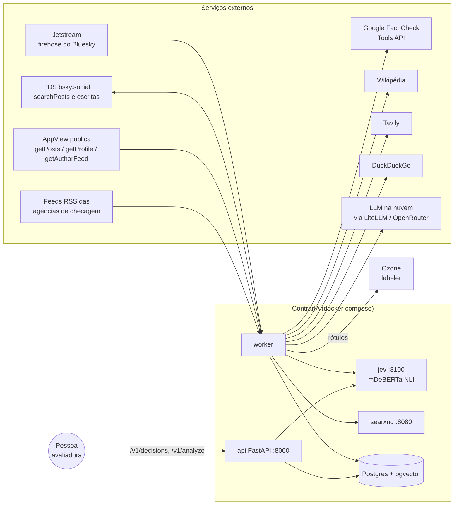
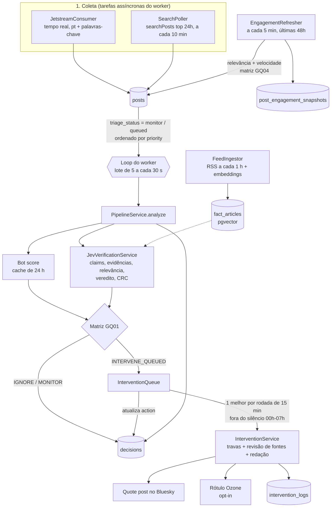
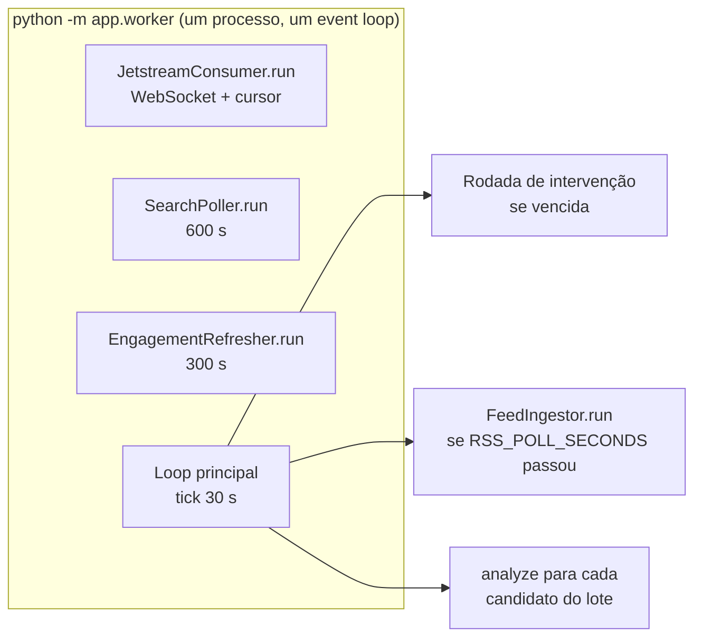
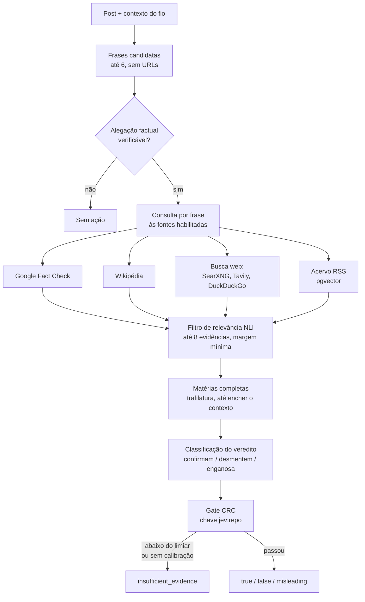

# Arquitetura

Esta página descreve o ContrarIA **como ele está implementado hoje**. Os detalhes de cada etapa
estão em [O Pipeline do Agente](pipeline.md); o esquema do banco, a configuração e a operação estão
em [Dados, Infraestrutura e Deploy](dados-e-infra.md).

## Contexto do sistema

O ContrarIA lê posts públicos do Bluesky, consulta fontes de evidência na web e, quando há fundamento,
publica um *quote post* na conta do bot e (opcionalmente) emite um rótulo pelo labeler Ozone.


```mermaid
flowchart LR
    subgraph Externo["Serviços externos"]
        JS[Jetstream<br/>firehose do Bluesky]
        PDS[PDS bsky.social<br/>searchPosts e escritas]
        APP[AppView pública<br/>getPosts / getProfile / getAuthorFeed]
        FC[Google Fact Check<br/>Tools API]
        WP[Wikipédia]
        TV[Tavily]
        DDG[DuckDuckGo]
        RSSX[Feeds RSS das<br/>agências de checagem]
        OR[LLM na nuvem<br/>via LiteLLM / OpenRouter]
    end

    subgraph ContrarIA["ContrarIA (docker compose)"]
        W[worker]
        A[api FastAPI :8000]
        J[jev :8100<br/>mDeBERTa NLI]
        SX[searxng :8080]
        DB[(Postgres + pgvector)]
    end

    OZ[Ozone<br/>labeler]
    U((Pessoa<br/>avaliadora))

    JS --> W
    PDS <--> W
    APP --> W
    W --> J
    W --> SX
    W --> DB
    W --> FC & WP & TV & DDG
    RSSX --> W
    W --> OR
    W -- rótulos --> OZ
    U -- /v1/decisions, /v1/analyze --> A
    A --> DB
    A --> J
```

| Serviço | Papel | Porta |
|---|---|---|
| `worker` | Processo contínuo: coleta, atualização de engajamento, ingestão RSS, análise e rodadas de intervenção | – |
| `api` | HTTP fino: saúde, consulta e revisão de decisões, análise sob demanda | 8000 |
| `jev` | Única cópia em memória do classificador NLI, compartilhada por `api`, `worker` e scripts | 8100 |
| `searxng` | Metabuscador self-hosted usado como fonte primária de busca web | 8080 |
| `db` | Postgres 16 com extensão `pgvector` | 5432 |

`api` e `worker` usam a **mesma imagem** (`api/Dockerfile`); o `jev` também, com outro comando.

## Fluxo de ponta a ponta


```mermaid
flowchart TD
    subgraph Coleta["1. Coleta (tarefas assíncronas do worker)"]
        J1[JetstreamConsumer<br/>tempo real, pt + palavras-chave]
        J2[SearchPoller<br/>searchPosts top 24h, a cada 10 min]
    end
    J1 --> POSTS[(posts)]
    J2 --> POSTS

    ER[EngagementRefresher<br/>a cada 5 min, últimas 48h] --> SNAP[(post_engagement_snapshots)]
    ER -- relevância + velocidade<br/>matriz GQ04 --> POSTS

    POSTS -- triage_status = monitor / queued<br/>ordenado por priority --> LOOP{{Loop do worker<br/>lote de 5 a cada 30 s}}
    RSSJ[FeedIngestor<br/>RSS a cada 1 h + embeddings] --> FA[(fact_articles<br/>pgvector)]

    LOOP --> PIPE[PipelineService.analyze]
    PIPE --> BOT[Bot score<br/>cache de 24 h]
    PIPE --> VER[JevVerificationService<br/>claims, evidências, relevância,<br/>veredito, CRC]
    FA -.-> VER
    BOT --> GQ01{Matriz GQ01}
    VER --> GQ01
    GQ01 -- IGNORE / MONITOR --> LOG[(decisions)]
    GQ01 -- INTERVENE_QUEUED --> Q[InterventionQueue]
    Q -- 1 melhor por rodada de 15 min<br/>fora do silêncio 00h-07h --> INT[InterventionService<br/>travas + revisão de fontes + redação]
    INT --> QP[Quote post no Bluesky]
    INT --> LAB[Rótulo Ozone<br/>opt-in]
    INT --> IL[(intervention_logs)]
    Q -- atualiza action --> LOG
    PIPE --> LOG
```

Pontos que o desenho deixa explícitos:

- **A coleta não analisa.** Ela só grava posts. Quem escolhe o que será analisado é a triagem
  (relevância, velocidade, matriz GQ04), executada pelo `EngagementRefresher`.
- **A verificação cara roda em lote pequeno** (`WORKER_PIPELINE_BATCH_SIZE`, padrão 5) para proteger
  orçamento e CPU.
- **Intervir é sempre assíncrono e raro.** O pipeline só enfileira o candidato; a fila publica no
  máximo um por rodada e nenhum no horário de silêncio.
- **Toda análise termina em `decisions`**, inclusive abstenção e monitoramento.

## Tarefas concorrentes do worker

`app/worker.py` cria três tarefas `asyncio` em segundo plano e roda o loop principal na tarefa corrente.


```mermaid
flowchart LR
    subgraph Worker["python -m app.worker (um processo, um event loop)"]
        T1[JetstreamConsumer.run<br/>WebSocket + cursor]
        T2[SearchPoller.run<br/>600 s]
        T3[EngagementRefresher.run<br/>300 s]
        L[Loop principal<br/>tick 30 s]
    end
    L --> R1[Rodada de intervenção<br/>se vencida]
    L --> R2[FeedIngestor.run<br/>se RSS_POLL_SECONDS passou]
    L --> R3[analyze para cada<br/>candidato do lote]
```

A rodada de intervenção é verificada **antes e depois de cada análise** (`run_due_intervention_round`),
para que um lote lento não atrase a publicação já vencida. Ao iniciar, o worker fecha como `MONITOR`
qualquer decisão presa em `INTERVENE_QUEUED` (a fila vive só na memória do processo) e garante que a
calibração CRC do Jev esteja gravada no banco.

## Verificação com o Jev

O backend de verificação é escolhido por `VERIFICATION_BACKEND` em `build_verification_service`.

| Valor | Serviço | Uso |
|---|---|---|
| `jev` | `JevVerificationService` | Caminho descrito no CLAUDE.md, no ADR 0013 e no deploy de produção |
| `llm` | `VerificationService` (CoVe + Self-RAG + debate + CRC) | Alternativa para experimentos; é o **valor padrão do código** em `Settings` |

!!! warning "Padrão do código ≠ padrão de operação"
    `Settings.verification_backend` vem com `"llm"`. O ambiente de produção e a documentação operam com
    `VERIFICATION_BACKEND=jev` definido no `.env`. Sem essa variável, o worker sobe com o backend de LLM.


```mermaid
flowchart TD
    P[Post + contexto do fio] --> S[Frases candidatas<br/>até 6, sem URLs]
    S --> K{Alegação factual<br/>verificável?}
    K -- não --> X[Sem ação]
    K -- sim --> Q[Consulta por frase<br/>às fontes habilitadas]
    Q --> E1[Google Fact Check]
    Q --> E2[Wikipédia]
    Q --> E3[Busca web:<br/>SearXNG, Tavily, DuckDuckGo]
    Q --> E4[Acervo RSS<br/>pgvector]
    E1 & E2 & E3 & E4 --> F[Filtro de relevância NLI<br/>até 8 evidências, margem mínima]
    F --> M[Matérias completas<br/>trafilatura, até encher o contexto]
    M --> C[Classificação do veredito<br/>confirmam / desmentem / enganosa]
    C --> G[Gate CRC<br/>chave jev:repo]
    G -- abaixo do limiar<br/>ou sem calibração --> I[insufficient_evidence]
    G -- passou --> V[true / false / misleading]
```

O Jev é um *cross-encoder* NLI (`MoritzLaurer/mDeBERTa-v3-base-xnli-multilingual-nli-2mil7`) servido
por `app/jev_server.py` com três rotas: `/classify` (escolha entre opções por probabilidade),
`/count_tokens` e `/nli` (premissa × hipótese). Não gera texto livre, então não existe "JSON quebrado".
O LLM na nuvem só é chamado **depois**, para redigir a mensagem do quote post. Detalhes em
[ADR 0013](../adr/0013-backend-local-jev.md) e [Calibração do Jev](../calibracao-jev.md).

## Fontes de evidência

Cada fonte implementa a porta `EvidenceSource` e se registra por nome em `EVIDENCE_SOURCES`.

| Nome | Implementação | Observações |
|---|---|---|
| `google_factcheck` | `GoogleFactCheckClient` | 240 req/min por padrão (cota real: 300/min), `RateLimiter` de janela deslizante, pausa em 429; `rating` vem cru |
| `wikipedia` | `WikipediaClient` | `User-Agent` identificável; summaries em paralelo (máx. 5) |
| `web_search` | `WebSearchSource` | Encadeia SearXNG → Tavily → DuckDuckGo; filtra redes sociais e UGC; cache TTL |
| `searxng` / `tavily` / `duckduckgo` | `CachedSource` | Cada motor também pode ser usado isoladamente; o Tavily é desligado pelo resto da sessão ao esgotar a quota |
| `rss_checkers` | `RSSCheckersSource` | Busca vetorial em `fact_articles` (MiniLM multilíngue, 384 dimensões), com peso de recência |

Falhas de rede, cota ou chave viram log e lista vazia, nunca exceção. Resultados com falha não entram no cache.
Ver [ADR 0005](../adr/0005-multiplas-fontes-evidencia.md) e [ADR 0014](../adr/0014-busca-web-searxng-trafilatura.md).

## Intervenção e travas

O `InterventionService` só publica se **todas** as travas passarem:

1. Veredito `false` ou `misleading` com confiança ≥ 0,8.
2. O post não é do próprio bot e o autor não tem rótulo `bot`.
3. Um quote por post e um por autor a cada 24 h.
4. Teto diário de quotes (`DAILY_MAX_INTERVENTIONS`) e orçamento diário de pontos de escrita.
5. O post não desabilita citações (`postgate`).
6. O texto passa por revisão das fontes e é limitado a 300 graphemes, em fio quando necessário.

Além disso, `INTERVENTION_DRY_RUN` (padrão `true`) impede publicação real e `PIPELINE_LABELER_ENABLED`
(padrão `false`) mantém o rótulo Ozone como ação opt-in. Ver [ADR 0002](../adr/0002-quote-post.md)
e [ADR 0003](../adr/0003-labeler-ozone.md).

## Organização do código

O padrão é **Portas e Adaptadores**: `routers → services → domain`. Serviços dependem de portas
abstratas (`LLMPort`, `EvidenceSource`, `TextClassifierPort`/`JevClassifierPort`) e os testes usam *fakes*.

```
ContrarIA/
├── api/                      # FastAPI + worker + serviço Jev (mesma imagem, Python 3.12, uv)
│   ├── app/
│   │   ├── main.py           # HTTP: /health + routers/v1
│   │   ├── worker.py         # processo contínuo: tarefas + loop do pipeline
│   │   ├── jev_server.py     # classificador NLI compartilhado (:8100)
│   │   ├── core/             # config (Settings) e logging
│   │   ├── routers/v1/       # decisions: listar, obter, analisar, revisar
│   │   ├── schemas/          # contratos Pydantic de entrada e saída
│   │   ├── domain/           # entidades, priorização GQ04, features de bot, tópicos e pesos em YAML
│   │   ├── services/         # pipeline, jev_verification, verification (llm), self_rag, debate,
│   │   │                     # crc, crc_seed, bot_scoring, intervention, intervention_queue
│   │   ├── models/           # portas + LiteLLMModel, JevClassifier, FakeNewsTFIDFClassifier
│   │   ├── clients/          # BlueskyClient, OzoneClient, articles, evidence/*
│   │   ├── jobs/             # collector, refresh_engagement, ingest_fact_articles
│   │   ├── repositories/     # acesso a dados: posts, fact_articles, interventions, crc_calibration
│   │   ├── db/               # base + ORM SQLAlchemy
│   │   ├── prompts/          # prompts versionados (nome_vN.txt)
│   │   └── scripts/          # bsky_smoke, bsky_bot_setup, replay_decisions, benchmark_nli
│   ├── migrations/           # Alembic
│   └── tests/
├── research/                 # datasets, treino do pré-filtro, benchmark de veredito, calibração CRC
├── searxng/settings.yml      # configuração do metabuscador
├── deploy/                   # compose de produção, Caddyfile, runbook do Ozone
├── docs/                     # este site (MkDocs Material)
└── web/                      # painel React (pós-MVP, ainda sem código)
```

## Pontos de atenção conhecidos

- **Pré-filtro clássico (TF-IDF) não está ligado ao pipeline.** `FakeNewsTFIDFClassifier` existe em
  `app/models/classifiers/` e foi avaliado em `research/`, mas nem o worker nem o `PipelineService`
  o chamam. A priorização usa relevância, velocidade e bot score. Ver [ADR 0008](../adr/0008-pre-filtro-classico.md).
- **`TriagePipeline` (`jobs/triage_pipeline.py`) é legado.** O worker usa `PipelineService` com a matriz
  GQ01; a matriz GQ04 ainda decide a fila de candidatos, mas dentro do `EngagementRefresher`.
- **A fila de intervenção é volátil.** Um reinício do worker descarta os candidatos pendentes (registrados como `MONITOR`).
- **`api` e `worker` não compartilham limitador nem cache** (memória por processo); a margem de 20% na cota do Google cobre os dois.
- **O arquivo de sessão do Bluesky é compartilhado**, mas cada processo guarda a sessão em memória; prefira um só fazendo chamadas autenticadas.

**Referências:** [pipeline detalhado](pipeline.md), [dados e infraestrutura](dados-e-infra.md),
[calibração do Jev](../calibracao-jev.md), [ADRs](../adr/index.md).
