# Mapa do sistema

Esta página é o **mapa de referência** do ContrarIA: mostra, em camadas (do contexto ao detalhe), de onde vêm os dados,
por onde passam e para onde vão. A estrutura segue o [modelo C4](https://c4model.com/) (contexto → contêineres →
componentes) com diagramas de sequência e de estados para o comportamento. Cada diagrama é seguido de uma tabela que
nomeia o código e a configuração de cada bloco.

!!! info "Como ler os diagramas"
    As cores têm o mesmo significado em todas as páginas desta seção.

    | Cor | Significado |
    |---|---|
    | :material-circle:{ style="color:#475569" } cinza | Serviço externo (Bluesky, fontes de checagem, LLM, GitHub, Cloudflare) |
    | :material-circle:{ style="color:#0e7490" } azul-petróleo | Entrada de dados (coleta, ingestão) |
    | :material-circle:{ style="color:#2563eb" } azul | Processamento do agente (triagem, verificação, decisão) |
    | :material-circle:{ style="color:#7c3aed" } roxo | Armazenamento (tabelas do Postgres) |
    | :material-circle:{ style="color:#d97706" } laranja | Trava, filtro ou contrapressão |
    | :material-circle:{ style="color:#16a34a" } verde | Saída pública (quote post, rótulo) |
    | :material-circle:{ style="color:#db2777" } rosa | Pessoa (usuário, operador, revisor) |

Para o fluxo lógico da análise veja [O Pipeline do Agente](pipeline.md); para o esquema do banco e a configuração,
[Dados, Infraestrutura e Deploy](dados-e-infra.md); para a operação diária, [Operação na VM](operacao-vm.md).

---

## 1. Contexto: o sistema e quem fala com ele

O ContrarIA tem **seis fluxos de entrada de dados** (detalhados na [seção 3](#3-pipelines-de-entrada); todos leem
conteúdo público, nenhum é caixa de mensagens privada) e **duas saídas públicas** (um quote post e um rótulo). O Bluesky é, ao mesmo tempo, a fonte e o destino.

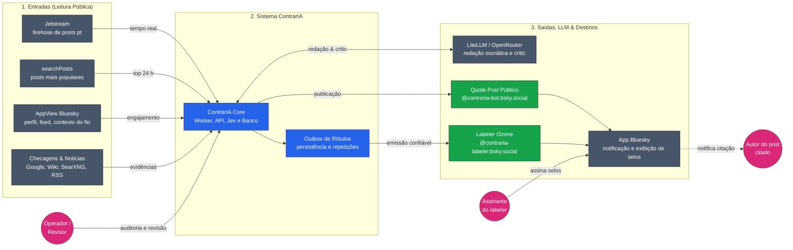

| Ator ou sistema | Papel | Como o ContrarIA interage |
|---|---|---|
| Jetstream | Firehose público de commits do Bluesky | WebSocket de leitura; só a coleção `app.bsky.feed.post` |
| `searchPosts` | Busca do AppView | Uma consulta por palavra-chave, ordenada por `top` |
| AppView pública | Hidrata posts, perfis e fios | `getPosts`, `getProfile`, `getAuthorFeed`, `getPostThread` |
| PDS do bot | Onde o quote post é gravado | Escrita autenticada como `contraria-bot.bsky.social` |
| Labeler Ozone | Emite rótulos assinados | Conta separada, `contraria-labeler.bsky.social` |
| Fontes de evidência | Dão base à verificação | Consultadas por frase, nunca por post inteiro |
| LLM na nuvem | Só **redige** o texto do quote e audita sua coerência | Nunca decide o veredito (quem decide é o Jev local) |
| GitHub | Código, CI e deploy | OIDC, sem segredo guardado ([ADR 0020](../adr/0020-acesso-vm-tunel-cloudflare.md)) |

---

## 2. Contêineres: o que roda e como a rede chega

Tudo roda em **uma VM** com Docker Compose. A VM não aceita conexões de entrada: o tráfego público chega por um túnel
da Cloudflare publicado por SSH reverso ([ADR 0020](../adr/0020-acesso-vm-tunel-cloudflare.md)).

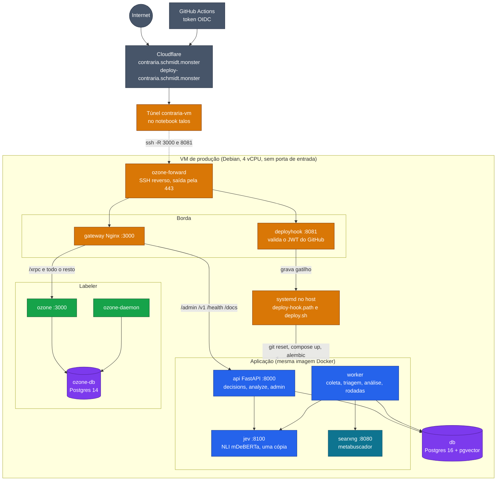

| Contêiner | Responsabilidade | Detalhe |
|---|---|---|
| `worker` | Único processo contínuo: coleta, atualização de engajamento, ingestão RSS, análise, rodadas de intervenção e repetição de rótulos | `python -m app.worker`, um *event loop* |
| `api` | HTTP fino: saúde, decisões, análise sob demanda, API administrativa somente-leitura | Atrás do `gateway` |
| `jev` | Classificador NLI compartilhado | Serializa as inferências; é o gargalo de CPU |
| `searxng` | Busca web self-hosted | Fonte primária da busca web |
| `db` | Estado da aplicação | `posts`, `decisions`, `label_events`, `system_logs`... |
| `gateway` | Roteia `/admin`, `/v1`, `/health` para a API e o resto para o Ozone | Nginx |
| `ozone`, `ozone-daemon`, `ozone-db` | Labeler da conta `contraria-labeler` | Anunciado no DID como `#atproto_labeler` |
| `deployhook` | Recebe o pedido de deploy autenticado por OIDC | Não executa nada: só grava o gatilho |

!!! warning "Dependência do túnel"
    Com o `talos` desligado ou sem rede, o **Ozone e o deploy ficam inacessíveis**, embora a coleta e a análise
    continuem. Foi o que causou rótulos perdidos antes da [outbox](#7-pipeline-de-saida-quote-post-e-rotulos): hoje o
    pedido de rótulo é guardado e repetido, e o `/admin/overview` mostra se o túnel responde.

---

## 3. Pipelines de entrada

O sistema tem **seis fluxos de entrada**. Três trazem **posts** (o que será analisado); os outros três trazem
**contexto** (o que sustenta a análise). Só o primeiro grupo cria linhas em `posts`.

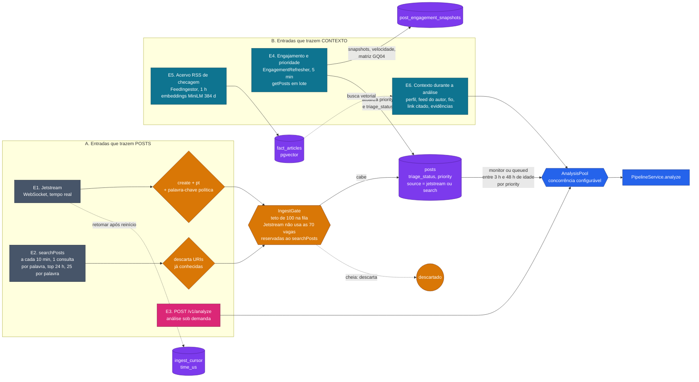

| # | Entrada | Código | Cadência | Filtro ou limite | Destino |
|---|---|---|---|---|---|
| E1 | Jetstream | `JetstreamConsumer` em `jobs/collector.py` | Contínua | Só `create` de `app.bsky.feed.post`, idioma `pt*`, texto com palavra-chave de `domain/topics/politica.yaml` | `posts` (`source=jetstream`) |
| E2 | `searchPosts` | `SearchPoller` | 600 s | Uma consulta por palavra-chave (a API não tem `OR`), `sort=top`, últimas 24 h, 25 por palavra; só URIs novas | `posts` (`source=search`), com `priority` pela popularidade |
| E3 | Análise sob demanda | `POST /v1/analyze` em `routers/v1/decisions.py` | Sob demanda | Não passa pela fila de análise, pelo aging nem pela fila de intervenção: se o veredito pedir, a intervenção sai na hora | `decisions` |
| E4 | Engajamento | `EngagementRefresher` em `jobs/refresh_engagement.py` | 300 s | Posts das últimas 48 h, até 1.000 por ciclo; poda a fila a `WORKER_QUEUE_MAX_PENDING` | `post_engagement_snapshots`, `posts.priority`, `posts.triage_status` |
| E5 | Feeds RSS | `FeedIngestor` em `jobs/ingest_fact_articles.py` | 3.600 s | Só agências em `RSS_ENABLED_SOURCES` | `fact_articles` (com embedding) |
| E6 | Contexto da análise | `BlueskyClient`, `ArticleClient`, `evidence/*` | A cada análise | Resiliência por provedor ([ADR 0021](../adr/0021-resiliencia-das-fontes-de-evidencia.md)) | Memória do worker e `decisions.sources` |

**Contrapressão.** A coleta nunca analisa: só grava. O `IngestGate` mantém a fila abaixo do teto
(`WORKER_QUEUE_MAX_PENDING`); cheia, os posts novos do Jetstream são descartados e o `searchPosts` ainda consegue
entrar, porque `WORKER_QUEUE_SEARCH_RESERVE` reserva vagas para ele ([ADR 0018](../adr/0018-concorrencia-e-contrapressao-do-worker.md)).

### 3.1 O que o ContrarIA faz com reposts

Os **reposts não são posts novos** e não entram na fila. Eles aparecem em três lugares, cada um com um papel diferente:

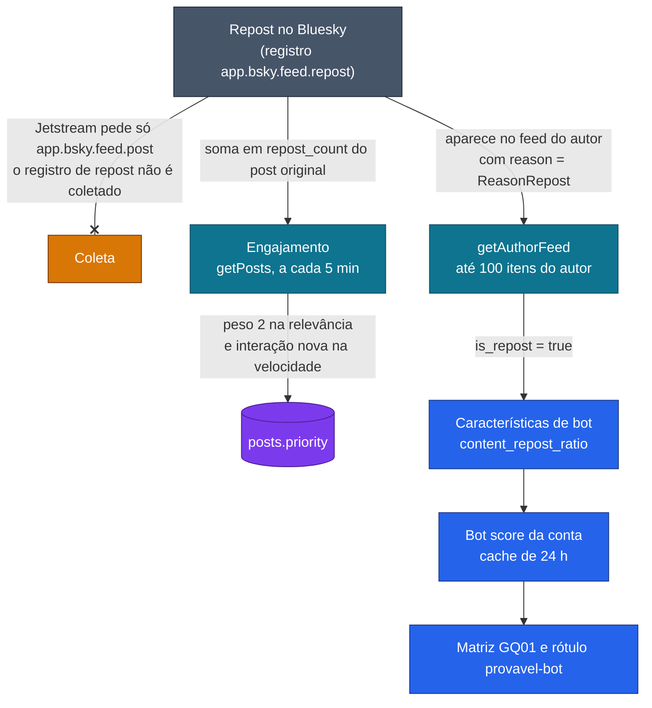

| Onde o repost aparece | Efeito |
|---|---|
| Contagem de reposts do post original | Aumenta a **relevância** (peso 2, o mesmo de resposta) e conta como interação nova na **velocidade de propagação**, o que sobe a prioridade na fila |
| Feed do autor (`getAuthorFeed`) | Cada item recebe `is_repost`. A fração de reposts do autor vira a característica `content_repost_ratio` do **bot score** |
| Jetstream | **Ignorado**: o consumidor pede só `wantedCollections=app.bsky.feed.post` |

!!! note "Por que não coletar reposts"
    Um repost não traz texto próprio. A afirmação a verificar está no post original, que entra por E1 ou E2. Coletar
    o registro de repost só duplicaria o trabalho sem acrescentar uma alegação nova.

---

## 4. Ciclo de vida de um post

Duas colunas guardam o estado: `posts.triage_status` (a fila) e `decisions.action` (o resultado da análise). O diagrama
mostra como um post passa de uma para a outra.

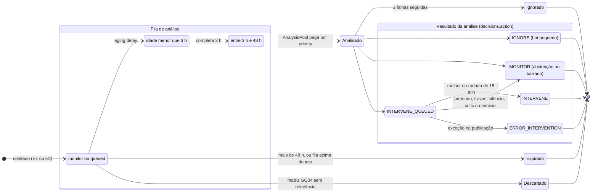

| Estado | Coluna | Quem define |
|---|---|---|
| `monitor`, `queued` | `triage_status` | Coleta e `EngagementRefresher` (matriz GQ04) |
| `processed`, `ignored`, `expired`, `discarded` | `triage_status` | Pool de análise, repositório e refresher. São **finais** |
| `IGNORE`, `MONITOR`, `INTERVENE_QUEUED` | `decisions.action` | `PipelineService` (matriz GQ01) |
| `INTERVENE`, `ERROR_INTERVENTION` | `decisions.action` | `InterventionQueue` ao fechar a rodada |

**Janela de maturação (aging).** Um post só pode ser analisado quando tem entre `POST_MIN_AGE_HOURS` (3 h) e
`POST_MAX_AGE_HOURS` (48 h). As primeiras horas dão tempo para a notícia ser publicada e indexada por buscadores e
agências de checagem; o limite superior evita analisar o que já esfriou. Posts acima de 48 h viram `expired` no
início do worker e a cada rodada de 15 min ([ADR 0022](../adr/0022-janela-de-maturacao-e-critic-semantico.md)).

---

## 5. Análise: o que acontece dentro do `PipelineService`

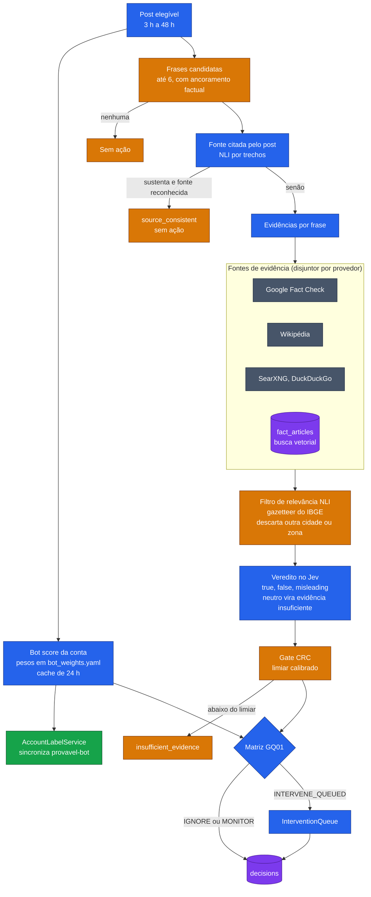

Esta é a visão de blocos; as regras de cada etapa estão em [O Pipeline do Agente](pipeline.md). O que importa para o
mapa: **tudo termina em `decisions`**, e só `INTERVENE_QUEUED` segue para a saída.

---

## 6. Rodada de intervenção

A fila vive em memória e publica **no máximo um candidato por rodada** (`INTERVENTION_ROUND_MINUTES`, 15 min), nunca
entre 0 h e 7 h (Brasília).

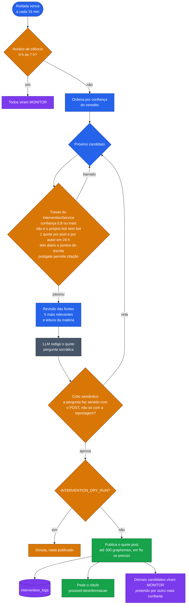

O **critic semântico** é o segundo passo de defesa contra alucinação: depois de redigido, o texto é auditado por um
prompt próprio (`semantic_critic_v1.txt`) que veta qualquer quote que atribua ao autor pessoas, declarações, leis ou
dados que **não estão no post**. A reportagem é só fonte de evidência: o destinatário da pergunta é sempre o post
([ADR 0022](../adr/0022-janela-de-maturacao-e-critic-semantico.md)).

---

## 7. Pipeline de saída: quote post e rótulos

Há duas saídas públicas, com **contas diferentes**: o quote sai de `contraria-bot`, o rótulo sai de
`contraria-labeler`. O rótulo passa pela **outbox** ([ADR 0023](../adr/0023-outbox-de-rotulos-do-ozone.md)), que o
registra e o repete se o Ozone estiver inacessível.

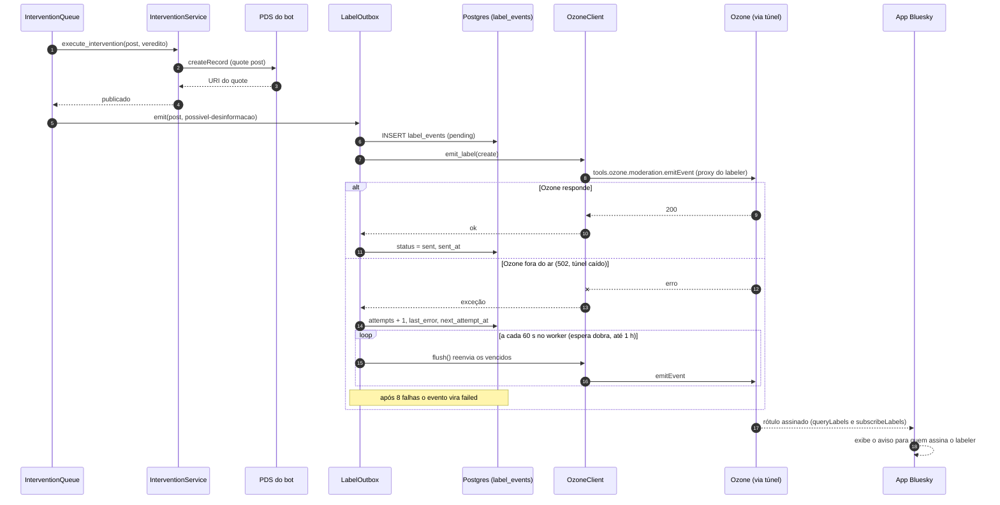

| Passo | Componente | Observação |
|---|---|---|
| Publicar | `InterventionService` + `BlueskyClient.quote_post` | `intervention_logs` alimenta as travas anti-loop e os limites diários |
| Registrar | `LabelOutbox.emit` ([label_outbox.py](https://github.com/moonshinerd/ContrarIA/blob/main/api/app/services/label_outbox.py)) | Pedido pendente igual é reaproveitado, sem duplicar |
| Emitir | `OzoneClient.emit_label` | Autentica como a conta do labeler, nunca como a do bot |
| Repetir | `run_due_label_flush` no laço do `worker` | `LABEL_RETRY_INTERVAL_SECONDS`, `LABEL_RETRY_MAX_ATTEMPTS` |
| Auditar | `/admin/overview` e `label_events` | Contagem por estado, último erro e health do Ozone |

---

## 8. Pipeline do Ozone: rótulos de post e de conta

Todos os rótulos saem pelo mesmo cliente, mas nascem de **três gatilhos** diferentes. A assinatura e a exibição ficam
com o app do Bluesky de cada pessoa (*opt-in*).

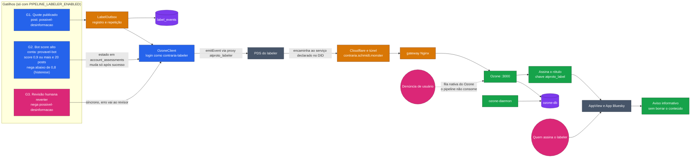

| Rótulo | Alvo | Gatilho | Reversão |
|---|---|---|---|
| `possivel-desinformacao` | Post | Depois de um quote publicado e fora do *dry-run* | Revisão `reverter` nega o rótulo (`negate`), sem apagar o histórico |
| `provavel-bot` | Conta | A cada análise: score ≥ 0,9 e ≥ 20 posts | Nega quando o score cai abaixo de `limiar − histerese` |
| `evidencia-insuficiente` | Post | Declarado no labeler; usado só em testes de emissão | – |

Os três rótulos têm `severity: inform` e `blurs: none`: avisam, não escondem. O health do caminho público do Ozone
(`OZONE_HEALTH_URL`) aparece em `/admin/overview`, no campo `ozone`.

---

## 9. Entrega e operação

### 9.1 Deploy sem segredo guardado

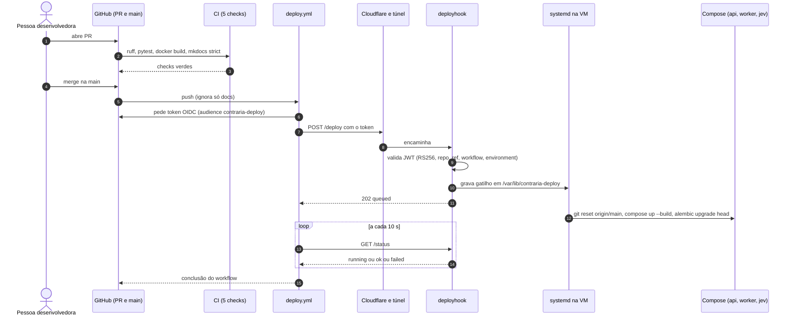

### 9.2 Observabilidade e API administrativa

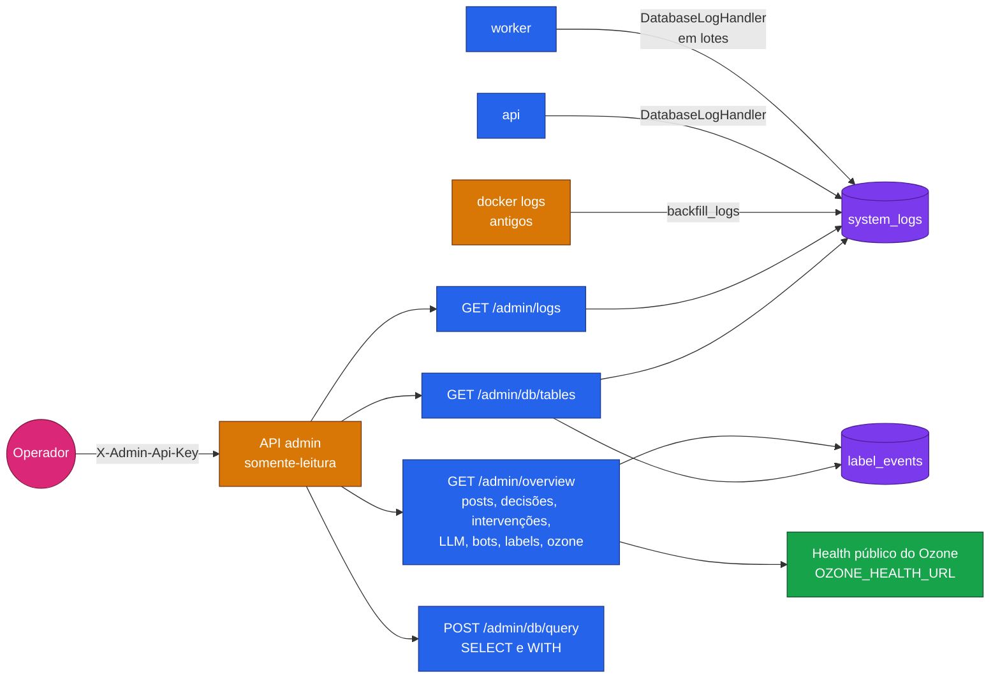

---

## 10. Inventário de tabelas por fluxo

| Tabela | Quem escreve | Fluxo |
|---|---|---|
| `posts` | `JetstreamConsumer`, `SearchPoller`, `EngagementRefresher`, worker | Entradas E1, E2, E4 |
| `ingest_cursor` | `JetstreamConsumer` | E1 (retomada) |
| `post_engagement_snapshots` | `EngagementRefresher` | E4 |
| `fact_articles` | `FeedIngestor` | E5 |
| `account_assessments` | `BotScoringService`, `AccountLabelService` | Análise e rótulo de conta |
| `decisions`, `decision_reviews` | `PipelineService`, `InterventionQueue`, `POST /v1/decisions/{id}/review` | Análise e revisão |
| `intervention_logs` | `InterventionService` | Saída (quote) e travas |
| `label_events` | `LabelOutbox` | Saída (rótulo de post) |
| `crc_calibration`, `llm_usage` | Semente do worker, `LiteLLMModel` | Controle de risco e orçamento |
| `system_logs` | `DatabaseLogHandler`, `backfill_logs` | Observabilidade |

---

## 11. Limites que moldam o desenho

| Limite | Valor | Efeito |
|---|---|---|
| Fila de análise | `WORKER_QUEUE_MAX_PENDING=100` | Coleta descarta posts novos quando cheia |
| Reserva do `searchPosts` | `WORKER_QUEUE_SEARCH_RESERVE` (70 em produção) | O firehose não ocupa as vagas dos posts mais populares |
| Aging | 3 h a 48 h | Maturação da notícia e descarte do que esfriou |
| Concorrência de análises | `WORKER_PIPELINE_CONCURRENCY` (1 na VM) | O `jev` serializa a inferência |
| Rodada de intervenção | 1 quote por 15 min, silêncio 0 h–7 h | Respeita a diretriz de bots do Bluesky contra volume de interações não solicitadas |
| Teto diário | `DAILY_MAX_INTERVENTIONS`, pontos de escrita | Limita o impacto público |
| Orçamento de LLM | `DAILY_LLM_BUDGET_USD` | O LLM só redige e audita o quote |
| Repetição de rótulos | 60 s dobrando até 1 h, 8 tentativas | Tolera quedas do túnel sem perder o rótulo |

**Referências:** [Visão Geral](index.md), [O Pipeline do Agente](pipeline.md),
[Dados, Infraestrutura e Deploy](dados-e-infra.md), [Operação na VM](operacao-vm.md) e os [ADRs](../adr/index.md).
