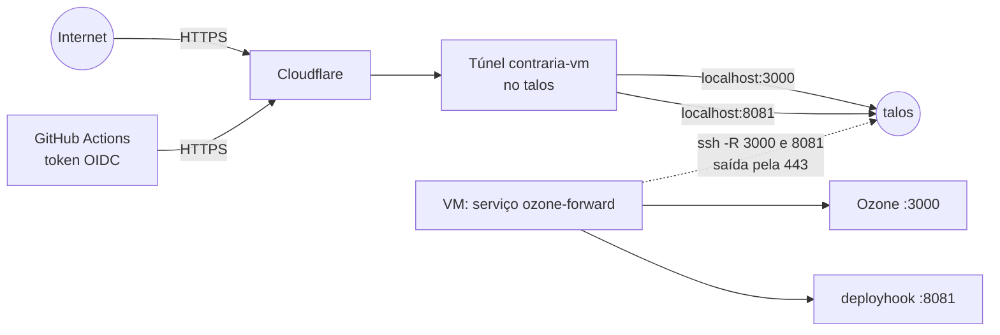

# Operação na VM de produção

Esta página descreve como o ContrarIA roda hoje na VM, como acessá-la, como o deploy funciona e o que ainda falta.
As decisões estão no [ADR 0020](../adr/0020-acesso-vm-tunel-cloudflare.md) e no
[ADR 0018](../adr/0018-concorrencia-e-contrapressao-do-worker.md).

## O ambiente

| Item | Valor |
|---|---|
| Sistema | Debian 12, Docker Engine e Compose v2 |
| Recursos | 4 vCPU, 9,7 GB de RAM, 40 GB de disco, sem GPU |
| Rede | Sem conexões de entrada; saída só por TCP 443 (a porta 7844 do túnel é bloqueada) |
| Código | `/opt/contraria` (usuário `deploy`), clone da `main` por deploy key somente leitura |
| Segredos | `/opt/contraria/api/.env` (permissão 600, fora do git) |
| Domínio | Ozone em `contraria.schmidt.monster`; deploy em `deploy-contraria.schmidt.monster` (só aceita token do GitHub) |

## Como o tráfego chega

A VM não aceita conexões de entrada e não consegue abrir o túnel da Cloudflare sozinha. Por isso o túnel
`contraria-vm` roda em **outra máquina** (o notebook `talos`, que sai pela 7844) e a VM publica as portas nele por
SSH reverso, usando só conexões de saída pela 443.



- `contraria.schmidt.monster` → `localhost:3000` do talos → Ozone na VM.
- `deploy-contraria.schmidt.monster` → `localhost:8081` do talos → container `deployhook` na VM (veja [Deploy](#deploy)).
- **Dependência:** com o talos desligado ou sem rede, o Ozone e o deploy ficam fora do ar. A pilha na VM continua
  rodando normalmente.

!!! success "O SSH da VM não é exposto à internet"
    Não existe rota pública para o sshd. A VM só aceita SSH pela rede local ou pela VPN, com a senha **desligada**
    (`/etc/ssh/sshd_config.d/00-contraria.conf`) e o root entrando somente por chave. O único endpoint público além do
    Ozone é o de deploy, que só aceita um token assinado pelo GitHub para este repositório (veja abaixo).

## Acesso administrativo

Pela rede local ou pela VPN do laboratório, com a chave SSH autorizada no root da VM. No `~/.ssh/config`:

```text
Host contraria-vm
    HostName 10.0.0.146
    User root
```

Depois: `ssh contraria-vm`. Fora da rede/VPN não há acesso por SSH, de propósito.

## Deploy

O workflow `.github/workflows/deploy.yml` roda em **push na `main`** (inclusive o merge de um PR), nunca em
`pull_request`, e pode ser reexecutado à mão (`workflow_dispatch`). Pushes que mexem só em `docs/**`, `mkdocs.yml` ou
arquivos `.md` não disparam deploy. Usa o ambiente `production` do GitHub, restrito à branch `main`.

Não há chave nem segredo guardado: o workflow se autentica com o **token OIDC do próprio GitHub** (`id-token: write`).

1. O job pede ao GitHub um token JWT com `audience=contraria-deploy` e faz `POST /deploy` em
   `https://deploy-contraria.schmidt.monster`.
2. O container `deployhook` (`api/app/deployhook.py`) verifica a assinatura com o JWKS do GitHub e exige, no mesmo
   token: emissor `token.actions.githubusercontent.com`, `audience`, `repository` e `repository_id` (o ID numérico
   impede reaproveitar o nome de um repositório apagado), `repository_owner_id`, `ref = refs/heads/main`,
   `job_workflow_ref` igual a `deploy.yml` na `main`, `environment = production` e evento `push` ou
   `workflow_dispatch`. Só aceita RS256 (recusa `alg: none` e a troca por HS256) e tokens emitidos há menos de 10 min.
   Qualquer outra coisa recebe `401`.
3. O container **não executa o deploy**: só grava um arquivo de gatilho em `/var/lib/contraria-deploy`. Ele roda sem
   o `.env` da aplicação, como usuário sem privilégio, com sistema de arquivos somente leitura, sem capabilities e sem
   acesso ao Docker.
4. A unidade `contraria-deploy-hook.path` (systemd) vê o gatilho e executa `/opt/contraria-deploy-run.sh` como usuário
   `deploy`, que roda `/opt/contraria-deploy.sh`: `git reset --hard origin/main`,
   `docker compose up -d --build --remove-orphans`, `alembic upgrade head` e a
   [limpeza do Docker](#disco-e-cache-do-docker). O endpoint não recebe comandos nem parâmetros: o deploy sempre usa a
   `origin/main`, e pedidos repetidos viram um só.
5. O workflow consulta `GET /status` (também com token) até o deploy terminar e falha se ele falhar. O resultado e o
   log ficam em `/var/lib/contraria-deploy/` (`status.json` e `last-deploy.log`).

| Onde | Nome | Tipo |
|---|---|---|
| Ambiente `production` | `DEPLOY_URL` | variável (`https://deploy-contraria.schmidt.monster`) |

**Deploy manual de uma branch** (por exemplo, para testar antes do merge), na rede local ou VPN:

```bash
ssh contraria-vm 'su deploy -c "DEPLOY_BRANCH=nome-da-branch /opt/contraria-deploy.sh"'
```

**Voltar a versão:** faça `git revert` na `main` (o deploy automático aplica). Em emergência, no servidor,
`su deploy -c "cd /opt/contraria && git reset --hard <commit> && docker compose -f deploy/docker-compose.prod.yml --env-file api/.env up -d --build"`.

## O que roda

| Serviço | Função | Limite de memória |
|---|---|---|
| `db` | Postgres com pgvector (aplicação) | 512 MB |
| `jev` | Modelo NLI local, uma cópia única (api e worker o chamam por HTTP) | 4 GB |
| `searxng` | Busca web | 256 MB |
| `api` | FastAPI | 1 GB |
| `worker` | Coleta, triagem e análise | 2 GB |
| `ozone-db`, `ozone`, `ozone-daemon` | Labeler | 512 MB, 1 GB, 512 MB |

Com a pilha completa a VM usa ~3,5 GB de RAM e ~13 GB de disco. O gargalo é a CPU do `jev`.

### Valores calibrados para esta máquina

| Variável | Valor na VM | Por quê |
|---|---|---|
| `WORKER_PIPELINE_CONCURRENCY` | `1` | O modelo é único e a inferência é serial; mais simultâneas só alongam a latência |
| `WORKER_QUEUE_MAX_PENDING` | `100` | Teto da fila de análise |
| `WORKER_QUEUE_SEARCH_RESERVE` | `70` | O Jetstream ocupa no máximo 30 vagas; o resto fica para os posts do `searchPosts` ordenados por alcance |
| `INTERVENTION_DRY_RUN` | `false` | Os quote posts são **publicados de verdade** (ligado em 05/10/2026) |
| `PIPELINE_LABELER_ENABLED` | `true` | O Ozone emite rótulos de verdade (ligado em 05/10/2026) |

Medição: com 1 simultânea a VM faz ~4,7 posts/min com p50 de 14 s e p95 de 29 s, contra 20 posts/min e p50 de 3 s no
Mac. Os números e os limites da medição estão no [ADR 0018](../adr/0018-concorrencia-e-contrapressao-do-worker.md).

A fila prioriza os posts mais populares: os do `searchPosts` entram com prioridade calculada por curtidas, reposts,
respostas e quotes, e a fila é podada a cada ciclo para ficar com os `WORKER_QUEUE_MAX_PENDING` de maior prioridade.

## Ozone

| Etapa do runbook | Estado |
|---|---|
| Containers (`ozone-db`, `ozone`, `ozone-daemon`) | Rodando |
| `https://contraria.schmidt.monster/xrpc/_health` | Responde 200 |
| Record `app.bsky.labeler.service` com os 3 rótulos | Publicado |
| Anúncio do serviço no DID (`#atproto_labeler` e chave `#atproto_label`) | Concluído em 05/10/2026 |
| Teste de emissão e reversão de rótulo | Concluído em 05/10/2026 |

O anúncio foi feito pelo assistente do próprio Ozone (entrar em `https://contraria.schmidt.monster` com a conta do
labeler e informar o código de confirmação do PLC enviado por e-mail). O documento do DID passou a declarar o serviço
`#atproto_labeler` (`https://contraria.schmidt.monster`) e a chave `#atproto_label`, que é a `did:key` derivada da
`OZONE_SIGNING_KEY_HEX`. Para conferir:

```bash
curl -s https://plc.directory/<DID_DO_LABELER> | python3 -m json.tool   # #atproto_labeler e #atproto_label
curl -s "https://api.bsky.app/xrpc/app.bsky.labeler.getServices?dids=<DID_DO_LABELER>"
```

**Teste de emissão e reversão (05/10/2026):** com o `OzoneClient` do projeto, na VM, num post do próprio bot, o rótulo
`evidencia-insuficiente` foi emitido (apareceu ativo no `queryLabels` do Ozone) e revertido (apareceu como `neg`). A
reversão não apaga o histórico: o Ozone registra o evento de negação.

!!! note "403 ao consultar o Ozone com o User-Agent padrão do Python"
    A Cloudflare responde 403 a `urllib` com o User-Agent padrão em `contraria.schmidt.monster`; use um User-Agent
    identificável ou o `curl`. O `OzoneClient` do projeto não é afetado (fala com o PDS e usa o proxy do labeler).

### Produção ligada (05/10/2026)

Desde 05/10/2026 a aplicação roda **de verdade** na VM, sem modo seco (`INTERVENTION_DRY_RUN=false` e
`PIPELINE_LABELER_ENABLED=true`):

- **Quote posts** saem do perfil principal (`contraria-bot.bsky.social`, o `BLUESKY_HANDLE`).
- **Rótulos** saem do labeler (`contraria-labeler.bsky.social`, DID do labeler): `possivel-desinformacao` no post, depois
  de um quote publicado, e `provavel-bot` na conta com `bot_score` ≥ 0,9 e pelo menos 20 posts. Um rótulo sempre vem do
  DID do labeler, nunca do perfil principal.
- **Travas que continuam valendo:** no máximo `DAILY_MAX_INTERVENTIONS=20` quotes por dia, orçamento de LLM de
  `DAILY_LLM_BUDGET_USD=1.0` por dia, rodadas a cada 15 min, silêncio das 0h às 7h, só autores com 1.000 seguidores ou
  mais (`PIPELINE_MIN_FOLLOWERS_FOR_INTERVENTION`) e o limite de pontos de escrita da API do Bluesky.
- A validação de qualidade ainda está em andamento: a amostra de 200 posts anotados (issues #62, #64 e #65) serve para
  medir o sistema, e a produção não espera por ela. Acompanhe os primeiros quotes e rótulos.

**Para pausar a publicação sem derrubar a coleta:** na VM, edite `/opt/contraria/api/.env` (`INTERVENTION_DRY_RUN=true`
para parar os quotes e os rótulos de post; `PIPELINE_LABELER_ENABLED=false` para parar também o `provavel-bot`) e rode
`su deploy -c "docker compose -f deploy/docker-compose.prod.yml --env-file api/.env up -d worker"`. Para desfazer um
rótulo, use `review_action=reverter` no Ozone (veja o runbook).

## Disco e cache do Docker

Cada deploy com `--build` deixa camadas órfãs e cache de build; sem limpeza o disco enche aos poucos. Medido na VM:
imagens ~6,7 GB, cache de build ~3,5 GB e volumes ~1,2 GB, num disco de 40 GB.

- **Logs dos containers com rotação:** todos os serviços do compose de produção usam `json-file` com `max-size: 10m` e
  `max-file: 3` (no máximo 30 MB por serviço).
- **Limpeza no fim de cada deploy** e **toda semana** (domingo, 4h, `contraria-docker-prune.timer`), por
  `/opt/contraria-docker-prune.sh`: remove camadas órfãs e cache de build com mais de 7 dias. Se o disco passar de 80%,
  faz uma limpeza agressiva (todo o cache de build e as imagens que nenhum container usa).
- **Nunca remove volumes** (bancos, cache do modelo, sessão do bot). Jamais use `docker system prune --volumes` na VM.
- Os scripts versionados estão em `deploy/vm/`. Para instalar ou atualizar: copiar para `/opt/` com dono `root`
  (o `contraria-deploy.sh` é o comando forçado da chave do GitHub; ele não deve ser gravável pelo usuário `deploy`) e
  habilitar o timer com `systemctl enable --now contraria-docker-prune.timer`.

```bash
docker system df                      # imagens, cache e volumes
df -h /                               # uso do disco
systemctl list-timers contraria-docker-prune.timer
```

## Rotina de operação

```bash
ssh contraria-vm
cd /opt/contraria
C="docker compose -f deploy/docker-compose.prod.yml --env-file api/.env"
su deploy -c "$C ps"                           # estado dos serviços
su deploy -c "$C logs --tail 100 worker"       # logs
su deploy -c "$C restart worker"               # reinicia um serviço
systemctl status ozone-forward                 # forward do SSH reverso
docker stats --no-stream                       # CPU e memória
```

**Erros do worker:**
`su deploy -c "$C logs --since 30m worker" | grep '"level": "ERROR"'`.

**Segredos:** o `api/.env` fica só na VM. Para alterar um valor, edite o arquivo e rode
`su deploy -c "$C up -d <serviço>"`. As credenciais do bot, do labeler e das APIs devem ser rotacionadas se forem
compartilhadas fora de um canal seguro.

## Falhas conhecidas e como diagnosticar

| Sintoma | Causa provável | O que fazer |
|---|---|---|
| Ozone e deploy fora do ar, VM saudável | talos desligado ou sem rede | Religar o talos; `ozone-forward` reconecta sozinho |
| Deploy do Actions falha com 401 | Token recusado (repositório, branch, workflow ou environment diferentes) | Ver `docker logs deploy-deployhook-1` (o motivo fica só no log) |
| Deploy do Actions falha com 403 ou 5xx | Cloudflare bloqueando o runner, ou talos fora | Testar `curl https://deploy-contraria.schmidt.monster/health` |
| Deploy fica em `running` | Build longo ou falha no script | `cat /var/lib/contraria-deploy/last-deploy.log` na VM |
| Jetstream reconectando de tempos em tempos | Instabilidade da rede na saída | Esperado; o cursor retoma de onde parou |
| `worker` reiniciando | Falta de memória | Conferir `docker inspect ... OOMKilled` e o limite do serviço |

## Pendências {#pendencias}

- [ ] Conversar com a infra (Arthur) sobre as duas portas públicas (Ozone e endpoint de deploy) e sobre o túnel por outra máquina.
- [ ] Liberar a porta 7844 de saída na rede da VM e mover o `cloudflared` para ela, eliminando a dependência do talos.
- [ ] Anotar uma amostra de posts reais para medir sinais de falsidade ([ADR 0015](../adr/0015-pre-filtro-tfidf-nao-integrado.md)). Uma amostra de 200 posts foi exportada da fila da VM para `research/datasets/data/amostra_anotacao.csv` (ignorada pelo git).
- [x] Primeiro deploy automático pelo Actions com token OIDC: concluído em 06/10/2026 (commit `9fb71eb`: `queued`, `running` e `ok`).
- [x] Registro DNS `ssh-contraria`: removido pela Cloudflare junto com a rota em 06/10/2026 (o hostname deixou de resolver). Na zona restam só `contraria` e `deploy-contraria`.
