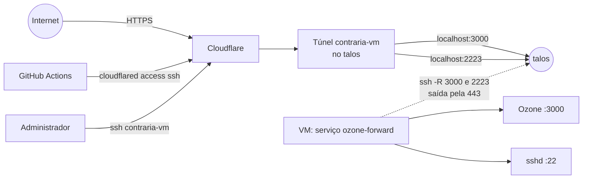

# Operação na VM de produção

Esta página descreve como o ContrarIA roda hoje na VM, como acessá-la, como o deploy funciona e o que ainda falta.
As decisões estão no [ADR 0020](../adr/0020-acesso-vm-tunel-cloudflare.md) e no
[ADR 0018](../adr/0018-concorrencia-e-contrapressao-do-worker.md).

## O ambiente

| Item | Valor |
|---|---|
| Sistema | Debian 12, Docker Engine e Compose v2 |
| Recursos | 4 vCPU, 9,7 GB de RAM, 40 GB de disco, sem GPU |
| Rede | Sem conexões de entrada; saída só por TCP 443 (a porta 7844 do túnel é bloqueada) |
| Código | `/opt/contraria` (usuário `deploy`), clone da `main` por deploy key somente leitura |
| Segredos | `/opt/contraria/api/.env` (permissão 600, fora do git) |
| Domínio | Ozone em `contraria.schmidt.monster`; SSH em `ssh-contraria.schmidt.monster` |

## Como o tráfego chega

A VM não aceita conexões de entrada e não consegue abrir o túnel da Cloudflare sozinha. Por isso o túnel
`contraria-vm` roda em **outra máquina** (o notebook `talos`, que sai pela 7844) e a VM publica as portas nele por
SSH reverso, usando só conexões de saída pela 443.



- `contraria.schmidt.monster` → `localhost:3000` do talos → Ozone na VM.
- `ssh-contraria.schmidt.monster` → `localhost:2223` do talos → sshd da VM.
- **Dependência:** com o talos desligado ou sem rede, o Ozone e o deploy ficam fora do ar. A pilha na VM continua
  rodando normalmente.

!!! warning "SSH exposto"
    O hostname `ssh-contraria` é público (não usamos Cloudflare Access). O acesso é protegido só por chave SSH: a
    autenticação por senha está **desligada** na VM (`/etc/ssh/sshd_config.d/00-contraria.conf`) e o root entra somente
    por chave. A chave do deploy ainda tem `command=` e só executa o script de deploy.

## Acesso administrativo

No `~/.ssh/config` da máquina de quem administra (precisa do `cloudflared` instalado e da chave SSH autorizada):

```text
Host contraria-vm
    HostName ssh-contraria.schmidt.monster
    User root
    ProxyCommand cloudflared access ssh --hostname %h
```

Depois: `ssh contraria-vm`. Funciona de qualquer rede.

## Deploy

O workflow `.github/workflows/deploy.yml` roda em **push na `main`** (inclusive o merge de um PR), nunca em
`pull_request`, e pode ser reexecutado à mão (`workflow_dispatch`). Pushes que mexem só em `docs/**`, `mkdocs.yml` ou
arquivos `.md` não disparam deploy. Usa o ambiente `production` do GitHub, restrito à branch `main`.

1. O runner instala o `cloudflared` e entra na VM por `cloudflared access ssh`, com a chave `DEPLOY_SSH_KEY`.
2. No `authorized_keys` do usuário `deploy`, essa chave tem `command="/opt/contraria-deploy.sh",restrict,no-pty`: ela
   **só consegue executar o script de deploy**, sem shell, sem outros comandos e sem forward.
3. O script faz `git reset --hard origin/main`, `docker compose up -d --build --remove-orphans`,
   `alembic upgrade head` e a [limpeza do Docker](#disco-e-cache-do-docker).
4. A identidade do servidor é fixada por `DEPLOY_HOST_KEY`, e não há confiança no primeiro acesso.

| Onde | Nome | Tipo |
|---|---|---|
| Ambiente `production` | `DEPLOY_SSH_KEY` | secret (chave privada só do deploy) |
| Ambiente `production` | `DEPLOY_HOST` | variável (`ssh-contraria.schmidt.monster`) |
| Ambiente `production` | `DEPLOY_HOST_KEY` | variável (chave pública do servidor) |

**Deploy manual de uma branch** (por exemplo, para testar antes do merge), como administrador:

```bash
ssh contraria-vm 'su deploy -c "DEPLOY_BRANCH=nome-da-branch /opt/contraria-deploy.sh"'
```

**Voltar a versão:** faça `git revert` na `main` (o deploy automático aplica). Em emergência, no servidor,
`su deploy -c "cd /opt/contraria && git reset --hard <commit> && docker compose -f deploy/docker-compose.prod.yml --env-file api/.env up -d --build"`.

## O que roda

| Serviço | Função | Limite de memória |
|---|---|---|
| `db` | Postgres com pgvector (aplicação) | 512 MB |
| `jev` | Modelo NLI local, uma cópia única (api e worker o chamam por HTTP) | 4 GB |
| `searxng` | Busca web | 256 MB |
| `api` | FastAPI | 1 GB |
| `worker` | Coleta, triagem e análise | 2 GB |
| `ozone-db`, `ozone`, `ozone-daemon` | Labeler | 512 MB, 1 GB, 512 MB |

Com a pilha completa a VM usa ~3,5 GB de RAM e ~13 GB de disco. O gargalo é a CPU do `jev`.

### Valores calibrados para esta máquina

| Variável | Valor na VM | Por quê |
|---|---|---|
| `WORKER_PIPELINE_CONCURRENCY` | `1` | O modelo é único e a inferência é serial; mais simultâneas só alongam a latência |
| `WORKER_QUEUE_MAX_PENDING` | `100` | Teto da fila de análise |
| `WORKER_QUEUE_SEARCH_RESERVE` | `70` | O Jetstream ocupa no máximo 30 vagas; o resto fica para os posts do `searchPosts` ordenados por alcance |
| `INTERVENTION_DRY_RUN` | `true` | Nada é publicado |
| `PIPELINE_LABELER_ENABLED` | `false` | Nenhum rótulo é emitido |

Medição: com 1 simultânea a VM faz ~4,7 posts/min com p50 de 14 s e p95 de 29 s, contra 20 posts/min e p50 de 3 s no
Mac. Os números e os limites da medição estão no [ADR 0018](../adr/0018-concorrencia-e-contrapressao-do-worker.md).

A fila prioriza os posts mais populares: os do `searchPosts` entram com prioridade calculada por curtidas, reposts,
respostas e quotes, e a fila é podada a cada ciclo para ficar com os `WORKER_QUEUE_MAX_PENDING` de maior prioridade.

## Ozone

| Etapa do runbook | Estado |
|---|---|
| Containers (`ozone-db`, `ozone`, `ozone-daemon`) | Rodando |
| `https://contraria.schmidt.monster/xrpc/_health` | Responde 200 |
| Record `app.bsky.labeler.service` com os 3 rótulos | Publicado |
| **Anúncio do serviço no DID** (`#atproto_labeler` e chave `#atproto_label`) | **Pendente** |
| Teste de emissão e reversão de rótulo | Pendente (depende do anúncio) |

O documento do DID do labeler hoje só declara o `#atproto_pds`. Enquanto o serviço não for anunciado, o Bluesky não
reconhece esse Ozone como labeler. O passo exige entrar com a conta do labeler e confirmar uma operação do PLC por
e-mail, então é feito por uma pessoa, seguindo o [runbook do Ozone](https://github.com/moonshinerd/ContrarIA/blob/main/deploy/OZONE_RUNBOOK.md):
abrir `https://contraria.schmidt.monster`, entrar como a conta do labeler e concluir o assistente. Depois, conferir:

```bash
curl -s https://plc.directory/<DID_DO_LABELER> | python3 -m json.tool   # deve listar #atproto_labeler
```

Mantenha `PIPELINE_LABELER_ENABLED=false` até testar um post autorizado.

## Disco e cache do Docker

Cada deploy com `--build` deixa camadas órfãs e cache de build; sem limpeza o disco enche aos poucos. Medido na VM:
imagens ~6,7 GB, cache de build ~3,5 GB e volumes ~1,2 GB, num disco de 40 GB.

- **Logs dos containers com rotação:** todos os serviços do compose de produção usam `json-file` com `max-size: 10m` e
  `max-file: 3` (no máximo 30 MB por serviço).
- **Limpeza no fim de cada deploy** e **toda semana** (domingo, 4h, `contraria-docker-prune.timer`), por
  `/opt/contraria-docker-prune.sh`: remove camadas órfãs e cache de build com mais de 7 dias. Se o disco passar de 80%,
  faz uma limpeza agressiva (todo o cache de build e as imagens que nenhum container usa).
- **Nunca remove volumes** (bancos, cache do modelo, sessão do bot). Jamais use `docker system prune --volumes` na VM.
- Os scripts versionados estão em `deploy/vm/`. Para instalar ou atualizar: copiar para `/opt/` com dono `root`
  (o `contraria-deploy.sh` é o comando forçado da chave do GitHub; ele não deve ser gravável pelo usuário `deploy`) e
  habilitar o timer com `systemctl enable --now contraria-docker-prune.timer`.

```bash
docker system df                      # imagens, cache e volumes
df -h /                               # uso do disco
systemctl list-timers contraria-docker-prune.timer
```

## Rotina de operação

```bash
ssh contraria-vm
cd /opt/contraria
C="docker compose -f deploy/docker-compose.prod.yml --env-file api/.env"
su deploy -c "$C ps"                           # estado dos serviços
su deploy -c "$C logs --tail 100 worker"       # logs
su deploy -c "$C restart worker"               # reinicia um serviço
systemctl status ozone-forward                 # forward do SSH reverso
docker stats --no-stream                       # CPU e memória
```

**Erros do worker:**
`su deploy -c "$C logs --since 30m worker" | grep '"level": "ERROR"'`.

**Segredos:** o `api/.env` fica só na VM. Para alterar um valor, edite o arquivo e rode
`su deploy -c "$C up -d <serviço>"`. As credenciais do bot, do labeler e das APIs devem ser rotacionadas se forem
compartilhadas fora de um canal seguro.

## Falhas conhecidas e como diagnosticar

| Sintoma | Causa provável | O que fazer |
|---|---|---|
| Ozone e deploy fora do ar, VM saudável | talos desligado ou sem rede | Religar o talos; `ozone-forward` reconecta sozinho |
| `ssh contraria-vm` falha | talos fora ou serviço `ozone-forward` parado | Acessar pela rede local e rodar `systemctl status ozone-forward` |
| Jetstream reconectando de tempos em tempos | Instabilidade da rede na saída | Esperado; o cursor retoma de onde parou |
| `worker` reiniciando | Falta de memória | Conferir `docker inspect ... OOMKilled` e o limite do serviço |
| Deploy falha com "host key" | `DEPLOY_HOST_KEY` desatualizada (reinstalação da VM) | Atualizar a variável do ambiente `production` |

## Pendências {#pendencias}

- [ ] **Anunciar o Ozone no DID** (a chave esperada em `#atproto_label` é a `did:key` da `OZONE_SIGNING_KEY_HEX`) e testar emissão e reversão de rótulo (veja acima).
- [ ] Regra de IP no WAF da Cloudflare para `ssh-contraria` (faixas do GitHub Actions); reduz ruído, não é identidade.
- [ ] Liberar a porta 7844 de saída na rede da VM e mover o `cloudflared` para ela, eliminando a dependência do talos.
- [ ] Anotar uma amostra de posts reais para medir sinais de falsidade ([ADR 0015](../adr/0015-pre-filtro-tfidf-nao-integrado.md)).
- [ ] Primeiro deploy automático pelo Actions (só dispara após o merge deste PR na `main`).
