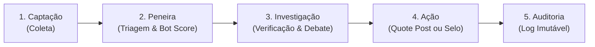

# Como Funciona o ContrarIA: O Pipeline do Agente

Um guia passo a passo em linguagem simples e acessível para entender o funcionamento do protótipo **ContrarIA**, apresentado no showcase.

---

## A Visão Geral

Pense no **ContrarIA** como uma estação automatizada de triagem e controle de qualidade de informações nas redes sociais. A cada segundo, milhares de pessoas e robôs publicam mensagens na rede **Bluesky**. O nosso agente monitora esse fluxo, filtra o ruído, investiga publicações suspeitas com inteligência artificial e fontes confiáveis, e age educando os leitores ou sinalizando contas inautênticas.

O fluxo de processamento divide-se em **cinco etapas sequenciais**:

---

## Etapa 1: Captação de Mensagens (Coleta Contínua)
* **O que acontece**: O robô conecta-se ao *Jetstream* do Bluesky (um fluxo que transmite tudo o que é postado na rede em tempo real, sem atraso) e também faz buscas direcionadas por termos em alta.
* **Analogia**: É como abrir um registro de água bruta que capta todo o fluxo do rio para análise.
* **Requisitos envolvidos**: [RF01 (Coleta de publicações)](file:///Users/aluno1/ContrarIA/docs/requisitos.md).

---

## Etapa 2: A Peneira Inicial (Triagem, Tema e Detecção de Bots)
* **O que acontece**: O volume total de mensagens é grande demais para checar tudo. O sistema aplica dois filtros rápidos:
  1. **Filtro de Tema (Política e Interesse Público)**: Descarta mensagens sobre amenidades, esportes ou fofocas que não se encaixam no escopo de desinformação do MVP.
  2. **Cálculo do Bot Score**: Analisa o comportamento do autor (frequência de postagem, horários, proporção de seguidores) e atribui uma nota de 0 a 1:
     - Abaixo de 0.50: Provavelmente um usuário humano real.
     - Acima de 0.80: Forte evidência de ser uma automação/robô.
* **Analogia**: Uma esteira de separação mecânica que separa grãos de terra e impurezas antes do processamento fino.
* **Requisitos envolvidos**: [RF02 (Detecção de bots)](file:///Users/aluno1/ContrarIA/docs/requisitos.md), [RF08 (Relevância)](file:///Users/aluno1/ContrarIA/docs/requisitos.md), [RF09 (Filtro temático)](file:///Users/aluno1/ContrarIA/docs/requisitos.md) e [RF12 (Padrões de atividade)](file:///Users/aluno1/ContrarIA/docs/requisitos.md).

---

## Etapa 3: A Investigação Factual (Cadeia de Verificação e Debate)
Se a publicação for relevante, viral e suspeita, ela entra no núcleo de raciocínio de inteligência artificial:
1. **Extração da Alegação**: O modelo isola o cerne da afirmação (ex: *"Governo decreta lockdown em outubro"*).
2. **Consulta a Fontes Externas**: O agente consulta agências de fact-checking oficiais (via Google Fact Check API), enciclopédias (Wikipedia) e notícias em tempo real (DuckDuckGo/Tavily e feeds RSS do TSE).
3. **Cadeia de Verificação (CoVe) e Self-RAG**: A IA formula perguntas de checagem, avalia se as evidências encontradas são fortes e descarta respostas vagas.
4. **Debate Multiagente**: Dois agentes autônomos assumem papéis complementares (um avalia os fatos, outro atua como advogado cético buscando contraprovas).
5. **Veredito com Abstenção Ativa**: Se as evidências provarem falsidade com confiança $\ge 80\%$, o veredito é **Falso**. Se não houver dados suficientes ou houver dúvida razoável, o sistema **se abstém** e não acusa ninguém.
* **Analogia**: Um conselho pericial onde dois especialistas debatem provas documentais antes de emitir um laudo técnico.
* **Requisitos envolvidos**: [RF03 (Verificação)](file:///Users/aluno1/ContrarIA/docs/requisitos.md), [RF11 (Fontes externas)](file:///Users/aluno1/ContrarIA/docs/requisitos.md) e [RNF01 (Confiabilidade)](file:///Users/aluno1/ContrarIA/docs/requisitos.md).

---

## Etapa 4: Intervenção Direcionada (Ação na Rede)
Uma vez gerado o laudo, o sistema consulta a [Matriz de Intervenção](file:///Users/aluno1/ContrarIA/docs/pesquisa/matrizes.md) para decidir como agir:
* **Se o autor for Humano**: Publica um **Quote Post** socrático. Em vez de acusar ("*Mentira!*"), faz uma pergunta reflexiva educada (*"Você sabia que o órgão oficial X publicou um desmentido ontem? Confira o link..."*). Isso vacina a audiência espectadora (*bystanders*) sem gerar brigas estéreis.
* **Se o autor for um Bot**: Aciona o servidor **Ozone** oficial do Bluesky, emitindo um rótulo de moderação na conta e publicando um aviso factual direto.
* **Se for Inconclusivo**: O sistema permanece em silêncio.
* **Requisitos envolvidos**: [RF05 (Intervenção socrática)](file:///Users/aluno1/ContrarIA/docs/requisitos.md), [RF06 (Adaptação)](file:///Users/aluno1/ContrarIA/docs/requisitos.md) e [RF07 (Sinalização Ozone)](file:///Users/aluno1/ContrarIA/docs/requisitos.md).

---

## Etapa 5: Auditoria e Rastreabilidade (O Livro-Caixa)
* **O que acontece**: Toda e qualquer decisão — seja responder, carimbar ou se abster — é gravada em um banco de dados em formato de registro imutável.
* **O que é guardado**: O texto original, data/hora, link, nota do bot score, fontes consultadas, transcrição do debate dos agentes e o motivo exato da decisão.
* **Benefício**: Qualquer avaliador externo, pesquisador ou cidadão pode auditar a decisão e entender exatamente o porquê da intervenção.
* **Requisitos envolvidos**: [RF13 (Registro de decisões)](file:///Users/aluno1/ContrarIA/docs/requisitos.md) e [RNF06 (Rastreabilidade e explicabilidade)](file:///Users/aluno1/ContrarIA/docs/requisitos.md).
