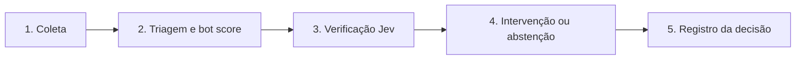

# Como funciona o ContrarIA: o pipeline do agente

Este guia explica a arquitetura operacional do ContrarIA. O backend padrão de
verificação é o Jev local; o caminho anterior baseado integralmente em LLM
continua disponível para experimentos, mas não é o usado pelo worker quando
`VERIFICATION_BACKEND=jev`.

## Visão geral

O ContrarIA acompanha publicações políticas em português no Bluesky, seleciona candidatos, busca evidências e decide se há fundamento para uma intervenção. Quando faltam evidências, ele se abstém. O processo pode ser entendido em cinco etapas:

```mermaid
flowchart LR
    A["1. Coleta"] --> B["2. Triagem e bot score"]
    B --> C["3. Verificação Jev"]
    C --> D["4. Intervenção ou abstenção"]
    D --> E["5. Registro da decisão"]
```

## 1. Coleta: encontrar publicações

O Jetstream fornece eventos de novas publicações. Em paralelo, buscas periódicas com `searchPosts`, ordenadas por `top`, recuperam posts das últimas 24 horas que podem ter circulado antes de o agente iniciar. A coleta filtra idioma português e palavras-chave políticas, evita duplicatas pela URI e guarda um cursor para retomar o fluxo após reiniciar.

É como acompanhar as notícias que chegam e também consultar as que já ganharam atenção.

**Referências:** [RF01](../requisitos.md), [ADR 0009](../adr/0009-coleta-hibrida-jetstream-searchposts.md).

## 2. Triagem: escolher o que investigar

O sistema avalia tema, relevância, velocidade de propagação e sinais de automação da conta. O bot score combina características como frequência, regularidade, repetição de texto e perfil em uma nota entre 0 e 1. Uma nota alta é um indício, não prova de automação; os pesos e limiares precisam ser avaliados.

Um classificador clássico opcional fornece outro sinal para priorizar candidatos com provável desinformação. Ele nunca decide sozinho publicar ou rotular. Candidatos com baixa prioridade podem continuar em monitoramento.

É como organizar uma fila de investigação: prioridade não é condenação.

**Referências:** [RF02, RF04, RF08, RF09, RF10 e RF12](../requisitos.md), [ADR 0006](../adr/0006-bot-score-heuristico.md), [ADR 0008](../adr/0008-pre-filtro-classico.md).

## 3. Verificação Jev: confrontar a alegação com evidências

1. **Separar frases candidatas:** o worker divide o post e, quando disponível, o contexto do fio. O Jev identifica quais frases são alegações factuais verificáveis; opinião, pergunta, ironia e retórica encerram sem ação.
2. **Buscar evidências:** cada alegação factual consulta as fontes habilitadas — agências de checagem, Wikipédia, busca web e acervo RSS. A busca web utiliza primariamente a instância self-hosted do SearXNG (com fallback para Tavily e DuckDuckGo) e extração estruturada de conteúdo com Trafilatura, evitando dependência de créditos e ruídos de raspagem HTML. A consulta usa a frase específica, sem URLs, para evitar resultados apenas tematicamente relacionados.
3. **Filtrar relevância:** o Jev compara alegação e trecho de fonte e só conserva evidência que trate dos mesmos fatos, pessoas, números ou eventos. Ele mede essa decisão por probabilidades de tokens, sem depender de JSON gerado.
4. **Classificar o veredito:** com as fontes relevantes, o Jev escolhe entre "confirmam a alegação", "desmentem a alegação" e "confirmam o fato, mas desmentem a conclusão ou o exagero". Isso produz, respectivamente, `true`, `false` ou `misleading`.
5. **Aplicar o controle de risco:** o Conformal Risk Control (CRC) usa um limiar aprendido com exemplos rotulados para **esse modelo Jev**, com tolerância de 5% para a perda de falsos positivos na calibração. Não é uma regra fixa de confiança nem garantia de acerto em todos os casos. Sem calibração ou abaixo do limiar, a decisão é `insufficient_evidence` e não há intervenção.

É como uma análise pericial que só conclui quando a fonte trata do fato
específico e a confiança passou por uma calibração empírica.

**Referências:** [ADR 0013 — backend Jev](../adr/0013-backend-local-jev.md),
[ADR 0014 — busca SearXNG e Trafilatura](../adr/0014-busca-web-searxng-trafilatura.md) e
[guia de calibração](../calibracao-jev.md). O fluxo CoVe/Self-RAG/debate do
[ADR 0007](../adr/0007-verificacao-cove-selfrag-mad-crc.md) permanece como
backend alternativo (`VERIFICATION_BACKEND=llm`).

## 4. Ação: intervir somente quando houver fundamento

Após a análise completa, um veredito falso ou enganoso elegível pode gerar um **quote post no perfil do bot**, citando a publicação e uma fonte. Para humanos prováveis, o tom é empático e socrático; para bots prováveis, é clínico e descreve sinais de automação. Não há reply nem menção direta ao autor.

Quote posts notificam o autor. A decisão aceita o risco relacionado à diretriz de opt-in descrito no ADR 0002; a citação não elimina esse risco. Limites por post, autor e dia, orçamento, anti-loop e postgate restringem a publicação. Se o autor bloqueou citações, o sistema não publica o quote post.

A rotulagem pelo **Ozone** é complementar, por uma conta dedicada de labeler: `possivel-desinformacao` em conteúdo e `provavel-bot` em conta, conforme a análise. Usuários que assinam esse serviço podem ver os rótulos; uma revisão do veredito pode negá-los, sem apagar o histórico. O score sozinho não autoriza rotulagem.

Conteúdo verdadeiro ou não factual não recebe intervenção corretiva. Um resultado inconclusivo causa abstenção, sem ação penalizadora.

**Referências:** [RF05, RF06 e RF07](../requisitos.md), [ADR 0002](../adr/0002-quote-post.md), [ADR 0003](../adr/0003-labeler-ozone.md).

## 5. Auditoria: registrar o motivo da decisão

A decisão, inclusive monitoramento ou abstenção, deve ser registrada com os dados necessários para explicar seu resultado: publicação, data, bot score, evidências, reflexões, debate, limiar usado e ação tomada. Isso permite revisar os motivos e corrigir decisões posteriores sem perder o histórico.

É o registro que permite ao avaliador conferir como a conclusão foi construída.

**Referências:** [RF13 e RNF06](../requisitos.md), [visão geral da arquitetura](index.md).
