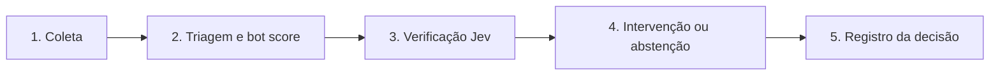

# Como funciona o ContrarIA: o pipeline do agente

Este guia explica a arquitetura operacional do ContrarIA. O backend padrão de
verificação é o Jev local; o caminho anterior baseado integralmente em LLM
continua disponível para experimentos, mas não é o usado pelo worker quando
`VERIFICATION_BACKEND=jev`.

## Visão geral

O ContrarIA acompanha publicações políticas em português no Bluesky, seleciona candidatos, busca evidências e decide se há fundamento para uma intervenção. Quando faltam evidências, ele se abstém. O processo pode ser entendido em cinco etapas:

```mermaid
flowchart LR
    A["1. Coleta"] --> B["2. Triagem e bot score"]
    B --> C["3. Verificação Jev"]
    C --> D["4. Intervenção ou abstenção"]
    D --> E["5. Registro da decisão"]
```

## 1. Coleta: encontrar publicações

O Jetstream fornece eventos de novas publicações. Em paralelo, buscas periódicas com `searchPosts`, ordenadas por `top`, recuperam posts das últimas 24 horas que podem ter circulado antes de o agente iniciar. A coleta filtra idioma português e palavras-chave políticas, evita duplicatas pela URI e guarda um cursor para retomar o fluxo após reiniciar.

É como acompanhar as notícias que chegam e também consultar as que já ganharam atenção.

**Referências:** [RF01](../requisitos.md), [ADR 0009](../adr/0009-coleta-hibrida-jetstream-searchposts.md).

## 2. Triagem: escolher o que investigar

A triagem acontece em duas camadas, e só a segunda é cara.

**Priorização barata (`EngagementRefresher`, a cada 5 minutos).** Para os posts das últimas 48 horas, o worker
consulta o engajamento atual, grava um *snapshot* e calcula a **velocidade de propagação** (interações novas por
hora entre snapshots). A relevância combina, em escala logarítmica, engajamento, velocidade e seguidores do autor. A
matriz GQ04 transforma isso em `triage_status` (`monitor`, `queued` ou `discarded`) e `priority`. Posts já
`processed` ou `ignored` não voltam para a fila.

**Análise cara (loop do worker, lote de 5 a cada 30 segundos).** Os candidatos `monitor` e `queued` são lidos por
`priority` decrescente. Para cada um, o `PipelineService` calcula o **bot score** da conta: pesos em
`domain/bot_weights.yaml` sobre características demográficas, de rede, temporais e de conteúdo, passados por uma
sigmoide e guardados em cache por 24 horas. Uma nota alta é um indício, não prova de automação.

!!! note "Pré-filtro clássico fora do fluxo"
    O classificador TF-IDF (`FakeNewsTFIDFClassifier`) foi treinado e avaliado em `research/`, mas **não está ligado
    ao worker**, por decisão do [ADR 0015](../adr/0015-pre-filtro-tfidf-nao-integrado.md): em posts reais do Bluesky
    ele chegou a ROC-AUC 0,76 (F1 0,72, amostra pequena), contra 0,99 em notícias, e a verificação local eliminou o
    argumento de custo. Hoje a fila usa relevância, velocidade de propagação e bot score. Esses sinais medem alcance,
    não a chance de o post ser falso.

É como organizar uma fila de investigação: prioridade não é condenação.

**Referências:** [RF02, RF04, RF08, RF09, RF10 e RF12](../requisitos.md), [ADR 0006](../adr/0006-bot-score-heuristico.md), [ADR 0008](../adr/0008-pre-filtro-classico.md).

## 3. Verificação Jev: confrontar a alegação com evidências

1. **Separar frases candidatas:** o worker divide o post e, quando disponível, o contexto do fio. Uma heurística determinística (sem LLM nem Jev) mantém só as frases com ancoramento factual (número, título político, sigla institucional, predicado fático ou nome próprio) e descarta perguntas, expressões idiomáticas e hashtags de campanha; sem frases candidatas, a análise encerra sem ação. Essa heurística ainda não tem validação quantitativa.
2. **Buscar evidências:** cada alegação factual consulta as fontes habilitadas — agências de checagem, Wikipédia, busca web e acervo RSS. A busca web utiliza primariamente a instância self-hosted do SearXNG (com fallback para o DuckDuckGo; o Tavily usado no MVP foi removido, ver [ADR 0016](../adr/0016-remocao-do-tavily.md)) e extração estruturada de conteúdo com Trafilatura, evitando dependência de créditos e ruídos de raspagem HTML. A consulta usa a frase específica, sem URLs, para evitar resultados apenas tematicamente relacionados.
3. **Filtrar relevância:** o Jev compara alegação e trecho de fonte e só conserva evidência que trate dos mesmos fatos, pessoas, números ou eventos. Ele mede essa decisão por probabilidades de tokens, sem depender de JSON gerado.
4. **Classificar o veredito:** com as fontes relevantes, o Jev escolhe entre "confirmam a alegação", "desmentem a alegação" e "confirmam o fato, mas desmentem a conclusão ou o exagero". Isso produz, respectivamente, `true`, `false` ou `misleading`.
5. **Aplicar o controle de risco:** o Conformal Risk Control (CRC) usa um limiar aprendido com exemplos rotulados para **esse modelo Jev**, com tolerância de 5% para a perda de falsos positivos na calibração. Não é uma regra fixa de confiança nem garantia de acerto em todos os casos. Sem calibração ou abaixo do limiar, a decisão é `insufficient_evidence` e não há intervenção.

É como uma análise pericial que só conclui quando a fonte trata do fato
específico e a confiança passou por uma calibração empírica.

**Referências:** [ADR 0013 — backend Jev](../adr/0013-backend-local-jev.md),
[ADR 0014 — busca SearXNG e Trafilatura](../adr/0014-busca-web-searxng-trafilatura.md) e
[guia de calibração](../calibracao-jev.md). O fluxo CoVe/Self-RAG/debate do
[ADR 0007](../adr/0007-verificacao-cove-selfrag-mad-crc.md) permanece como
backend alternativo (`VERIFICATION_BACKEND=llm`).

## 4. Ação: intervir somente quando houver fundamento

Depois da verificação, a **matriz GQ01** (no `PipelineService`) escolhe a ação, nesta ordem:

1. **`IGNORE`:** bot score acima de 0,9 e conta com menos de 1.000 seguidores. Evita amplificar contas automatizadas pequenas.
2. **`MONITOR`:** veredito `insufficient_evidence`.
3. **`INTERVENE_QUEUED`:** conta com 1.000 seguidores ou mais e veredito `false` ou `misleading`.
4. **`MONITOR`:** qualquer outro caso, inclusive intervenção desabilitada por *feature flag*.

O candidato **não é publicado na hora**. Ele entra na `InterventionQueue` e, a cada rodada de 15 minutos, só o de
**maior confiança** é publicado; os demais são fechados como `MONITOR`. Entre 0h e 7h (Brasília) não há rodada de
publicação, para que a conta não opere 24 horas seguidas. A fila vive na memória: se o worker reinicia, os pendentes
são fechados como `MONITOR`.

O candidato escolhido passa pelas travas do `InterventionService`: confiança mínima de 0,8, anti-loop (nunca citar o
próprio bot nem contas com rótulo `bot`), um quote por post e um por autor a cada 24 horas, teto diário de quotes,
orçamento de pontos de escrita e `postgate` que desabilite citações. Passando, o LLM revisa as cinco fontes mais
relevantes e redige o **quote post no perfil do bot**, em até 300 caracteres (em fio, se preciso). Para humanos
prováveis o tom é empático e socrático; para bots prováveis, clínico. Não há reply nem menção direta ao autor.

Quote posts notificam o autor. A decisão aceita o risco relacionado à diretriz de opt-in descrito no ADR 0002; a
citação não elimina esse risco. Com `INTERVENTION_DRY_RUN=true` (padrão) nada é publicado.

A rotulagem pelo **Ozone** é complementar, por uma conta dedicada de labeler: `possivel-desinformacao` em conteúdo
(o rótulo `provavel-bot` ainda não é emitido pelo código). Ela só é emitida com `PIPELINE_LABELER_ENABLED=true` e fora do *dry-run*. Uma revisão
com `reverter` nega o rótulo (`action="negate"`) sem apagar o histórico. O score sozinho não autoriza rotulagem.

Conteúdo verdadeiro ou não factual não recebe intervenção corretiva. Um resultado inconclusivo causa abstenção, sem ação penalizadora.

**Referências:** [RF05, RF06 e RF07](../requisitos.md), [ADR 0002](../adr/0002-quote-post.md), [ADR 0003](../adr/0003-labeler-ozone.md).

## 5. Auditoria: registrar o motivo da decisão

A decisão, inclusive monitoramento ou abstenção, deve ser registrada com os dados necessários para explicar seu resultado: publicação, data, bot score, evidências, reflexões, debate, limiar usado e ação tomada. Isso permite revisar os motivos e corrigir decisões posteriores sem perder o histórico.

É o registro que permite ao avaliador conferir como a conclusão foi construída.

**Referências:** [RF13 e RNF06](../requisitos.md), [visão geral da arquitetura](index.md) e [modelo de dados](dados-e-infra.md).
