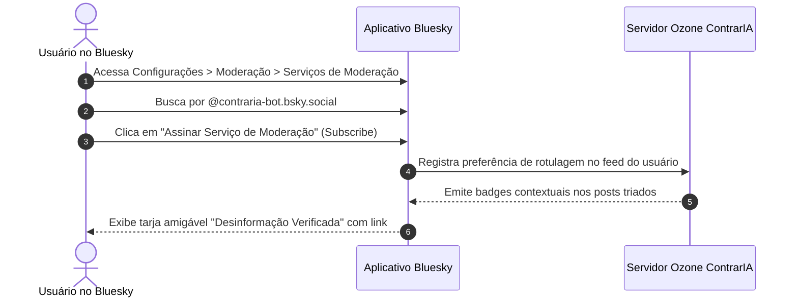

# Guia Prático de Uso da Ferramenta

Bem-vindo ao **Guia Prático de Uso do ContrarIA**. Este documento orienta tanto os **usuários finais da rede social Bluesky** quanto **desenvolvedores, pesquisadores e operadores de infraestrutura** sobre como interagir, configurar, operar e auditar o sistema.

---

## 1. Visão Geral do Sistema

O **ContrarIA** é uma solução de inteligência artificial de código aberto concebida para atuar na rede social federada **Bluesky** (protocolo AT Protocol). O sistema opera sob um duplo propósito ético:

1. **Estimular o Pensamento Crítico (Intervenção Socrática):** Em vez de confrontar usuários ou impor sentenças fechadas, o bot formula perguntas reflexivas e fornece links de checagem factual neutros em publicações que citam desinformações de alto alcance, focando na conscientização da audiência espectadora (*bystanders*).
2. **Fornecer Moderação Transparente e Descentralizada (Ozone Labeler):** Atua como um serviço de rotulagem (*Labeler*) independente, permitindo que os próprios usuários da rede escolham voluntariamente assinar seus rótulos de alerta contra desinformação e bots inautênticos.

* **Handle Público Oficial:** `@contraria-bot.bsky.social`
* **Perfil de Moderação (Labeler):** `did:plc:contraria-labeler` (hospedado no servidor Ozone da equipe)

---

## 2. Guia do Usuário da Rede Social Bluesky

Se você é um usuário da rede Bluesky e encontrou uma intervenção do ContrarIA ou deseja utilizar seus serviços de proteção comunitária, veja abaixo como funciona a interação.

### 2.1 Como Reconhecer uma Intervenção Socrática

O ContrarIA **nunca responde diretamente dentro do seu fio de comentários (*reply*) nem marca seu usuário com `@`**, evitando constrangimentos ou conflitos diretos.

Quando o sistema identifica uma alegação comprovadamente falsa com alto alcance, ele publica um **Quote Post** em seu próprio perfil com a seguinte estrutura:

```
┌─────────────────────────────────────────────────────────────┐
│  @contraria-bot.bsky.social (Bot verificado)                │
│                                                             │
│  "Ao avaliar esta alegação, você já conferiu se há          │
│   registros oficiais sobre esse procedimento no portal do   │
│   TSE? O documento da checagem indica que a contagem é     │
│   auditável publicamente: https://fatoouboato.tse.jus.br"   │
│                                                             │
│  ┌───────────────────────────────────────────────────────┐  │
│  │ [Post Original Citado]                                │  │
│  │ "Urgente: urnas foram programadas sem fiscalização..."│  │
│  └───────────────────────────────────────────────────────┘  │
└─────────────────────────────────────────────────────────────┘
```

#### Características da Mensagem Socrática:
* **Tom Respeitoso e Não-Polarizador:** Ausência de adjetivos acusatórios ("mentira", "fake news criminosa").
* **Estímulo à Metacognição:** A pergunta convida o leitor a ponderar sobre a confiabilidade da fonte.
* **Link para a Fonte Primária:** Acesso direto à checagem realizada por agências profissionais (Lupa, Aos Fatos, Comprova, TSE).

---

### 2.2 Como Assinar o Serviço de Moderação (Ozone Labeler)

No Bluesky, a moderação é personalizável e não centralizada. Qualquer pessoa pode assinar o serviço de rotulagem do ContrarIA para receber alertas contextuais sem bloquear ninguém:



#### Passo a Passo de Configuração:
1. Abra o aplicativo do Bluesky (ou acesse [bsky.app](https://bsky.app)) e faça login.
2. Navegue até o menu lateral e clique em **Configurações** (*Settings*).
3. Selecione a opção **Moderação** (*Moderation*) $\rightarrow$ **Serviços de Moderação** (*Moderation Services*).
4. Localize o serviço do **ContrarIA Labeler** ou acesse diretamente o perfil `@contraria-bot.bsky.social`.
5. Clique no botão **Assinar** (*Subscribe to labeler*).
6. Configure as suas preferências visuais para cada tipo de selo emitido:
   * **Desinformação Factual:** *Avisar* (exibe uma tarja informativa com link da checagem) ou *Ocultar* (esconde o post até o clique).
   * **Conta Automatizada / Bot:** *Avisar* (insere um ícone visual identificando que a conta tem comportamento inautêntico).

---

## 3. Guia do Desenvolvedor e Operador

Esta seção orienta como subir a infraestrutura completa do ContrarIA para desenvolvimento local, execução de testes e operação em produção.

### 3.1 Pré-requisitos de Ambiente

* **Sistema Operacional:** Linux, macOS ou Windows (com WSL2).
* **Docker Engine:** Versão 24.0+ e **Docker Compose** v2+.
* **Python:** 3.12+ (gerenciado preferencialmente com [`uv`](https://github.com/astral-sh/uv)).
* **Git:** Para controle de versão.

---

### 3.2 Configuração das Variáveis de Ambiente

O ContrarIA mantém uma separação rígida entre código e credenciais. Nunca comite arquivos `.env` no repositório.

1. Clone o repositório e crie o arquivo de ambiente a partir do modelo:
   ```bash
   git clone https://github.com/moonshinerd/ContrarIA.git
   cd ContrarIA
   cp api/.env.example api/.env
   ```

2. Abra o arquivo `api/.env` e configure as chaves necessárias:

| Variável | Descrição | Onde Obter / Padrão |
|---|---|---|
| `BLUESKY_HANDLE` | Handle público da conta do bot | Ex.: `contraria-bot.bsky.social` |
| `BLUESKY_APP_PASSWORD` | App Password gerada exclusivamente para o bot | Configurações do Bluesky $\rightarrow$ *App Passwords* |
| `BLUESKY_SESSION_PATH` | Caminho do arquivo de sessão em disco | `/srv/data/bluesky.session` (padrão no container) |
| `GOOGLE_FACTCHECK_API_KEY` | Chave da Google Fact Check Tools API | Console do Google Cloud (projeto com a API ativada) |
| `LITELLM_MODEL` | Identificador do modelo de linguagem | `openrouter/meta-llama/llama-3.1-70b-instruct` ou `ollama/...` |
| `OPENROUTER_API_KEY` | Chave de acesso à OpenRouter | Console da OpenRouter (se utilizar modelos em nuvem) |
| `DATABASE_URL` | String de conexão SQLAlchemy | `postgresql+psycopg://contraria:contraria@db:5432/contraria` |
| `RSS_CHECKERS_ENABLED` | Ativação do job de ingestão de feeds | `true` |

> [!WARNING]
> Nunca utilize a senha principal da sua conta Bluesky pessoal em `BLUESKY_APP_PASSWORD`. Crie sempre uma **App Password** descartável e com permissões restritas.

---

### 3.3 Inicialização via Docker Compose

A forma recomendada de executar todo o ecossistema (banco com pgvector, API FastAPI e worker assíncrono) é através do Docker Compose:

```bash
# Subir todo o ambiente em segundo plano com build das imagens
make up
# ou alternativamente:
docker compose up -d --build
```

#### Para acompanhar os logs de execução:
```bash
make logs
# ou filtrando apenas pelo worker de triagem:
docker compose logs -f worker
```

#### Para derrubar os containers:
```bash
make down
```

---

### 3.4 Scripts de Manutenção e Smoke Tests

Para verificar a integridade da comunicação com a rede Bluesky e as fontes de dados sem subir o pipeline completo:

#### 1. Teste de Conexão com o Bluesky (*Smoke Test*)
Executa o login seguro com reaproveitamento de sessão e faz uma consulta pública à AppView:
```bash
docker compose run --rm --no-deps api python -m app.scripts.bsky_smoke
```

#### 2. Configuração do Perfil do Bot (*Idempotente*)
Grava no perfil oficial a tag explícita de `bot`, garantindo total conformidade ética com as diretrizes do Bluesky:
```bash
docker compose run --rm --no-deps api python -m app.scripts.bsky_bot_setup
```

#### 3. Ingestão Forçada de Feeds RSS
Dispara manualmente a coleta das checagens mais recentes das agências jornalísticas parceiras e grava no banco vetorial:
```bash
docker compose run --rm api python -m app.jobs.ingest_fact_articles
```

#### 4. Execução do Experimento de Calibração CRC
Roda a validação estatística de abstenção com notas de corte empíricas sobre o dataset de avaliação:
```bash
docker compose run --rm api python -m research.experiments.calibrate_crc
```

---

### 3.5 Utilização da API HTTP do ContrarIA

O serviço HTTP do ContrarIA é construído em **FastAPI** e roda por padrão na porta `8000`.

* **Endpoint de Verificação de Saúde (*Liveness*):**
  ```bash
  curl http://localhost:8000/health
  # Resposta esperada: {"status":"ok"}
  ```
* **Documentação Interativa Swagger / OpenAPI:**
  Acesse pelo navegador em: [http://localhost:8000/docs](http://localhost:8000/docs) para explorar os endpoints de consulta de decisões e verificação manual sob demanda.

---

### 3.6 Guia de Boas Práticas Operacionais e Observabilidade

* **Rate Limits do Google Fact Check:** A cota da API é de 300 chamadas por minuto. O cliente nativo do ContrarIA (`app/clients/evidence/ratelimit.py`) aplica automaticamente uma janela deslizante calibrada para 240 chamadas/minuto com margem de segurança de 20%.
* **Limite de Sessões no Bluesky:** O AT Protocol permite até 300 criações de sessão por dia e 30 a cada 5 minutos. O sistema armazena a sessão ativa em arquivo (`BLUESKY_SESSION_PATH`). Nunca delete esse arquivo sem necessidade.
* **Princípio do Silêncio em Falhas:** Se uma API externa cair ou a rede falhar momentaneamente, o ContrarIA **não interrompe o fluxo com exceções fatais**; ele adota o princípio da abstenção fundamentada (`insufficient_evidence`), garantindo que nenhum post seja rotulado erroneamente por falta de dados.
