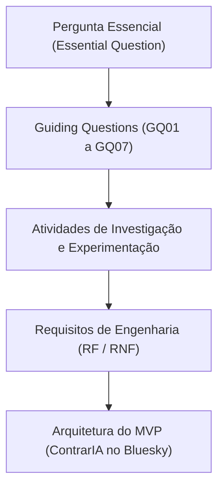

# Perguntas Norteadoras da Pesquisa (Guiding Questions)

Este documento consolida as **Guiding Questions (GQ)** formuladas e investigadas pela equipe ao longo das fases *Engage* e *Investigate* do projeto **ContrarIA**, no âmbito da metodologia **Challenge-Based Learning (CBL)** (*Challenge 1: Fake News / Desinformação*).

As perguntas norteadoras funcionam como a âncora epistemológica e técnica de todo o sistema. Elas estabelecem uma **rastreabilidade bidirecional** estrita com os Requisitos Funcionais (RF) e Não-Funcionais (RNF) definidos em [`docs/requisitos.md`](../requisitos.md) e com as matrizes formais descritas em [`docs/pesquisa/matrizes.md`](matrizes.md).

---

## 1. O Enquadramento Metodológico (CBL)

No framework CBL, o processo de aprendizagem e desenvolvimento de engenharia é estruturado em três fases cíclicas:

1. **Engage (Engajamento)**: Transição do tema macro (*Fake News*) para um desafio concreto (*Essential Question*), conectando impacto social, comportamento humano e restrições de tecnologia.
2. **Investigate (Investigação)**: Formulação das *Guiding Questions*, levantamento de literatura científica, análise de soluções de mercado e exploração de bases de dados abertas.
3. **Act (Ação / MVP)**: Síntese dos achados em requisitos de engenharia, arquitetura de software e desenvolvimento do produto mínimo viável na rede Bluesky.

### A Pergunta Essencial (*Essential Question*)

> *"Como sistemas de inteligência artificial podem ajudar as pessoas a avaliar a confiabilidade de informações sem substituir seu pensamento crítico?"*

A formulação desta pergunta essencial impôs uma premissa ética e comportamental fundamental: **o sistema não deve atuar como um tribunal orwelliano da verdade**, tampouco emitir sentenças dogmáticas que provoquem resistência psicológica. A atuação da IA deve, prioritariamente, catalisar o pensamento crítico, fornecendo evidências verificáveis e estimulando o discernimento dos cidadãos e espectadores.

---

## 2. Detalhamento das Guiding Questions (GQ)

Abaixo estão detalhadas as 7 perguntas norteadoras formuladas pela equipe, incluindo sua motivação investigativa, hipóteses de trabalho, fundamentação teórica e as conclusões técnicas que determinaram a arquitetura do MVP.

---

### GQ01: Como intervir sem gerar polarização e sem provocar o efeito *backfire*?

* **Pergunta formal:** Qual deve ser a abordagem conversacional e a estratégia de publicação do agente para reduzir a difusão de desinformação sem disparar resistência ideológica ou amplificar o conflito?
* **Justificativa e Hipótese:** A literatura de psicologia cognitiva (Nyhan & Reifler, 2010; Lewandowsky et al., 2020) demonstra que a refutação direta e agressiva (*debunking* tradicional) frequentemente gera o efeito *backfire*, no qual o indivíduo que compartilhou a desinformação reage entrincheirando-se ainda mais em sua crença original. Formulamos a hipótese de que o **método socrático** (perguntas abertas reflexivas aliadas a links factuais neutros) é superior à confrontação direta, e que o público-alvo prioritário da intervenção não é o emissor radicalizado, mas a audiência espectadora (*bystanders*).
* **Fundamentação Teórica:**
  - *The Debunking Handbook* (Lewandowsky et al., 2020): importância de preencher lacunas conceituais e evitar a repetição enfática do mito.
  - *Bystander Effect em Mídias Sociais*: a intervenção pública tem efeito profilático preventivo sobre terceiros que ainda não formaram juízo definitivo.
  - Método Socrático: estimula a metacognição e a avaliação epistêmica da fonte pelo próprio leitor.
* **Conclusões Técnicas para o MVP:**
  - O agente não responde no fio original como réplica agressiva nem marca diretamente o autor com `@`, adotando **Quote Post** não-invasivo em seu próprio perfil.
  - O tom da mensagem é obrigatoriamente neutro, reflexivo e fundamentado em evidências primárias checadas.
  - Adotou-se uma regra de **intervenção única por post** (RF14) para impedir disputas infinitas (*loops*) com perfis hostis.
* **Rastreabilidade:** RF04, RF05, RF06, RF08, RF10, RF14, RNF04, RNF05.

---

### GQ02: Como identificar e segregar perfis automatizados (bots) de usuários humanos legítimos?

* **Pergunta formal:** Quais características comportamentais, métricas de rede e metadados de conta viabilizam a estimativa probabilística de automação (*Bot Score*) de forma leve e em tempo real?
* **Justificativa e Hipótese:** Intervir com questionamentos socráticos reflexivos contra robôs de propaganda é um desperdício inútil de capacidade de inferência e quota de API, já que algoritmos não possuem cognição reflexiva. Hipotetizou-se que uma combinação ponderada de sinais do perfil (razão seguidores/seguindo, cadência de postagem, idade da conta e frequência de republicação) permite isolar contas inautênticas sem exigir pipelines caros de aprendizado profundo em tempo real.
* **Fundamentação Teórica:**
  - Pesquisas sobre detecção de spambots sociais (Cresci et al., 2017; Ferrara et al., 2016).
  - Padrões de atividade hiper-frequente e baixa reciprocidade social como marcadores de automação.
* **Conclusões Técnicas para o MVP:**
  - Criação da entidade pura `BotAssessment` (`api/app/domain/entities.py`) com pontuação de 0.0 a 1.0.
  - Para contas com *Bot Score* alto ($> 0.80$), a intervenção não dialoga: o sistema emite um alerta técnico objetivo e aciona rotulagem descentralizada (RF07).
  - Para contas híbridas ($0.50 \le \text{score} \le 0.80$) e humanas ($< 0.50$), o sistema modula a abordagem conforme a [Matriz de Decisão de Intervenção](matrizes.md).
* **Rastreabilidade:** RF02, RF06, RF07, RF12, RNF06.

---

### GQ03: Como avaliar a veracidade de alegações com modelos de linguagem minimizando alucinações e garantindo abstenção formal?

* **Pergunta formal:** Como arquitetar um pipeline de verificação factual que decomponha alegações complexas, consulte fontes externas confiáveis e declare explicitamente a impossibilidade de checagem quando as evidências forem insuficientes?
* **Justificativa e Hipótese:** LLMs puros operando em zero-shot são suscetíveis a alucinações graves e exibem calibragem de confiança inadequada. Hipotetizou-se que uma arquitetura em múltiplos estágios — combinando *Chain-of-Verification* (CoVe), *Self-RAG* (recuperação com autocrítica de fontes) e *Multi-Agent Debate* (MAD) com calibração via *Conformal Risk Control* (CRC) — assegura que o sistema apenas emita vereditos afirmativos sob alta certeza matemática, preferindo a abstenção (`INSUFFICIENT_EVIDENCE`) em zonas de ambiguidade.
* **Fundamentação Teórica:**
  - *Chain-of-Verification Reduces Hallucination* (Dhuliawala et al., 2023): decomposição da alegação em perguntas de checagem cruzada.
  - *Self-RAG* (Asai et al., 2023): tokens reflexivos para avaliar relevância de passagens recuperadas e aderência da resposta aos fatos.
  - *Multi-Agent Debate* (Liang et al., 2023): agentes em papéis antagônicos (promotor vs. defensor) com um juiz independente para mitigar viés de confirmação.
  - *Conformal Risk Control* (Angelopoulos et al., 2024): garantias estatísticas formais de taxa de erro com nota de corte empírica sobre dataset de calibração.
* **Conclusões Técnicas para o MVP:**
  - Implementação das portas `LLMPort` e `EvidenceSource` no domínio, com pipeline de 4 fases (Decomposição $\rightarrow$ Self-RAG $\rightarrow$ Debate Promotor/Defensor/Juiz $\rightarrow$ Calibração CRC).
  - Se a probabilidade do modelo não atingir a nota de corte calibrada pelo CRC, o veredito torna-se obrigatoriamente `insufficient_evidence`, acionando a abstenção pública (RNF01).
* **Rastreabilidade:** RF03, RF11, RF15, RF16, RNF01, RNF02.

---

### GQ04: Diante de um fluxo contínuo de posts e de cotas estritas de API, como priorizar os itens para processamento?

* **Pergunta formal:** Como selecionar, filtrar e enfileirar conteúdos do *firehose* público de modo que os recursos computacionais mais caros (inferência de LLMs e checagem factual) foquem nos eventos de maior risco e impacto coletivo?
* **Justificativa e Hipótese:** O fluxo em tempo real do Bluesky (via Jetstream) processa dezenas de mensagens por segundo. Processar todos os posts com modelos pesados levaria ao esgotamento imediato das cotas diárias de API (RNF05). Hipotetizou-se que uma matriz de triagem baseada em dois eixos ortogonais — **Velocidade de Disseminação/Engajamento** e **Potencial de Risco Temático** — viabiliza um sistema de filas com 4 níveis de prioridade (P0 a Descarte).
* **Fundamentação Teórica:**
  - Modelos epidemiológicos de difusão de informação em redes complexas (Vosoughi et al., 2018).
  - Engenharia de sistemas distribuídos orientada a prioridades e descarte antecipado (*early drop*).
* **Conclusões Técnicas para o MVP:**
  - Estruturação da [Matriz de Priorização da Fila](matrizes.md), onde posts de alto engajamento em temas críticos (eleições, saúde) recebem prioridade máxima (P0) no worker.
  - Posts de baixo alcance ou dúvidas marginais são armazenados no banco para análise passiva (`MONITOR`), sem disparar inferências desnecessárias.
* **Rastreabilidade:** RF01, RF04, RF08, RF09, RF10, RF13, RNF05.

---

### GQ05: Quais são as restrições técnicas, éticas e de conformidade do ecossistema Bluesky (AT Protocol)?

* **Pergunta formal:** Quais limites de taxa (*rate limits*), políticas de automação, diretrizes anti-spam e requisitos de transparência regem a operação de um agente autônomo na rede Bluesky?
* **Justificativa e Hipótese:** A operação de bots em redes sociais enfrenta rotineiramente bloqueios por comportamento considerado intrusivo ou automatização predatória. Investigou-se a especificação técnica do protocolo AT (Authenticated Transfer Protocol) e as diretrizes do Bluesky para desenhar uma integração que respeitasse o ecossistema federado e oferecesse total transparência.
* **Fundamentação Teórica:**
  - Especificação do AT Protocol (Bluesky Social PBC): arquitetura de PDS, AppView, Lexicons e XRPC.
  - Princípios de governança descentralizada e moderação composável (*composable moderation*).
* **Conclusões Técnicas para o MVP:**
  - Identificação pública explícita da conta como bot através da gravação de `self-label` no perfil via script `bsky_bot_setup.py`.
  - Persistência e reaproveitamento do token de sessão (`BLUESKY_SESSION_PATH`) para respeitar a cota rígida de `createSession` (300/dia e 30/5min).
  - Separação estrita de conexões: AppView pública desautenticada para leituras massivas e PDS autenticado estritamente para buscas e publicações.
  - Manutenção de logs imutáveis e auditáveis de cada ação e veredito para total conformidade regulatória (RNF06).
* **Rastreabilidade:** RF14, RNF03, RNF05, RNF06, RNF07.

---

### GQ06: Como definir e delimitar o escopo temático para o contexto nacional (PT-BR)?

* **Pergunta formal:** Quais tópicos constituem o domínio prioritário de atuação do MVP do ContrarIA e como diferenciar alegações factuais graves de opiniões, humor ou sátiras políticas?
* **Justificativa e Hipótese:** Desinformação política no Brasil envolve temas recorrentes de alta sensibilidade social (processo eleitoral, funcionamento das urnas eletrônicas, políticas públicas de saúde e atribuições constitucionais de poderes). Hipotetizou-se que restringir o escopo do MVP a tópicos com evidências documentais inequívocas e treinar um pré-filtro clássico de fake news previne que o agente intervenha em debates de opinião legítima ou em publicações humorísticas.
* **Fundamentação Teórica:**
  - Critérios de checabilidade da *International Fact-Checking Network* (IFCN): apenas alegações sobre fatos passados ou presentes verificáveis são passíveis de checagem; opiniões e predições futuras são não-checáveis.
  - Linguística computacional aplicada a sarcasmo e discurso político em português brasileiro.
* **Conclusões Técnicas para o MVP:**
  - Treinamento do pré-filtro leve supervisionado baseado no corpus nacional `Fake.br-Corpus` para pré-classificação em PT-BR.
  - Ingestão contínua de bases de dados do Tribunal Superior Eleitoral (TSE - Fato ou Boato) e agências associadas ao Projeto Comprova.
  - Implementação de módulo de verificação contextual (RF15) para descarte de sátiras antes da emissão de qualquer intervenção.
* **Rastreabilidade:** RF01, RF09, RF15.

---

### GQ07: Como implementar uma sinalização de conteúdos descentralizada e transparente sem centralizar poder de moderação?

* **Pergunta formal:** De que forma a infraestrutura do AT Protocol pode ser utilizada para rotular conteúdos desinformativos ou contas automatizadas, garantindo que o usuário mantenha total autonomia sobre suas preferências de visualização?
* **Justificativa e Hipótese:** Em plataformas centralizadas, a moderação é opaca e unilateral. O AT Protocol permite a existência de *Labelers* independentes, nos quais serviços de moderação emitem rótulos criptograficamente assinados e os usuários decidem voluntariamente se desejam assinar (*opt-in*) e aplicar esses rótulos em sua experiência de navegação.
* **Fundamentação Teórica:**
  - Moderação Federada e Descentralizada (Kleppmann et al., 2024; Bluesky moderation architecture).
  - Separação entre a camada de dados públicos e a camada de curadoria/moderação de conteúdo.
* **Conclusões Técnicas para o MVP:**
  - Instalação e deploy de uma instância oficial do servidor **Ozone** (`deploy/ozone/`) acoplada ao pipeline do ContrarIA.
  - Quando uma alegação é comprovadamente falsa ou um bot coordenado é detectado com alta certeza, o ContrarIA emite um rótulo no Ozone (`labeler`).
  - O usuário que subscreve o *Labeler* do ContrarIA no Bluesky recebe o alerta visual na interface da rede social, podendo configurar o nível de filtragem desejado (apenas aviso, ocultação ou desativação).
* **Rastreabilidade:** RF02, RF05, RF07, RF13, RNF04, RNF06.

---

## 3. Matriz de Rastreabilidade Bidirecional (GQ $\leftrightarrow$ Requisitos)

A tabela a seguir estabelece o mapeamento explícito entre as Perguntas Norteadoras da Pesquisa, os Requisitos do Sistema, os Artefatos Arquiteturais e as respectivas tarefas/issues:

| GQ | Eixo Temático | Requisitos Funcionais (RF) | Requisitos Não-Funcionais (RNF) | Módulo / Artefato Técnico | Issues Associadas |
|---|---|---|---|---|---|
| **GQ01** | Intervenção Socrática & Anti-Backfire | RF04, RF05, RF06, RF08, RF10, RF14 | RNF04, RNF05 | `app/services/intervention.py` [Matriz de Intervenção](matrizes.md) | [#12](https://github.com/moonshinerd/ContrarIA/issues/12), [#14](https://github.com/moonshinerd/ContrarIA/issues/14), [#17](https://github.com/moonshinerd/ContrarIA/issues/17) |
| **GQ02** | Detecção de Bots & Análise Heurística | RF02, RF06, RF07, RF12 | RNF06 | `app/services/bot_score.py` `domain/entities.py` (`BotAssessment`) | [#13](https://github.com/moonshinerd/ContrarIA/issues/13), [#18](https://github.com/moonshinerd/ContrarIA/issues/18) |
| **GQ03** | Verificação com Abstenção & Multiagente | RF03, RF11, RF15, RF16 | RNF01, RNF02 | `app/services/verification.py` `app/services/crc.py` `app/services/debate.py` | [#22](https://github.com/moonshinerd/ContrarIA/issues/22), [#23](https://github.com/moonshinerd/ContrarIA/issues/23), [#24](https://github.com/moonshinerd/ContrarIA/issues/24), [#25](https://github.com/moonshinerd/ContrarIA/issues/25) |
| **GQ04** | Triagem & Priorização de Fila | RF01, RF04, RF08, RF09, RF10, RF13 | RNF05 | `app/services/triage.py` [Matriz de Priorização](matrizes.md) | [#11](https://github.com/moonshinerd/ContrarIA/issues/11), [#12](https://github.com/moonshinerd/ContrarIA/issues/12), [#17](https://github.com/moonshinerd/ContrarIA/issues/17) |
| **GQ05** | Plataforma Bluesky & Auditoria | RF14 | RNF03, RNF05, RNF06, RNF07 | `app/clients/bluesky_client.py` `app/core/logging.py` | [#10](https://github.com/moonshinerd/ContrarIA/issues/10), [#14](https://github.com/moonshinerd/ContrarIA/issues/14), [#17](https://github.com/moonshinerd/ContrarIA/issues/17) |
| **GQ06** | Escopo Político & Filtro PT-BR | RF01, RF09, RF15 | RNF01 | `app/models/classifiers/fake_news_tfidf.py` `research/` | [#12](https://github.com/moonshinerd/ContrarIA/issues/12), [#26](https://github.com/moonshinerd/ContrarIA/issues/26) |
| **GQ07** | Rotulagem Descentralizada via Ozone | RF02, RF05, RF07, RF13 | RNF04, RNF06 | `deploy/ozone/` `app/clients/ozone_client.py` | [#15](https://github.com/moonshinerd/ContrarIA/issues/15), [#16](https://github.com/moonshinerd/ContrarIA/issues/16) |

---

## 4. Conclusão da Fase de Investigação

A sistematização destas 7 *Guiding Questions* permitiu à equipe:
1. Eliminar prematuramente soluções de alto custo ou baixo impacto (ex.: refutação direta via menção agressiva ou modelos pesados rodando em 100% dos posts do firehose).
2. Definir contratos de dados matematicamente formalizados antes de iniciar a codificação das trilhas de software.
3. Assegurar que nenhuma funcionalidade do MVP fosse desenvolvida sem justificativa teórica e metodológica explícita.

