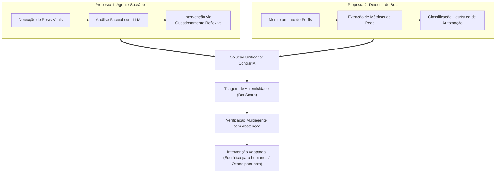
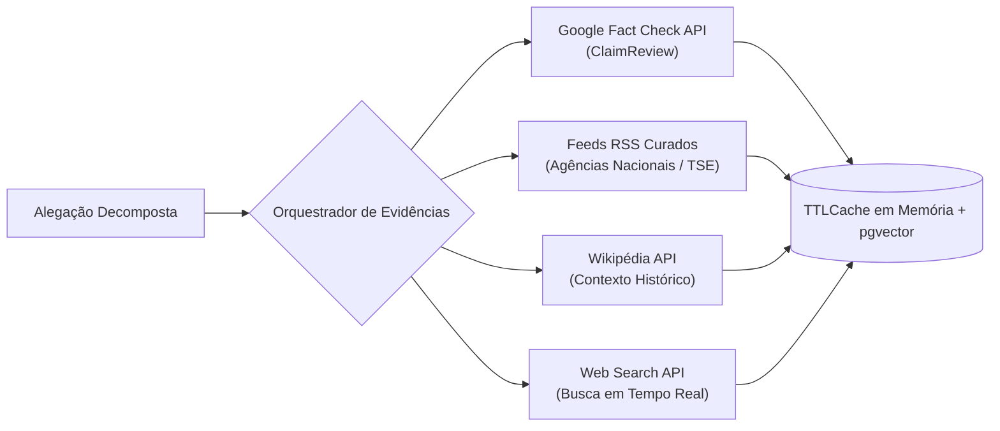

# Levantamento de Ideias, Fontes e Soluções Iniciais

Este documento registra o processo investigativo das fases *Engage* e *Investigate* do projeto **ContrarIA**, sintetizando as hipóteses iniciais de solução levantadas pela equipe, a análise crítica das tecnologias e abordagens existentes no mercado e na academia, o catálogo de fontes de evidência consultadas e os *datasets* avaliados para o treinamento e a calibração do sistema.

---

## 1. O Processo de Brainstorming Inicial (Fase Engage)

Durante a reunião inaugural de alinhamento metodológico (09/09/2026, registrada na [Ata de Reunião 01](../atas/ata01.md)), a equipe multidisciplinar dedicou-se à exploração de abordagens para responder à Pergunta Essencial: *"Como sistemas de IA podem ajudar as pessoas a avaliar a confiabilidade de informações sem substituir seu pensamento crítico?"*.

Foram inicialmente desenhadas **duas frentes conceituais independentes**:



### Proposta 1: Bot Socrático contra Desinformação e *Rage Bait*
* **Conceito:** Um agente conversacional autônomo que, ao identificar publicações com forte potencial desinformativo, não emite uma refutação categórica ("Isto é falso"), mas formula perguntas abertas orientadas pelo método socrático.
* **Objetivo:** Estimular o autor e os leitores a questionarem a procedência, a consistência lógica e a intencionalidade da informação compartilhada, quebrando o ciclo de engajamento emocional induzido por conteúdos inflamados (*rage bait*).
* **Desafio identificado:** Risco de alucinação do modelo de linguagem caso operasse sem ancoragem estrita em fontes externas (*RAG*), além do perigo de entrar em debates infinitos com usuários agressivos ou com outros agentes automatizados.

### Proposta 2: Detector e Classificador de Contas Inautênticas (Bots)
* **Conceito:** Um sistema voltado à identificação de padrões comportamentais de contas automatizadas (frequência anormal de postagem, replicação massiva de textos, ausência de reciprocidade em interações sociais).
* **Objetivo:** Isolar e sinalizar perfis automatizados que orquestram campanhas coordenadas de manipulação de opinião pública.
* **Desafio identificado:** Apenas classificar uma conta como bot não resolve o conteúdo desinformativo já disseminado; além disso, modelos pesados de grafos sociais seriam inviáveis computacionalmente para a escala de tempo real do MVP.

### A Decisão pela Solução Unificada
A equipe concluiu que a separação entre as duas propostas geraria soluções incompletas. A **unificação dos módulos** viabilizou o desenho do pipeline do **ContrarIA**:
1. O módulo de autenticidade comportamental (*Bot Score*) funciona como filtro e direcionador de estratégia.
2. O módulo de inteligência factual (*Verificação Multiagente*) analisa as alegações sob evidências documentais sólidas.
3. A estratégia de ação adapta-se: humanos recebem a intervenção socrática pedagógica; robôs de propaganda são rotulados via infraestrutura de moderação independente (Ozone) sem diálogo inútil.

---

## 2. Análise Crítica de Soluções e Paradigmas Existentes

A equipe realizou um estudo comparativo das principais abordagens utilizadas contemporaneamente para mitigar a desinformação em ambientes digitais:

| Solução / Modelo | Como Opera | Pontos Fortes | Limitações e Desafios | Decisão no ContrarIA |
|---|---|---|---|---|
| **Agências de Checagem Tradicionais** *(Lupa, Aos Fatos, Comprova)* | Jornalistas humanos investigam e produzem relatórios minuciosos. | Extremo rigor técnico, credibilidade institucional e alta precisão. | Baixa velocidade de resposta (horas ou dias); não acompanha a velocidade viral de difusão de fake news. | Ingerir suas checagens em tempo real como **fontes primárias de evidência** via API e feeds RSS. |
| **Notas da Comunidade** *(Community Notes do X)* | Usuários voluntários colaboram propondo notas; algoritmo de consenso busca acordo entre lados opostos. | Descentralização, alto volume e transparência no modelo de consenso. | Exige massa crítica gigantesca de usuários; vulnerável a *brigading* coordenado e atrasos na validação. | Absorver a filosofia de transparência e descentralização, aplicando-a através de *Labelers* independentes. |
| **Modelos Puros de Chat (LLM Zero-Shot)** *(ChatGPT, Claude)* | Análise textual direta baseada no conhecimento congelado no treinamento dos pesos. | Excelente capacidade de síntese e raciocínio verbal. | Alucinações frequentes, falta de atualização temporal e calibragem inadequada de certeza. | Rejeitar o uso puro: exigir arquitetura em camadas (**CoVe + Self-RAG + Debate Multiagente + CRC**). |
| **Detectores Tradicionais de Spambots** *(Botometer / OSoMe)* | Classificadores baseados em extração massiva de metadados da API do Twitter. | Identificação eficaz de bots industriais de primeira e segunda geração. | Incompatíveis com arquiteturas federadas modernas; custo elevado de extração de dados históricos. | Desenvolver algoritmo próprio, leve e heurístico adaptado ao ecossistema do AT Protocol. |

---

## 3. Justificativas das Escolhas Estruturais do MVP

Durante a transição da pesquisa teórica para a arquitetura de engenharia (consolidada na [Ata de Reunião 02](../atas/ata02.md)), foram tomadas quatro decisões estruturantes:

### 3.1 Por que a plataforma Bluesky (AT Protocol) em vez do X (Twitter)?
* **Abertura e Custo:** A API do X impõe barreiras tarifárias proibitivas para projetos acadêmicos e limitações de taxa severas no nível básico. O Bluesky oferece APIs públicas gratuitas, transparentes e acessíveis.
* **Firehose em Tempo Real:** O AT Protocol disponibiliza o serviço *Jetstream*, um fluxo websocket leve que transmite todos os eventos da rede em tempo real, viabilizando a triagem imediata de novos posts.
* **Moderação Descentralizada e Composável:** O Bluesky permite a criação de servidores de moderação independentes (**Ozone**). O usuário final tem a liberdade de escolher quais serviços de rotulagem deseja assinar (*opt-in*), alinhando-se aos princípios éticos do projeto.

### 3.2 Por que a intervenção via *Quote Post* e não via *Reply* Direto?
* **Prevenção do Efeito *Backfire*:** O confronto direto com um autor radicalizado na seção de comentários costuma gerar respostas defensivas agressivas. O *Quote Post* no perfil do próprio ContrarIA redireciona a conversa para a esfera pública neutra.
* **Conscientização de Espectadores (*Bystanders*):** A psicologia social demonstra que a maioria das pessoas que visualizam uma fake news em um feed social não interage com ela, mas pode ser influenciada passivamente. A intervenção pública informativa protege a audiência neutra.
* **Conformidade com Diretrizes Comunitárias:** O envio automatizado de respostas diretas não solicitadas nos fios alheios é frequentemente interpretado como spam ou assédio pelas políticas de moderação das plataformas. O *Quote Post* respeita a autonomia do usuário original.

### 3.3 Por que LiteLLM e Abstração de Provedores?
* **Prevenção de *Vendor Lock-in*:** A biblioteca `litellm` padroniza o formato de chamadas e respostas entre OpenAI, Anthropic, Google Gemini e provedores agregados (OpenRouter).
* **Resiliência Operacional:** Caso uma chave de API atinja a cota diária ou sofra indisponibilidade, o sistema pode alternar de modelo com uma simples alteração em arquivo de configuração.
* **Ambiente de Desenvolvimento Sem Custo:** Possibilidade de rotear inferências locais para instâncias do **Ollama** durante a fase de desenvolvimento e testes.

### 3.4 Por que o adiamento formal do Frontend Web (React)?
* **Foco no Núcleo de Valor:** A essência do desafio de engenharia reside na integridade matemática da verificação, na robustez do pipeline de coleta e no rigor do debate multiagente. Uma interface web gráfica consumiria esforço que foi alocado para a estabilização do backend e dos testes de estresse.

---

## 4. Catálogo de Fontes de Evidência Factual

Para que o agente verifique alegações com embasamento factual verídico (atendendo ao requisito **RF11**), foram selecionadas e catalogadas as seguintes fontes de dados:



### 1. Google Fact Check Tools API
* **Descrição:** Serviço que indexa checagens de fatos de organizações jornalísticas globais credenciadas, estruturadas sob o padrão Schema.org `ClaimReview`.
* **Formato de Dados:** JSON contendo `textualRating` (ex.: "Falso", "Distorcido"), URL da checagem original, data e entidade avaliadora.
* **Operação no ContrarIA:** Fonte de primeira linha para alegações com grande circulação nacional ou internacional. Opera com limitador de taxa (240 requisições/minuto) e cache local de 1 hora.

### 2. Feeds RSS de Agências de Checagem Nacionais
* **Descrição:** Coleta periódica automatizada dos canais de publicação das principais agências brasileiras de verificação:
  - *Agência Lupa*
  - *Aos Fatos*
  - *Projeto Comprova*
  - *UOL Confere*
  - *G1 - Fato ou Fake*
* **Operação no ContrarIA:** Ingestão periódica via job assíncrono executado pelo worker (`app/jobs/ingest_fact_articles.py`), com indexação vetorial e busca semântica via extensão `pgvector` no PostgreSQL.

### 3. Tribunal Superior Eleitoral (TSE - Fato ou Boato)
* **Descrição:** Canal oficial do TSE voltado ao esclarecimento de boatos e desinformações sobre o sistema eletrônico de votação, urnas eletrônicas e legitimidade do processo eleitoral brasileiro.
* **Relevância:** Essencial para cobrir o escopo temático prioritário de integridade democrática (GQ06).

### 4. Wikipédia REST API (Wikimedia)
* **Descrição:** Consulta estruturada ao acervo enciclopédico em língua portuguesa para recuperação de dados biográficos, termos jurídicos, marcos regulatórios e eventos históricos consolidados.
* **Operação no ContrarIA:** Chamadas assíncronas com no máximo 5 requisições concorrentes e cabeçalho `User-Agent` customizado e identificável, conforme exigido pelas políticas da Fundação Wikimedia.

### 5. Provedores de Busca na Web em Tempo Real (DuckDuckGo / Tavily)
* **Descrição:** Mecanismos de busca textual para recuperação de notas oficiais de órgãos públicos e matérias recentes de veículos de imprensa profissional sobre acontecimentos factuais de última hora.

---

## 5. Datasets Acadêmicos Avaliados

Para o treinamento dos classificadores de pré-triagem e para os testes de calibração estatística do Conformal Risk Control (CRC), foram pesquisados e avaliados os seguintes conjuntos de dados abertos:

### 1. Fake.br-Corpus (Monteiro et al., 2018)
* **Descrição:** O mais referenciado e rigoroso corpus de notícias falsas em português brasileiro, desenvolvido por pesquisadores do NILC/USP e UFSCar.
* **Estrutura:** 7.200 notícias (3.600 falsas e 3.600 verdadeiras), coletadas entre 2016 e 2018, balanceadas por tamanho de texto e categoria temática (Política, Economia, Sociedade).
* **Utilização no Projeto:** Treinamento supervisionado do pré-filtro clássico leve em `api/app/models/classifiers/fake_news_tfidf.py` e experimentos em `research/datasets/`.

### 2. FactCKPT / Datasets de Checagens em Português
* **Descrição:** Agrupamento de alegações factuais e vereditos consolidados extraídos de plataformas de checagem brasileiras.
* **Utilização no Projeto:** Validação dos prompts de decomposição de alegações (`research/claim_extraction_golden.json`) e benchmarks da acurácia de veredito (`research/experiments/calibrate_crc.py`).

### 3. Cresci Social Spambots Datasets (MIB / Cresci et al., 2017)
* **Descrição:** Conjunto de dados internacional com dezenas de milhares de contas catalogadas em humanos genuínos, spambots tradicionais e spambots sociais sofisticados.
* **Utilização no Projeto:** Identificação dos vetores estatísticos mais discriminantes para a composição da fórmula heurística do *Bot Score*.

---

## 6. Síntese dos Trade-offs de Engenharia

O processo investigativo documentado permitiu balancear restrições orçamentárias, éticas e de latência:

```
Complexidade Teórica Ideal                    Restrições Reais do Projeto (MVP)
──────────────────────────                    ───────────────────────────────────
Classificação profunda de grafos sociais  -->  Heurística leve de Bot Score em tempo real
Refutação em massa de todos os posts      -->  Triagem por matriz de prioridade (P0 a P2)
Modelo monolítico pesadíssimo             -->  CoVe + Self-RAG + Debate com abstenção (CRC)
Interface web completa com dashboards     -->  Serviço headless com log imutável e Ozone
```

