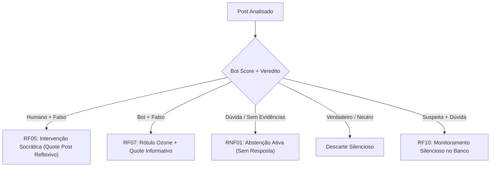

# Matrizes de Decisão do Sistema

Modelos formais de tomada de decisão, triagem de eventos e estratégias de intervenção do agente **ContrarIA**.

---

## 1. Contexto e Motivação de Engenharia

Em um ambiente de fluxo contínuo de dados em tempo real (*stream* do Bluesky via Jetstream), o sistema depara-se com restrições rígidas de projeto:
- **Limites de Recursos (RNF05)**: Quotas diárias de chamadas a modelos de linguagem (LLMs) e APIs externas de busca factual.
- **Conformidade de Plataforma (RNF03)**: Prevenção de comportamentos abusivos ou considerados spam na rede.
- **Impacto Comportamental (RNF04)**: Evitar o efeito *backfire* (onde correções agressivas reforçam a crença errônea) e priorizar a conscientização de espectadores neutros (*bystanders*).
- **Confiabilidade Algorítmica (RNF01)**: Minimização estrita de falsos positivos através do princípio da abstenção fundamentada.

Para garantir determinismo e reprodutibilidade, o agente opera sob **duas matrizes formais de decisão**:
1. **Matriz de Intervenção (GQ01)**: Determina *como* intervir após a análise de um conteúdo.
2. **Matriz de Priorização (GQ04)**: Determina *a ordem de processamento* na fila de triagem.

---

## 2. Matriz de Decisão de Intervenção (GQ01)

A matriz de intervenção cruza a **probabilidade de automação do autor** (*Bot Score*, gerado pelo módulo RF02/RF12) com a **classificação da alegação** (*Veredito Factual*, gerado pelo módulo de verificação RF03/RF25).

### Tabela de Decisão Operacional

| Autenticidade do Perfil (Bot Score) | Veredito: FALSO (Confiança ≥ 80%) | Veredito: INCONCLUSIVO (Evidências Insuficientes) | Veredito: VERDADEIRO / NÃO-FACTUAL |
|---|---|---|---|
| **Conta Humana Legítima** *(Bot Score < 0.50)* | **Ação: Intervenção Socrática (RF05)** Publicação de *Quote Post* utilizando formulações interrogativas reflexivas e links factuais neutros. Foco na audiência espectadora (*bystanders*). | **Ação: Abstenção Ativa (RF03 / RNF01)** O sistema não emite resposta. Registra métricas internamente sem intervenção pública. | **Ação: Descarte** Nenhuma ação. Post segue o fluxo normal da rede. |
| **Zona de Suspeita / Híbrida** *(0.50 ≤ Bot Score ≤ 0.80)* | **Ação: Intervenção Adaptada (RF06)** Resposta factual direta e objetiva, apontando a incoerência documental com citação da fonte primária checada. | **Ação: Monitoramento Silencioso (RF10)** Armazenamento do post e conta para detecção posterior de padrões repetitivos (RF12). | **Ação: Descarte** Nenhuma ação pública. |
| **Conta Automatizada / Bot** *(Bot Score > 0.80)* | **Ação: Rotulagem Técnica + Aviso (RF07)** Emissão de rótulo técnico no servidor de moderação Ozone e *Quote Post* puramente informativo. Não há diálogo com o autor. | **Ação: Registro de Telemetria (RF13)** Inclusão da conta na base de suspeitas para mineração de grafos e coordenação inautêntica. | **Ação: Descarte** Nenhuma ação pública. |

### Justificativa dos Estados
- **Intervenção Socrática vs. Confronto**: Estudos de comunicação em mídias sociais indicam que refutações diretas aumentam a polarização. O questionamento socrático estimula o pensamento crítico dos leitores secundários sem atacar a identidade do autor original.
- **Princípio da Abstenção**: Acusar falsamente uma publicação verdadeira ou inconclusiva destrói a confiança no sistema. Quando as fontes de evidência divergem ou a confiança é baixa, o agente adota **abstenção mandatória**.
- **Segregação de Bots**: Modelos de conversação socrática são ineficazes contra bots programados. Para bots, a resposta adequada é a contenção algorítmica via rotulagem (Ozone) e alerta à plataforma.

---

## 3. Matriz de Priorização da Fila de Triagem (GQ04)

Como o volume de posts coletados via *Jetstream* excede a capacidade de inferência em tempo real dos modelos mais pesados, uma matriz de triagem prévia classifica os itens em quatro níveis de urgência.

A priorização cruza a **Velocidade de Disseminação / Viralidade** com o **Potencial de Risco Temático**:

### Tabela de Priorização de Fila

| Potencial de Risco Temático | Viralidade Alta *(> 50 engajamentos/min)* | Viralidade Média *(10 a 50 engajamentos/min)* | Viralidade Baixa *(Post isolado ou recente)* |
|---|---|---|---|
| **Crítico / Alta Sensibilidade** *(Integridade eleitoral, instituições democráticas, saúde pública)* | **Prioridade P0 (Imediata)** Encaminhado sem espera ao pipeline completo de checagem multiagente. | **Prioridade P1 (Alta)** Fila prioritária com verificação concorrente. | **Prioridade P2 (Regular)** Fila de lote (*batch*) executada sob demanda. |
| **Moderado** *(Declarações públicas distorcidas, citações fora de contexto)* | **Prioridade P1 (Alta)** Fila prioritária. | **Prioridade P2 (Regular)** Fila de processamento padrão. | **Monitoramento Silencioso (RF10)** Persistência em banco para análise histórica, sem consumo de LLM. |
| **Baixo / Fora do Escopo** *(Opiniões subjetivas, sátiras evidentes, entretenimento)* | **Monitoramento Silencioso** Armazenamento apenas para fins de calibração estatística. | **Descarte (RF09)** Filtro temático descarta a postagem do pipeline. | **Descarte (RF09)** Descarte imediato no pré-filtro. |

---

## 4. Rastreabilidade com os Requisitos do Sistema

As regras modeladas nestas matrizes fornecem a lógica de controle para os seguintes requisitos de engenharia:

| Requisito | Denominação | Como a Matriz Atende |
|---|---|---|
| **RF04** | Priorização da intervenção | Aplica a Matriz de Priorização (GQ04) para ordenar a fila de trabalho. |
| **RF05** | Intervenção socrática | Define a estratégia obrigatória para autores humanos em alegações falsas. |
| **RF06** | Adaptação da estratégia | Ajusta o tom e o canal de intervenção conforme o *Bot Score*. |
| **RF07** | Sinalização de contas | Aciona a rotulagem técnica via Ozone para perfis automatizados com alta certeza. |
| **RF08** | Classificação de relevância | Fornece os eixos de engajamento e velocidade na Matriz de Triagem. |
| **RF09** | Filtragem temática | Elimina da fila tópicos irrelevantes ou fora do escopo do MVP. |
| **RF10** | Monitoramento sem intervenção | Cria o estado de observação para casos inconclusivos ou de baixo alcance. |
| **RF14** | Prevenção de loops adversários | Limita o agente a uma única intervenção socrática por fio, impedindo ataques de negação de serviço. |
| **RNF01** | Confiabilidade da classificação | Estabelece o princípio da abstenção mandatória diante de baixa confiança. |
| **RNF04** | Neutralidade das respostas | Garante que nenhuma ação utilize linguagem acusatória ou polarizada. |
