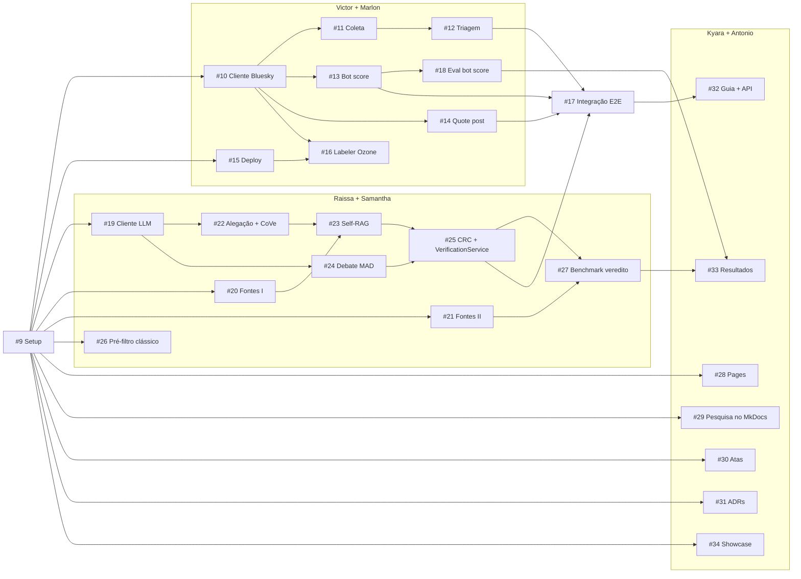

# Planejamento do MVP

Este documento explica a lógica por trás do [Project "ContrarIA — MVP"](https://github.com/users/moonshinerd/projects/4), não só o resultado. A estrutura vem do [planejamento do Medscriba](https://github.com/Medscriba/medscriba/blob/main/docs/PLANEJAMENTO.md), adaptada a uma restrição diferente: **temos semana e meia (17/09 a 26/09) para o MVP inteiro**.

## Por que não há sprints

O Medscriba usa elaboração progressiva: só detalha a sprint que vai começar. Aqui não há tempo para ciclos: o planejamento é **completo desde o início**. No lugar de sprints, três mecanismos:

1. **Duplas**: cada tarefa é feita por uma dupla, que aparece como os dois *assignees* da issue.
2. **Trilhas paralelas**: cada dupla tem uma área própria e raramente espera pela outra.
3. **Dependências explícitas**: *Relationships → Blocked by*, nativo do GitHub. Uma tarefa só começa quando tudo que a bloqueia está fechado.

## Duplas e trilhas

| Dupla | Trilha | Épicos |
|---|---|---|
| Victor + Marlon | Infra/deploy, coleta e triagem, bot score, intervenção, labeler, integração | [#1](https://github.com/moonshinerd/ContrarIA/issues/1), [#2](https://github.com/moonshinerd/ContrarIA/issues/2), [#3](https://github.com/moonshinerd/ContrarIA/issues/3), [#5](https://github.com/moonshinerd/ContrarIA/issues/5) |
| Raissa + Samantha | Verificação (LLM, fontes, CoVe, Self-RAG, debate, CRC) e benchmark | [#4](https://github.com/moonshinerd/ContrarIA/issues/4), [#6](https://github.com/moonshinerd/ContrarIA/issues/6) |
| Kyara + Antonio | Documentação, atas, ADRs e showcase, **100% via GitHub**, sem código | [#7](https://github.com/moonshinerd/ContrarIA/issues/7) |

## Como as dependências foram minimizadas

**Contrato primeiro.** O setup inicial ([#9](https://github.com/moonshinerd/ContrarIA/issues/9)) já entrega as entidades de domínio (`api/app/domain/entities.py`) e as portas abstratas (`LLMPort`, `EvidenceSource`, `TextClassifierPort`). Cada dupla desenvolve contra essas interfaces usando *fakes* nos testes. Por exemplo, a intervenção ([#14](https://github.com/moonshinerd/ContrarIA/issues/14)) usa o `FakeLLM` e não precisa esperar o cliente LLM real ([#19](https://github.com/moonshinerd/ContrarIA/issues/19)).

**Integração em issue própria.** As trilhas só se encontram na issue com label `integracao`: [#17](https://github.com/moonshinerd/ContrarIA/issues/17) liga coleta, bot score e intervenção (Victor + Marlon) à verificação (Raissa + Samantha). Até lá, ninguém bloqueia ninguém.

**Só dependências reais.** "Seria bom ter X pronto" não vira *blocked by*: vira uma menção no corpo da issue. O pré-filtro clássico ([#26](https://github.com/moonshinerd/ContrarIA/issues/26)), por exemplo, é **opcional** no pipeline e não bloqueia a integração.

## Cronograma

| Janela | Victor + Marlon | Raissa + Samantha | Kyara + Antonio |
|---|---|---|---|
| 16/09 | #9 Setup (Victor) | | #30 Atas (contínua até 26/09) |
| 17/09 | #10 Cliente Bluesky | #19 Cliente LLM · #26 Pré-filtro (17–18) | #28 Pages (17–18) · #29 Pesquisa (17–19) |
| 18–19/09 | #11 Coleta · #13 Bot score | #20 Fontes I (18) | #31 ADRs (18–22) |
| 19–20/09 | ↓ | #22 Alegação + CoVe · #21 Fontes II | ↓ |
| 20–21/09 | #12 Triagem · #15 Deploy | ↓ | ↓ |
| 21–22/09 | ↓ | #23 Self-RAG · #24 Debate | ↓ |
| 22–23/09 | #14 Quote post · #16 Labeler | #25 CRC (23) | |
| 24–25/09 | **#17 Integração** · #18 Eval bot score | #27 Benchmark | #34 Showcase (24–26) |
| 25–26/09 | | | #32 Guia + API · #33 Resultados |
| **26/09** | **Congelamento do código, ensaio do showcase** | | |

As duas pessoas da dupla podem tocar em paralelo duas issues da mesma janela (ex.: #11 e #13). O PR de cada uma é revisado pela outra pessoa.

## Épico e tarefa

| | Épico | Tarefa |
|---|---|---|
| Representa | Entregável macro (um bloco de requisitos) | Item acionável de 1–2 dias |
| Label | `epic` | `area/*`, `prioridade/*`, `dupla/*` |
| Milestone | Nenhum (cobre vários dias; mesmo racional do Medscriba) | `MVP – Showcase (26/09)` |
| Relação | Pai | [Sub-issue](https://docs.github.com/en/issues/tracking-your-work-with-issues/using-issues/adding-sub-issues) nativa do épico |

O épico [#8](https://github.com/moonshinerd/ContrarIA/issues/8) (painel web) é **pós-MVP**: existe só para a ideia não se perder e não tem tarefas.

## Campos do Project

- **Status**: `Backlog` → `Pronta` (todos os *blocked by* fechados) → `Em andamento` → `Em revisão` (PR aberto) → `Concluída`; `Pós-MVP` para o que está fora do escopo.
- **Área**, **Prioridade** (P0 bloqueante … P3), **Dupla**: espelham as labels, para filtrar e agrupar dentro do Project.
- **Início / Entrega**: janela planejada, alimentam a view Roadmap.

### Views

| # | View | Layout | Filtro | Para quê |
|---|---|---|---|---|
| 1 | Backlog Geral | Tabela | — | Tudo: épicos e tarefas |
| 2 | Board | Board | sem épicos e sem pós-MVP | Fluxo de Status do MVP inteiro |
| 3 | Por dupla | Tabela | sem épicos e sem pós-MVP | Agrupar por `Dupla`, ordenar por `Início` |
| 4 | Roadmap | Roadmap | sem pós-MVP | Gantt por `Início`/`Entrega` |
| 5 | Épicos | Tabela | `label:epic` | Progresso das sub-issues de cada épico |
| 6–8 | Victor + Marlon · Raissa + Samantha · Kyara + Antonio | Board | `dupla:"..."` | Board de cada dupla |
| 9 | Minhas tarefas | Board | `assignee:@me` | O que é seu, para quem abrir o Project |

Todas criadas via API com `gh`: a REST `POST /users/{login}/projectsV2/{n}/views` aceita `group_by`, `vertical_group_by` e `sort_by`, que o GraphQL não aceita (lá esses campos são só leitura). Board: colunas por `Status`; *Por dupla* e *Roadmap*: agrupadas por `Dupla`; tudo ordenado por `Início` (o Board, por `Prioridade`). A única coisa que nenhuma das duas APIs expõe são os *date fields* do Roadmap: se a barra não aparecer, menu ▾ da view → *Date fields* → `Início` / `Entrega`.

## Rotina

1. **Ao fechar uma issue**, abrir as que ela bloqueava (*Relationships* na lateral) e mover para `Pronta` as que ficaram sem bloqueio.
2. **Ao começar**: branch `feature/<descrição>`, Status `Em andamento`.
3. **Ao abrir o PR**: `Closes #N`, Status `Em revisão`, revisão pela outra pessoa da dupla.
4. **Se uma issue atrasar** e travar outra dupla: registrar na ata do checkpoint ([#30](https://github.com/moonshinerd/ContrarIA/issues/30)) e decidir se o bloqueado segue com fake ou se as duplas trocam de tarefa.
5. **Mudança em `app/domain/entities.py`** é mudança de contrato: avisar as outras duplas no PR.

## Requisitos → issues

A rastreabilidade RF/RNF → issue fica em `docs/requisitos.md` ([#29](https://github.com/moonshinerd/ContrarIA/issues/29)).
