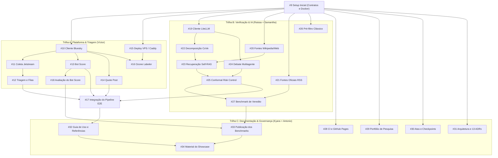
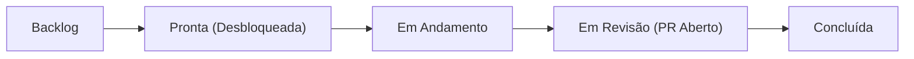

# Planejamento e Estratégia do MVP

Este documento formaliza a metodologia de trabalho, a divisão de responsabilidades e a engenharia de dependências adotadas para a construção do **Produto Mínimo Viável (MVP)** do projeto **ContrarIA**, planejado e executado na janela intensiva de **16 a 26 de setembro de 2026**.

---

## 1. Racional Metodológico: Fluxo Contínuo e Engenharia Baseada em Contratos

Diante de um horizonte de desenvolvimento reduzido a dez dias para a entrega de um protótipo com alta complexidade técnica (processamento distribuído, múltiplos provedores de LLM, verificação epistêmica e integração ao protocolo federado do Bluesky), o modelo tradicional de Sprints sucessivas de duas semanas mostrou-se inviável.

Adotou-se, portanto, uma abordagem de **Engenharia Concorrente Orientada a Contratos (*Contract-First Architecture*)**, sustentada por três pilares operacionais:

1. **Atuação em Duplas Especializadas:** Cada frente de trabalho é executada por uma dupla com atribuições bem delimitadas e papéis formais no processo ágil, atuando como code reviewers mútuos.
2. **Trilhas Paralelas Independentes:** A esteira de engenharia foi decomposta em eixos funcionais ortogonais (Coleta/Infra, Inteligência/Verificação e Governança/Documentação), permitindo desenvolvimento assíncrono sem bloqueios prematuros.
3. **Mapeamento Explícito de Bloqueios (*Blocked by*):** As relações de precedência técnica foram estabelecidas nativamente no GitHub. Nenhuma tarefa tem início antes do fechamento de seus pré-requisitos essenciais, e o teste de cada módulo baseia-se em *fakes* e abstrações desacopladas.

---

## 2. Estrutura de Trilhas de Execução

A equipe distribuiu suas competências em três trilhas operacionais complementares:

| Trilha | Responsáveis | Competência Técnica | Escopo de Entregas |
|---|---|---|---|
| **Trilha A: Plataforma & Triagem** | **Víctor Schmidt** | Product Owner & Engenharia de Plataforma | Infraestrutura e deploy VPS, cliente AT Protocol/Bluesky, ingestão Jetstream, triagem heurística e filas, Bot Score comportamental, servidor Ozone Labeler e orquestração do pipeline E2E. |
| **Trilha B: Verificação & IA** | **Raissa Silva + Samantha Tanaka** | Engenharia de IA & Verificação Factual | Integração LiteLLM/OpenRouter, decomposição de alegações (CoVe), recuperação multi-fonte (Self-RAG), Debate Multiagente (MAD), calibração Conformal Risk Control (CRC) e suíte de benchmarks. |
| **Trilha C: Documentação & Governança** | **Kyara Esteves + Antonio Leonardo** | Governança, Arquitetura & Showcase | Portfólio de pesquisa e perguntas norteadoras (GQ01–GQ07), matrizes de decisão, especificação de requisitos MoSCoW, atas de checkpoints, 13 ADRs arquiteturais, glossário, benchmarks e material do showcase. |

---

## 3. Minimização de Dependências: A Abordagem *Contract-First*

Para que as três frentes pudessem codificar e documentar simultaneamente desde o primeiro dia, estabeleceram-se três diretrizes de arquitetura:

* **Contratos Estáveis no Setup Inicial ([Issue #9](https://github.com/moonshinerd/ContrarIA/issues/9)):** A definição prévia das entidades imutáveis do domínio (`app/domain/entities.py`) e das interfaces abstratas de comunicação (`LLMPort`, `EvidenceSource`, `TextClassifierPort`) permitiu que cada módulo fosse desenvolvido e testado de forma isolada através de classes *fake* (como `FakeLLM`, `FakeEvidenceSource`), sem depender da conclusão de serviços externos.
* **Ponto Único de Integração ([Issue #17](https://github.com/moonshinerd/ContrarIA/issues/17)):** O pipeline só exigiu a união dos módulos das duplas na etapa final de integração ponta a ponta (*E2E*), na qual a esteira de coleta e intervenção (Trilha A) conectou-se ao motor de verificação factual (Trilha B). Até essa etapa, o desenvolvimento progrediu 100% em paralelo.
* **Dependências Exclusivamente Críticas:** Sugestões de melhorias ou extensões não essenciais (como a acurácia opcional do pré-filtro supervisionado) foram classificadas como não-bloqueantes, impedindo paradas desnecessárias no cronograma.

---

## 4. Grafo de Precedência Técnica e Interdependências

O diagrama a seguir sintetiza a árvore de dependências das tarefas, ilustrando como o setup inicial liberou as trilhas e onde os pontos de convergência ocorreram:

```mermaid
flowchart TD
    Setup["#9 Setup Inicial (Contratos e Docker)"]

    subgraph TrilhaA["Trilha A: Plataforma & Triagem (Víctor)"]
        A1["#10 Cliente Bluesky"] --> A2["#11 Coleta Jetstream"] --> A3["#12 Triagem e Filas"]
        A1 --> A4["#13 Bot Score"] --> R3["#18 Avaliação do Bot Score"]
        A1 --> A5["#14 Quote Post"]
        A6["#15 Deploy VPS / Caddy"] --> A7["#16 Ozone Labeler"]
        A1 --> A7
    end

    subgraph TrilhaB["Trilha B: Verificação & IA (Raissa + Samantha)"]
        B1["#19 Cliente LiteLLM"] --> B4["#22 Decomposição CoVe"] --> B5["#23 Recuperação Self-RAG"]
        B2["#20 Fontes Wikipedia/Web"] --> B5
        B1 --> B6["#24 Debate Multiagente"]
        B5 --> B7["#25 Conformal Risk Control"]
        B6 --> B7
        B3["#21 Fontes Oficiais RSS"] --> R2["#27 Benchmark de Veredito"]
        B7 --> R2
        R1["#26 Pré-filtro Clássico"]
    end

    subgraph TrilhaDoc["Trilha C: Documentação & Governança (Kyara + Antonio)"]
        D1["#28 CI e GitHub Pages"]
        D2["#29 Portfólio de Pesquisa"]
        D3["#30 Atas e Checkpoints"]
        D4["#31 Arquitetura e 13 ADRs"]
        D5["#32 Guia de Uso e Referências"]
        D6["#33 Publicação dos Benchmarks"]
        D7["#34 Material do Showcase"]
    end

    %% Ponto de partida
    Setup --> A1 & A6 & B1 & B2 & B3 & R1 & D1 & D2 & D3 & D4

    %% Convergência E2E
    A3 & A4 & A5 & B7 --> Integ["#17 Integração do Pipeline E2E"]
    Integ --> D5
    R2 & R3 --> D6
    D5 & D6 --> D7

```

---

## 5. Cronograma Executivo de Entregas (16/09 a 26/09)

O plano de execução foi distribuído em janelas diárias sincronizadas, garantindo entregas incrementais contínuas até a consolidação para o showcase:

| Janela Temporal | Trilha A (Víctor) | Trilha B (Raissa + Samantha) | Trilha C (Kyara + Antonio) | Marco do Projeto |
|:---:|---|---|---|---|
| **16/09** | [#9](https://github.com/moonshinerd/ContrarIA/issues/9) Setup Inicial e Infraestrutura | Planejamento de interfaces | [#30](https://github.com/moonshinerd/ContrarIA/issues/30) Abertura das Atas e Checkpoints | Início Oficial do MVP |
| **17/09** | [#10](https://github.com/moonshinerd/ContrarIA/issues/10) Cliente Bluesky | [#19](https://github.com/moonshinerd/ContrarIA/issues/19) Cliente LiteLLM / [#26](https://github.com/moonshinerd/ContrarIA/issues/26) Pré-filtro | [#28](https://github.com/moonshinerd/ContrarIA/issues/28) CI do MkDocs / [#29](https://github.com/moonshinerd/ContrarIA/issues/29) Pesquisa | Primeira versão do site |
| **18–19/09** | [#11](https://github.com/moonshinerd/ContrarIA/issues/11) Ingestão Jetstream / [#13](https://github.com/moonshinerd/ContrarIA/issues/13) Bot Score | [#20](https://github.com/moonshinerd/ContrarIA/issues/20) Fontes de Evidência I | [#31](https://github.com/moonshinerd/ContrarIA/issues/31) Redação das ADRs de Arquitetura | Pipeline de Coleta ativo |
| **19–20/09** | Testes de carga na esteira de eventos | [#22](https://github.com/moonshinerd/ContrarIA/issues/22) Decomposição CoVe / [#21](https://github.com/moonshinerd/ContrarIA/issues/21) Fontes II | Elaboração das matrizes de triagem | Conexão de busca web |
| **20–21/09** | [#12](https://github.com/moonshinerd/ContrarIA/issues/12) Triagem / [#15](https://github.com/moonshinerd/ContrarIA/issues/15) Deploy VPS | Refinamento de prompts com CoVe | Documentação dos requisitos MoSCoW | Ambiente de produção ativo |
| **21–22/09** | Validação perimetral e TLS (Caddy) | [#23](https://github.com/moonshinerd/ContrarIA/issues/23) Self-RAG / [#24](https://github.com/moonshinerd/ContrarIA/issues/24) Debate MAD | Consolidação de Atas (Checkpoint 2) | Motor de verificação pronto |
| **22–23/09** | [#14](https://github.com/moonshinerd/ContrarIA/issues/14) Quote Post / [#16](https://github.com/moonshinerd/ContrarIA/issues/16) Labeler Ozone | [#25](https://github.com/moonshinerd/ContrarIA/issues/25) Calibração CRC em tempo real | Revisão formal de referências e ADRs | Moderação federada ativa |
| **24–25/09** | **[#17](https://github.com/moonshinerd/ContrarIA/issues/17) Integração E2E** / [#18](https://github.com/moonshinerd/ContrarIA/issues/18) Eval Bot Score | [#27](https://github.com/moonshinerd/ContrarIA/issues/27) Benchmark de Veredito | [#34](https://github.com/moonshinerd/ContrarIA/issues/34) Estrutura do Showcase | Pipeline ponta a ponta verde |
| **25–26/09** | Validação em produção e testes de estresse | Apuração final de métricas e ablações | [#32](https://github.com/moonshinerd/ContrarIA/issues/32) Guia de Uso / [#33](https://github.com/moonshinerd/ContrarIA/issues/33) Resultados | Documentação completa |
| **26/09** | **Congelamento de Código (*Code Freeze*)** | **Ensaio Técnico Geral da Demonstração** | **Validação Final dos Slides e Roteiro** | **Showcase Oficial** |

---

## 6. Governança e Acompanhamento no GitHub Projects

A gestão operacional das atividades foi centralizada no [GitHub Projects do ContrarIA](https://github.com/users/moonshinerd/projects/4), orientada pelas seguintes diretrizes:

### Hierarquia entre Épicos e Tarefas
* **Épicos (`label: epic`):** Representam os grandes agrupamentos de requisitos e objetivos de negócio do sistema (ex.: Coleta, Verificação, Governança).
* **Tarefas Técnicas:** Itens de trabalho com granularidade de 1 a 2 dias, atribuídos explicitamente aos dois integrantes da respectiva dupla (`dupla/*`), com rótulo de prioridade (`prioridade/P0` a `P3`) e vinculados ao Milestone `MVP – Showcase (26/09)`.

### Fluxo de Estados (*Lifecycle*)

```mermaid
flowchart LR
    A["Backlog"] --> B["Pronta (Desbloqueada)"] --> C["Em Andamento"] --> D["Em Revisão (PR Aberto)"] --> E["Concluída"]
```

1. **Abertura de Bloqueios:** Ao fechar uma issue, o GitHub atualiza os relacionamentos de dependência, movendo automaticamente para `Pronta` as tarefas que tiveram todos os seus pré-requisitos satisfeitos.
2. **Revisão Paritária Mandatória:** Todo Pull Request deve ser aberto com descrição detalhada e critérios de aceitação, sendo obrigatoriamente revisado e aprovado pelo colega de dupla antes da integração na branch `main`.
3. **Respeito à Estabilidade dos Contratos:** Qualquer alteração nos esquemas de entidades (`app/domain/entities.py`) exige notificação expressa e alinhamento com as demais duplas no canal de comunicação do projeto.
