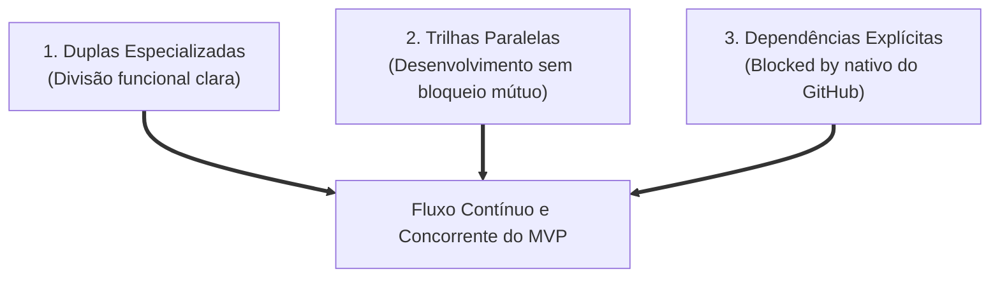
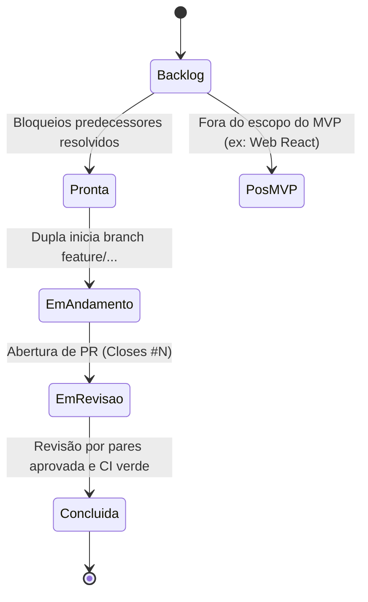

# Metodologia Ágil e Estrutura Scrum

Este documento formaliza a metodologia de gestão, o modelo de governança ágil e a distribuição de papéis adotados pela equipe no desenvolvimento do projeto **ContrarIA**.

A governança do projeto foi desenhada para conciliar o rigor do desenvolvimento de software com uma restrição severa de tempo: **uma janela de execução de apenas 10 dias corridos (17/09 a 26/09/2026)** para entrega do MVP funcional no encerramento do *Challenge 1: Fake News / Desinformação*.

---

## 1. Adaptação do Framework Scrum para Janela Crítica

Modelos tradicionais de Scrum utilizam ciclos iterativos de *Sprints* de 2 a 4 semanas, com refinamento progressivo do backlog a cada ciclo. No contexto de uma entrega de dez dias, essa abordagem inviabilizaria a coordenação, pois o tempo de planejamento fragmentado consumiria a maior parte do cronograma de engenharia.

A equipe adotou uma adaptação inspirada na engenharia do projeto [Medscriba](https://github.com/Medscriba/medscriba), substituindo as *sprints* convencionais por **três pilares estruturantes**:



1. **Planejamento Completo e Antecipado:** Todo o escopo de requisitos, épicos e tarefas foi mapeado antes do início da implementação ([docs/planejamento.md](../planejamento.md)).
2. **Duplas em Trilhas Paralelas:** Três duplas atuam concorrentemente em áreas de competência distintas, evitando sobreposição de escopo e reduzindo gargalos de comunicação.
3. **Desenvolvimento Orientado a Contratos:** O contrato de interfaces (`api/app/domain/entities.py`, `LLMPort`, `EvidenceSource`) foi congelado no primeiro dia. Cada dupla pôde desenvolver contra abstrações utilizando *fakes* e *mocks* nos testes, postergando o acoplamento físico para a etapa de integração.
4. **Dependências Explícitas no GitHub:** O fluxo de trabalho é orquestrado via relações nativas de dependência (*Relationships $\rightarrow$ Blocked by*). Uma issue só passa para o status `Pronta` quando todas as suas predecessoras forem concluídas e mergeadas.

---

## 2. Papéis e Responsabilidades no Time

A distribuição de responsabilidades combinou papéis clássicos do Scrum com a formação de duplas funcionais de engenharia e governança:

| Integrante | GitHub | Papel no Scrum | Trilha Operacional | Escopo de Entrega Primário |
|---|---|---|---|---|
| **Víctor Hugo Lima Schmidt** | [@moonshinerd](https://github.com/moonshinerd) | **Product Owner (PO)** | Dupla de Código A | Visão do produto, arquitetura de deploy, cliente Bluesky, Ozone, integração E2E e releases. |
| **Marlon Martins Braga** | [@MylinDev](https://github.com/MylinDev) | **Scrum Master (SM)** | Dupla de Código A | Facilitação ágil, disciplina do board, infraestrutura Docker, Jetstream, Bot Score e Quote Post. |
| **Raissa Silva** | [@RaissaOliveira19](https://github.com/RaissaOliveira19) | **Developer** | Dupla de Código B | Portas LLM (LiteLLM), fontes de evidência primárias (Wikipedia, Google Fact Check) e Self-RAG. |
| **Samantha Yumi Tanaka** | [@ySamantha](https://github.com/ySamantha) | **Developer** | Dupla de Código B | Provedores de busca web/RSS, decomposição CoVe, Debate Multiagente, calibração CRC e benchmarks. |
| **Kyara Esteves de Sousa** | [@Kyara2](https://github.com/Kyara2) | **Developer** | Dupla de Documentação | Pesquisa teórica (Guiding Questions, Ideias e Fontes), matrizes de decisão, autoavaliações e guia de uso. |
| **Antonio Leonardo Souto Gomes** | [@AntonioLeonardoUNB](https://github.com/AntonioLeonardoUNB) | **Developer** | Dupla de Documentação | Deploy do MkDocs via Pages, atas de reunião, acompanhamento de checkpoints, ADRs e material do showcase. |

### Atribuições dos Papéis de Liderança

* **Product Owner (Víctor Schmidt):**
  - Mantém o alinhamento do MVP com as diretrizes do desafio do CBL e com os Requisitos do Sistema.
  - Define os critérios de aceitação e aprova os Pull Requests de integração final.
  - Gerencia o provisionamento de infraestrutura (VPS, domínios, instâncias do Ozone e credenciais seguras de API).
* **Scrum Master (Marlon Braga):**
  - Monitora o fluxo do GitHub Projects e remove impedimentos técnicos nas duplas.
  - Garante a adesão estrita às políticas de branch, commits e revisão por pares.
  - Coordena o alinhamento assíncrono dos checkpoints operacionais a cada dois dias.

---

## 3. Gestão Visual no GitHub Projects

A gestão visual de tarefas ocorre centralizadamente no [Project ContrarIA — MVP](https://github.com/users/moonshinerd/projects/4), estruturado com **9 visualizações (*views*) especializadas**:

```
Views do Board:
├── 1. Backlog Geral (Tabela completa com épicos e tarefas)
├── 2. Board de Fluxo (Kanban de status do MVP sem pós-MVP)
├── 3. Por Dupla (Tabela agrupada por dupla e ordenada por início)
├── 4. Roadmap (Gráfico de Gantt temporal por data de entrega)
├── 5. Épicos (Progresso consolidado das sub-issues)
├── 6. Victor + Marlon (Quadro kanban individual da Dupla A)
├── 7. Raissa + Samantha (Quadro kanban individual da Dupla B)
├── 8. Kyara + Antonio (Quadro kanban individual da Dupla de Documentação)
└── 9. Minhas Tarefas (Filtro dinâmico por assignee)
```

### Ciclo de Vida dos Estados (*Status*)



1. **Backlog:** Tarefa mapeada, com prioridade e estimativa de janela, mas com dependências técnicas em aberto.
2. **Pronta (*Ready*):** Todos os itens bloqueantes (*Blocked by*) foram concluídos; a tarefa está apta para início imediato.
3. **Em andamento (*In Progress*):** Branch de desenvolvimento ativa criada no formato `feature/<descricao-curta>`.
4. **Em revisão (*In Review*):** Pull Request aberto com a menção `Closes #N`, aguardando validação do CI e revisão obrigatória por pares.
5. **Concluída (*Done*):** Código mergeado na branch `main` e dependências sucessoras desbloqueadas.
6. **Pós-MVP:** Itens deliberadamente postergados (ex.: Painel Web React no Épico #8).

---

## 4. Cerimônias e Ritos Adaptados

Para não onerar o time com reuniões síncronas excessivas durante uma janela de 10 dias, as cerimônias ágeis foram reconfiguradas:

### 1. Alinhamento de Desafio e Arquitetura (Reuniões de Marco)
* **Reunião 01 (09/09):** Alinhamento da fase *Engage*, definição da pergunta essencial e divisão de áreas de exploração.
* **Reunião 02 (16/09):** Congelamento do escopo do MVP, definição das tecnologias (Bluesky, LiteLLM, Ozone) e fechamento do planejamento.

### 2. Checkpoints Operacionais a Cada 2 Dias (Substitutos de Dailies)
Ao invés de reuniões diárias síncronas de 15 minutos que interromperiam os blocos de concentração das duplas, realiza-se um **checkpoint formal a cada 48 horas**, documentado em [`docs/atas/checkpoints.md`](../atas/checkpoints.md):
* **Auditoria de PRs:** Verificação dos PRs mergeados e das branches ativas.
* **Detecção de Bloqueios:** Identificação de atrasos em tarefas que impactam outras duplas.
* **Reavaliação de Escopo:** Em caso de imprevisto, aciona-se contingência (uso de *fake* temporário ou descarte de itens *Could Have* da priorização MoSCoW).

### 3. Revisão Contínua por Pares (*Peer Code Review*)
* **Regra de Ouro:** Nenhum integrante commita diretamente na branch principal (`main`).
* Todo PR deve ser obrigatoriamente revisado e aprovado pela outra pessoa da mesma dupla antes da mesclagem.
* O pipeline de Integração Contínua (CI) roda em cada push, exigindo aprovação estrita dos 5 jobs de validação.

### 4. Congelamento e Ensaio do Showcase (26/09)
* Congelamento completo de novas funcionalidades (*Code Freeze*) 24 horas antes da apresentação.
* Ensaio geral da demonstração pública do bot no Bluesky e revisão dos artefatos do repositório.

---

## 5. Boas Práticas de Engenharia e Controle de Qualidade

A integridade do software é garantida por salvaguardas automatizadas:

* **Branch Protection:** A branch `main` é estritamente protegida no GitHub. Nenhum commit entra sem PR aprovado e sem todos os checks do CI verdes (api, research, web, docker e docs com `mkdocs build --strict`).
* **Isolamento de Segredos:** Credenciais do Bluesky, senhas de aplicação e chaves de API jamais entram no versionamento de código, sendo injetadas exclusivamente via variáveis de ambiente seguras (`.env`).
* **Documentação Viva:** Qualquer decisão de arquitetura tomada durante a implementação é formalmente registrada em um novo documento ADR (`docs/adr/`), mantendo o histórico de engenharia auditável.

