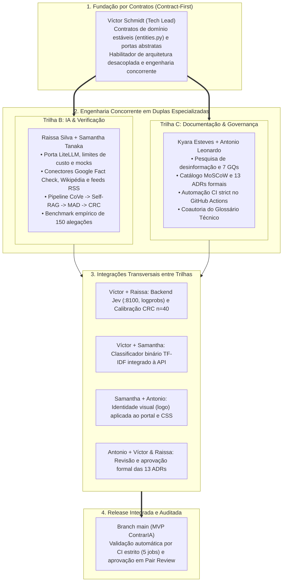
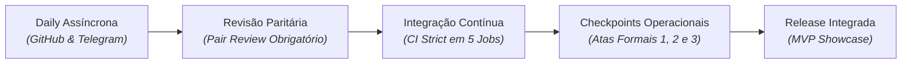

# Metodologia Scrum e Papéis da Equipe

**Projeto:** ContrarIA (Agente de Mitigação de Desinformação e Detecção de Bots no Bluesky)  
**Grupo:** 1  
**Atividade:** Metodologia Ágil, Atribuições Operacionais e Entregas da Equipe  
**Referência Teórica:** Scrum Guide (*Scrum.org*) & Framework CBL (*Challenge Based Learning*)

---

## 1. Contexto e Evolução da Dinâmica de Trabalho

O projeto **ContrarIA** foi executado sob uma janela crítica de **10 dias corridos para o MVP** (16/09 a 26/09), demandando alta cadência de entrega, paralelismo de engenharia e coordenação precisa. A organização do time evoluiu em duas etapas metodológicas:

1. **Alinhamento a Priori (Fase *Engage*):** Definição preliminar dos papéis na metodologia Scrum (Product Owner, Scrum Master e Desenvolvedores) com foco colaborativo e interdisciplinar na redação inicial das perguntas norteadoras (*Guiding Questions*). Na divisão inicial abstrata, previa-se uma distribuição com 6 membros; no entanto, com a inatividade e saída de um dos integrantes antes do início do desenvolvimento, a equipe consolidou-se em **5 membros ativos**, reconfigurando a gestão ágil para um modelo de corresponsabilidade e governança compartilhada.
2. **Execução Especializada e Fluxo Concorrente (Fases *Investigate* e *Act*):** Conforme registrado na [ADR 0012](../adr/0012-organizacao-sem-sprints.md), a divisão rígida em *sprints* semanais foi substituída por um modelo de **engenharia concorrente orientada a contratos estáveis (*contract-first*)**. Os 5 integrantes organizaram-se em três trilhas de atuação simultânea, apoiadas por trabalho em duplas (*pair programming* e *pair reviewing*), com rastreabilidade integral via issues, PRs e commits no GitHub.

---

## 2. Matriz Consolidada de Papéis e Atribuições Reais

A tabela a seguir consolida as atribuições operacionais e as entregas concretas dos **5 integrantes do projeto**:

| Integrante | Papel Metodológico | Trilha Operacional | Atribuições Reais e Entregas Técnicas Efetivas |
| :--- | :--- | :--- | :--- |
| **Víctor Hugo Lima Schmidt** ([@moonshinerd](https://github.com/moonshinerd)) | **Product Owner (PO)** & Tech Lead | **Trilha A:** Plataforma, Coleta e Infraestrutura | <ul><li><strong>Backlog & Contratos:</strong> Gestão de 35 issues e <code>entities.py</code></li><li><strong>Infraestrutura & Deploy:</strong> VPS, Docker Compose, Caddy TLS e Ozone</li><li><strong>Coleta & Triagem:</strong> Jetstream (WebSocket), busca ativa e prioridades</li><li><strong>Ações Socráticas:</strong> Quote Post com postgate e salvaguardas anti-loop</li><li><strong>Backend Local Jev:</strong> Servidor :8100 (<em>logprobs</em>) e auto-seed CRC</li><li><strong>Orquestração & Bots:</strong> Pipeline E2E (<code>worker.py</code>) e Bot Score</li></ul> |
| **Raissa Silva** ([@RaissaOliveira19](https://github.com/RaissaOliveira19)) | **Developer** (IA & Verificação) | **Trilha B:** Inteligência Factual e Verificação | <ul><li><strong>Inferência & Custos:</strong> LiteLLM/OpenRouter com trava diária de US$ 1</li><li><strong>Acervo & Vetores:</strong> Feeds RSS, busca web e <code>pgvector</code></li><li><strong>Raciocínio Epistêmico:</strong> Pipeline CoVe e Self-RAG com tokens de crítica</li><li><strong>Conformal Risk Control:</strong> Calibração CRC (α = 0,05) com abstenção</li><li><strong>Benchmark ClaimReview:</strong> Testes empíricos em 150 alegações reais</li><li><strong>Calibração Jev:</strong> Execução do CRC para modelo local (n = 40)</li></ul> |
| **Samantha Yumi Tanaka** ([@ySamantha](https://github.com/ySamantha)) | **Developer** (IA & Verificação) | **Trilha B:** Inteligência Factual e Verificação | <ul><li><strong>Porta LLM & Testes:</strong> Integração LiteLLM, prompts e <code>FakeLLM</code></li><li><strong>Fontes Primárias:</strong> Google Fact Check Tools API e Wikipédia PT</li><li><strong>Debate Multiagente (MAD):</strong> Dinâmica dialética e métrica P(IK)</li><li><strong>Classificador Supervisionado:</strong> Modelo TF-IDF (19.102 instâncias)</li><li><strong>Backend LLM:</strong> Manutenção da rota multiagente configurável</li><li><strong>Identidade Visual:</strong> Concepção do logotipo oficial ContrarIA</li></ul> |
| **Kyara Esteves de Sousa** ([@Kyara2](https://github.com/Kyara2)) | **Developer** (Pesquisa & Requisitos) | **Trilha C:** Documentação e Governança | <ul><li><strong>Guiding Questions:</strong> Integração das 7 Perguntas Norteadoras ao MkDocs</li><li><strong>Pesquisa sobre Desinformação:</strong> Estudo técnico para validação do projeto</li><li><strong>Requisitos:</strong> Integração dos requisitos MoSCoW (RF e RNF) ao MkDocs</li></ul> |
| **Antonio Leonardo Souto Gomes** ([@AntonioLeonardoUNB](https://github.com/AntonioLeonardoUNB)) | **Developer** (Arquitetura & Governança) | **Trilha C:** Documentação e Governança | <ul><li><strong>CI/CD & Deploy:</strong> GitHub Actions e GitHub Pages (<code>mkdocs build --strict</code>)</li><li><strong>Governança & Ritos:</strong> Atas 01 e 02 e Checkpoints 1, 2 e 3 do MVP</li><li><strong>Arquitetura & 13 ADRs:</strong> Pipeline operacional e decisões formais</li><li><strong>Matrizes de Decisão:</strong> Modelagem de intervenção e priorização de fila</li><li><strong>Manuais & Referências:</strong> Guia de Uso (hardware Jev) e acervo com DOIs</li><li><strong>Design & Divulgação:</strong> CSS acessível (<code>extra.css</code>), Benchmark e Showcase</li></ul> |

---

## 3. Detalhamento das Entregas Técnicas por Integrante

### 3.1. Víctor Hugo Lima Schmidt (Product Owner & Engenheiro de Plataforma)
* **Liderança de Produto e Backlog:** Estruturação e priorização das 35 issues do repositório no GitHub Projects com agrupamento dinâmico via API REST, definição de critérios de aceitação e acompanhamento contínuo dos objetivos do CBL.
* **Contratos Fundamentais de Domínio ([Issue #9](https://github.com/moonshinerd/ContrarIA/issues/9)):** Modelagem das entidades puras em `app/domain/entities.py` e das interfaces abstratas (`LLMPort`, `EvidenceSource`, `TextClassifierPort`), estabelecendo o desacoplamento *contract-first* entre as três trilhas de desenvolvimento.
* **Cliente Bluesky e Sessão AT Protocol ([Issue #10](https://github.com/moonshinerd/ContrarIA/issues/10)):** Camada de autenticação resiliente com persistência em disco de sessão e renovação automática de tokens de acesso contra a AppView.
* **Coleta Contínua e Ingestão Jetstream ([Issue #11](https://github.com/moonshinerd/ContrarIA/issues/11)):** Consumidor WebSocket assíncrono para o *firehose* Jetstream com cursor persistido em disco e rotina de busca ativa periódica via `searchPosts` ([ADR 0009](../adr/0009-coleta-hibrida-jetstream-searchposts.md)).
* **Triagem Heurística e Filas com Prioridade ([Issue #12](https://github.com/moonshinerd/ContrarIA/issues/12)):** Filtro léxico temático de desinformação política e escalonamento de posts candidatos por velocidade de propagação e volume de engajamento.
* **Intervenção Socrática com Salvaguardas ([Issue #14](https://github.com/moonshinerd/ContrarIA/issues/14)):** Módulo de *Quote Post* com barreira postgate, bloqueio anti-loop contra respostas automatizadas mútuas e salvaguardas para mitigação do efeito *backfire* ([ADR 0002](../adr/0002-quote-post.md)).
* **Deploy VPS e Servidor Ozone Labeler ([Issue #15](https://github.com/moonshinerd/ContrarIA/issues/15) e [Issue #16](https://github.com/moonshinerd/ContrarIA/issues/16)):** Provisionamento em VPS Linux com Docker Compose, proxy reverso Caddy HTTPS/TLS automático ([ADR 0011](../adr/0011-deploy-vps-caddy-cloudflare.md)) e serviço de moderação federada Ozone operando com Service Account oficial ([ADR 0003](../adr/0003-labeler-ozone.md)).
* **Integração E2E e Avaliação do Bot Score ([Issue #17](https://github.com/moonshinerd/ContrarIA/issues/17) e [Issue #18](https://github.com/moonshinerd/ContrarIA/issues/18)):** Orquestrador ponta a ponta (`worker.py`) e calibração estatística do classificador de contas automatizadas com Regressão Logística em dataset rotulado ([ADR 0006](../adr/0006-bot-score-heuristico.md)).
* **Backend de Verificação Local Jev ([PR #57](https://github.com/moonshinerd/ContrarIA/pull/57) e [ADR 0013](../adr/0013-backend-local-jev.md)):** Desenvolvimento do servidor local compartilhado `jev_server.py` (:8100) servindo o modelo Qwen3-4B-GGUF via `llama.cpp` para classificação por *logprobs* de alegações, relevância de evidências e veredito factual sem alucinação de texto aberto.
* **Auto-Seed de Calibração e Salvaguardas Avançadas:** Implementação do módulo `crc_seed.py` para semeadura automática do limiar λ e salvaguardas estritas no prompt socrático (proibição de correção de opiniões ou previsões, restrição a citações literais e controle de cadência contra *reply bots*).

### 3.2. Raissa Silva (Engenharia de IA & Verificação Factual)
* **Motor de Inferência e Telemetria ([Issue #19](https://github.com/moonshinerd/ContrarIA/issues/19)):** Conexão do adapter LiteLLM ao OpenRouter com retentativas exponenciais, fallback automático e rastreamento rigoroso do limite orçamentário diário de US$ 1 (`UsageTracker`, [ADR 0004](../adr/0004-litellm-openrouter.md)).
* **Acervo RSS e Busca com Vetores ([Issue #21](https://github.com/moonshinerd/ContrarIA/issues/21)):** Implementação do repositório de checagens jornalísticas alimentado por feeds RSS e busca web híbrida (DuckDuckGo/Tavily), com persistência vetorial via `pgvector` ([ADR 0005](../adr/0005-multiplas-fontes-evidencia.md)).
* **Extração e Decomposição CoVe ([Issue #22](https://github.com/moonshinerd/ContrarIA/issues/22)):** Decomposição sistemática de publicações em alegações atômicas e perguntas independentes de validação através do protocolo *Chain-of-Verification* ([ADR 0007](../adr/0007-verificacao-cove-selfrag-mad-crc.md)).
* **Mecanismo Self-RAG Adaptativo ([Issue #23](https://github.com/moonshinerd/ContrarIA/issues/23)):** Arquitetura de recuperação orientada a tokens de reflexão crítica epistêmica (`[Retrieve]`, `[IsRel]`, `[IsSup]`, `[IsUse]`), eliminando alucinações e condicionando as respostas à evidência factual.
* **Calibração Estatística Conformal Risk Control ([Issue #25](https://github.com/moonshinerd/ContrarIA/issues/25)):** Implementação em tempo real do algoritmo de CRC com taxa de erro estatisticamente garantida (α = 0,05), determinação do limiar ótimo λ e comando de abstenção formal (`ABSTAIN`).
* **Benchmark Reproduzível de Vereditos ([Issue #27](https://github.com/moonshinerd/ContrarIA/issues/27)):** Execução do protocolo experimental contra 150 checagens reais de agências jornalísticas (ClaimReview), explorando 17 configurações de ablação de fontes e métricas rigorosas de custo e latência ([Relatório de Benchmark](../resultados/benchmark.md)).
* **Calibração CRC do Backend Jev ([PR #57](https://github.com/moonshinerd/ContrarIA/pull/57)):** Condução do experimento de calibração formal adaptado ao modelo local Jev sobre $n = 40$ instâncias rotuladas, gerando a matriz empírica de predições cruas (`crc_calibration_predictions_jev.csv`), relatório estatístico e arquivo semente de produção (`crc_calibration_seed_jev.json`, [Calibração do Jev](../calibracao-jev.md)).

### 3.3. Samantha Yumi Tanaka (Engenharia de IA & Verificação Factual)
* **Estruturação da Porta de Inferência LLM ([Issue #19](https://github.com/moonshinerd/ContrarIA/issues/19)):** Construção da interface com LiteLLM, gerenciamento versionado de templates de prompt e implementação da classe de testes `FakeLLM`, viabilizando o desenvolvimento desacoplado e testes automatizados rápidos sem custos financeiros.
* **Conectores de Evidência Primários ([Issue #20](https://github.com/moonshinerd/ContrarIA/issues/20)):** Integração com a *Google Fact Check Tools API* para extração estruturada de esquemas `ClaimReview` e desenvolvimento do conector enciclopédico com a Wikipédia em português com cache local em memória ([ADR 0005](../adr/0005-multiplas-fontes-evidencia.md)).
* **Debate Antagônico Multiagente - MAD ([Issue #24](https://github.com/moonshinerd/ContrarIA/issues/24)):** Criação da dinâmica dialética entre agentes autônomos (Promotor antagônico vs. Defensor factual) arbitrados por um Juiz epistêmico, com cálculo quantitativo da métrica de incerteza de conhecimento intrínseco P(IK) ([ADR 0007](../adr/0007-verificacao-cove-selfrag-mad-crc.md)).
* **Classificador Clássico Supervisionado ([Issue #26](https://github.com/moonshinerd/ContrarIA/issues/26)):** Pipeline completo de Machine Learning clássico (TF-IDF + LinearSVC/LogisticRegression) treinado sobre 19.102 instâncias dos datasets Fake.br e FakeRecogna, incluindo avaliação quantitativa do impacto da mudança de domínio (*domain shift*) em textos informais do Bluesky ([ADR 0008](../adr/0008-pre-filtro-classico.md)).
* **Manutenção do Backend Multiagente:** Suporte e garantia contínua de compatibilidade do fluxo multiagente como rota de verificação configurável (`VERIFICATION_BACKEND=llm`), servindo de *baseline* comparativo e alternativa ao backend local Jev.
* **Identidade Visual e Logotipo Oficial:** Concepção artística e criação da identidade visual oficial do projeto (logotipo ContrarIA em [docs/assets/logo.png](../assets/logo.png)), definindo a identidade gráfica e visual do agente adotada no portal de documentação e na comunicação externa do ecossistema.

### 3.4. Kyara Esteves de Sousa (Pesquisa Científica & Governança de Requisitos)
* **Pesquisa Teórica e Perguntas Norteadoras ([Issue #29](https://github.com/moonshinerd/ContrarIA/issues/29)):** Condução da fundamentação teórica multidisciplinar e integração das 7 *Guiding Questions* (GQ01 a GQ07) ao portal MkDocs ([docs/pesquisa/guiding-questions.md](../pesquisa/guiding-questions.md)), fundamentando modelos de linguagem, psicologia cognitiva, desinformação eleitoral e moderação federada.
* **Pesquisa Técnica sobre Desinformação:** Investigação e pesquisa técnica aprofundada sobre a dinâmica de propagação de desinformação nas redes em [Ideias e Fontes](../pesquisa/ideias-e-fontes.md), caracterizando mecanismos de contágio viral, polarização algorítmica e justificando formalmente a necessidade e a urgência do projeto ContrarIA.
* **Integração de Requisitos MoSCoW ([Issue #29](https://github.com/moonshinerd/ContrarIA/issues/29)):** Integração completa dos 16 Requisitos Funcionais (RF01–RF16) e 7 Requisitos Não-Funcionais (RNF01–RNF07) ao portal MkDocs ([docs/requisitos.md](../requisitos.md)), priorizados via método MoSCoW e mapeados com rastreabilidade direta para as issues de engenharia.
* **Revisão Paritária e Validação de Qualidade:** Atuação ativa como revisora paritária e aprovação formal dos Pull Requests de documentação na branch principal ([PR #48](https://github.com/moonshinerd/ContrarIA/pull/48) e [PR #58](https://github.com/moonshinerd/ContrarIA/pull/58)), zelando pelo rigor conceitual, integridade das fontes e conformidade com os padrões da equipe.

### 3.5. Antonio Leonardo Souto Gomes (Arquitetura, DevOps Documental & Governança)
* **Automação de CI/CD da Documentação ([Issue #28](https://github.com/moonshinerd/ContrarIA/issues/28)):** Configuração completa da esteira no GitHub Actions para validação estrita (`mkdocs build --strict`) e publicação automatizada no GitHub Pages a cada merge na branch principal.
* **Governança de Atas e Checkpoints ([Issue #30](https://github.com/moonshinerd/ContrarIA/issues/30)):** Redação das atas formais de planejamento e arquitetura ([Ata 01](../atas/ata01.md) e [Ata 02](../atas/ata02.md)) e registro sistemático dos [Checkpoints do MVP](../atas/checkpoints.md) (Checkpoints 1, 2 e 3).
* **Arquitetura Técnica e 13 ADRs ([Issue #31](https://github.com/moonshinerd/ContrarIA/issues/31)):** Mapeamento integral do fluxo operacional em [docs/arquitetura/pipeline.md](../arquitetura/pipeline.md) e redação formal dos 13 registros de decisões arquiteturais ([ADRs 0001 a 0013](../adr/index.md)), integrando a [ADR 0013](../adr/0013-backend-local-jev.md).
* **Matrizes Operacionais de Decisão ([Issue #29](https://github.com/moonshinerd/ContrarIA/issues/29)):** Estruturação e diagramação formal das matrizes de intervenção socrática (cruzamento do Bot Score com o veredito factual) e de priorização de fila pública para mitigação do efeito *backfire* em [docs/pesquisa/matrizes.md](../pesquisa/matrizes.md).
* **Manuais Operacionais e Hardware do Jev ([Issue #32](https://github.com/moonshinerd/ContrarIA/issues/32)):** Elaboração do [Guia de Uso](../guia-de-uso.md) com seções voltadas ao usuário final, operadores de contêineres e desenvolvedores, incorporando parâmetros técnicos de alocação de memória (VRAM/RAM) e instruções operacionais do backend Jev.
* **Design System e Referências Bibliográficas ([Issue #32](https://github.com/moonshinerd/ContrarIA/issues/32)):** Estruturação do Design System em CSS (`extra.css`) com contraste acessível para temas claro e escuro e compilação do acervo de [Referências](../referencias.md) abrangendo 7 eixos temáticos com links e DOIs científicos validados.
* **Relatórios Analíticos e Benchmarks ([Issue #33](https://github.com/moonshinerd/ContrarIA/issues/33)):** Estruturação e síntese analítica dos resultados empíricos em [docs/resultados/benchmark.md](../resultados/benchmark.md).
* **Material e Roteiro do Showcase ([Issue #34](https://github.com/moonshinerd/ContrarIA/issues/34)):** Planejamento da estrutura de apresentação, divisão de falas da equipe, elaboração do roteiro de demonstração técnica e síntese reflexiva do ciclo CBL.

---

## 4. Dinâmica de Trabalho em Duplas e Entregas Conjuntas

Uma das principais forças metodológicas do projeto ContrarIA foi a superação do trabalho em silos isolados por meio de **engenharia concorrente em duplas especializadas (*pair programming*, coautoria e revisão cruzada)**, orquestradas sob a liderança técnica da Trilha A:

```mermaid
flowchart TD
    subgraph S1["1. Fundação por Contratos (Contract-First)"]
        TL["Víctor Schmidt (Tech Lead)<br/>Contratos de domínio estáveis (entities.py) e portas abstratas<br/>Habilitador de arquitetura desacoplada e engenharia concorrente"]
    end

    subgraph S2["2. Engenharia Concorrente em Duplas Especializadas"]
        subgraph DuplaB["Trilha B: IA & Verificação"]
            TB["Raissa Silva + Samantha Tanaka<br/>• Porta LiteLLM, limites de custo e mocks<br/>• Conectores Google Fact Check, Wikipédia e feeds RSS<br/>• Pipeline CoVe -> Self-RAG -> MAD -> CRC<br/>• Benchmark empírico de 150 alegações"]
        end

        subgraph DuplaC["Trilha C: Documentação & Governança"]
            TC["Kyara Esteves + Antonio Leonardo<br/>• Pesquisa de desinformação e 7 GQs<br/>• Catálogo MoSCoW e 13 ADRs formais<br/>• Automação CI strict no GitHub Actions<br/>• Coautoria do Glossário Técnico"]
        end
    end

    subgraph S3["3. Integrações Transversais entre Trilhas"]
        I1["Víctor + Raissa: Backend Jev (:8100, logprobs) e Calibração CRC n=40"]
        I2["Víctor + Samantha: Classificador binário TF-IDF integrado à API"]
        I3["Samantha + Antonio: Identidade visual (logo) aplicada ao portal e CSS"]
        I4["Antonio + Víctor & Raissa: Revisão e aprovação formal das 13 ADRs"]
    end

    subgraph S4["4. Release Integrada e Auditada"]
        REL["Branch main (MVP ContrarIA)<br/>Validação automática por CI estrito (5 jobs) e aprovação em Pair Review"]
    end

    TL ==> DuplaB
    TL ==> DuplaC
    DuplaB --> S3
    DuplaC --> S3
    S3 ==> REL
```

A tabela a seguir consolida as principais frentes de trabalho colaborativo, os mecanismos adotados e as entregas técnicas conjuntas com rastreabilidade direta no repositório:

| Parceria Técnica | Integrantes | Dinâmica Adotada | Entregas Técnicas Conjuntas | Evidências no Repositório |
| :--- | :--- | :--- | :--- | :--- |
| **Trilha B (IA & Verificação)** | **Raissa Silva** + **Samantha Tanaka** | *Pair Programming* & Co-design epistêmico | <ul><li>Porta LiteLLM modular com limites de custo e `FakeLLM` para testes</li><li>Múltiplas fontes: Google Fact Check Tools API, Wikipédia PT e feeds RSS</li><li>Esteira epistêmica completa: CoVe $\rightarrow$ Self-RAG $\rightarrow$ MAD $\rightarrow$ CRC</li><li>Execução e apuração do Benchmark empírico sobre 150 alegações reais</li></ul> | [PR #40](https://github.com/moonshinerd/ContrarIA/pull/40) [Issue #20](https://github.com/moonshinerd/ContrarIA/issues/20) [Issue #27](https://github.com/moonshinerd/ContrarIA/issues/27) |
| **Trilha C (Doc & Governança)** | **Kyara Esteves** + **Antonio Leonardo** | Coautoria *Docs as Code* & Revisão Paritária | <ul><li>Transposição das 7 GQs e pesquisa de desinformação para Requisitos MoSCoW</li><li>Formalização e rastreabilidade das matrizes de intervenção e priorização</li><li>Coautoria e revisão do Glossário Técnico federado do ecossistema</li><li>Automação de CI estrito e auditoria dos Checkpoints 1, 2 e 3 do MVP</li></ul> | [PR #42](https://github.com/moonshinerd/ContrarIA/pull/42) [PR #48](https://github.com/moonshinerd/ContrarIA/pull/48) [PR #58](https://github.com/moonshinerd/ContrarIA/pull/58) |
| **Plataforma ↔ IA (Backend Jev)** | **Víctor Schmidt** + **Raissa Silva** | Engenharia de Sistemas & Inferência Conforme | <ul><li>Construção do servidor local `jev_server.py` (:8100) servindo Qwen3-4B</li><li>Classificação por *logprobs* com calibração formal CRC ($n = 40$, $\alpha = 0,05$)</li><li>Geração da matriz de predições cruas e arquivo semente de produção</li><li>Refinamento de scrapers com bypass de WAF para fontes jornalísticas</li></ul> | [PR #47](https://github.com/moonshinerd/ContrarIA/pull/47) [PR #57](https://github.com/moonshinerd/ContrarIA/pull/57) [ADR 0013](../adr/0013-backend-local-jev.md) |
| **Plataforma ↔ IA (Classificador)** | **Víctor Schmidt** + **Samantha Tanaka** | Integração de Modelo Supervisionado | <ul><li>Conexão do pipeline clássico TF-IDF aos endpoints da API FastAPI</li><li>Avaliação conjunta de resiliência a *domain shift* em postagens do Bluesky</li></ul> | [PR #41](https://github.com/moonshinerd/ContrarIA/pull/41) [ADR 0008](../adr/0008-pre-filtro-classico.md) |
| **Arquitetura ↔ Plataforma & IA** | **Antonio Leonardo** + **Víctor S.** + **Raissa S.** | Auditoria e Validação Arquitetural | <ul><li>Revisão paritária técnica e aprovação formal dos 13 registros de decisões arquiteturais (ADRs 0001 a 0013) antes da integração definitiva na `main`</li></ul> | [PR #45](https://github.com/moonshinerd/ContrarIA/pull/45) [ADRs](../adr/index.md) |
| **Identidade ↔ Frontend Docs** | **Samantha Tanaka** + **Antonio Leonardo** | Concepção Visual & Design System | <ul><li>Samantha concebeu a identidade visual e o logotipo oficial do ContrarIA</li><li>Antonio estruturou o Design System CSS (`extra.css`) com contraste acessível para temas claro e escuro e integração dos assets gráficos no portal</li></ul> | [`extra.css`](../stylesheets/extra.css) [Logo](../assets/logo.png) [PR #58](https://github.com/moonshinerd/ContrarIA/pull/58) |

### 4.1. Parceria Técnica na Trilha B: Raissa Silva + Samantha Yumi Tanaka
* **Motor de Raciocínio LLM ([Issue #19](https://github.com/moonshinerd/ContrarIA/issues/19)):** Samantha implementou a primeira versão da porta com LiteLLM, limites de custo e mocks; Raissa refinou as variáveis de ambiente, dependências de produção e o rastreador de teto de custo diário no [PR #40](https://github.com/moonshinerd/ContrarIA/pull/40).
* **Conectores de Evidência e Acervo ([Issues #20](https://github.com/moonshinerd/ContrarIA/issues/20) e [#21](https://github.com/moonshinerd/ContrarIA/issues/21)):** Samantha conectou a Google Fact Check API e a Wikipédia PT com cache; Raissa complementou com os scrapers de feeds RSS de checagem, suporte ao DuckDuckGo e indexação com `pgvector`.
* **Esteira Epistêmica CoVe → Self-RAG → MAD → CRC ([Issues #22](https://github.com/moonshinerd/ContrarIA/issues/22), [#23](https://github.com/moonshinerd/ContrarIA/issues/23), [#24](https://github.com/moonshinerd/ContrarIA/issues/24) e [#25](https://github.com/moonshinerd/ContrarIA/issues/25)):** As duas integrantes dividiram os módulos do pipeline para execução concomitante: Samantha focou na formulação do debate dialético MAD e métrica P(IK), enquanto Raissa focou na extração de alegações atômicas CoVe e na calibração matemática do Conformal Risk Control (CRC).
* **Validação Empírica do Benchmark ([Issue #27](https://github.com/moonshinerd/ContrarIA/issues/27)):** Trabalho colaborativo na apuração dos dados sobre as 150 alegações reais do ClaimReview, calibração do limiar λ e verificação contra vazamento de dados (*leakage*).
* **Identidade Visual e Comunicação da Trilha:** Samantha concebeu a identidade visual oficial (logotipo ContrarIA), compartilhando os ativos visuais para integração ao portal de documentação e apresentação de resultados.

### 4.2. Parceria Técnica na Trilha C: Kyara Esteves de Sousa + Antonio Leonardo Souto Gomes
* **Pesquisa, Requisitos e Validação Conceitual ([Issues #28](https://github.com/moonshinerd/ContrarIA/issues/28) e [#29](https://github.com/moonshinerd/ContrarIA/issues/29)):** Kyara realizou a pesquisa técnica sobre desinformação para validar a necessidade do projeto, a redação e integração ao MkDocs das 7 Perguntas Norteadoras e a integração do catálogo formal de Requisitos MoSCoW (RF01–RF16 e RNF01–RNF07); Antonio estruturou as matrizes operacionais de decisão em Markdown, conectando as decisões arquiteturais à rastreabilidade dos requisitos.
* **Glossário Técnico do Ecossistema ([Issue #32](https://github.com/moonshinerd/ContrarIA/issues/32)):** Coautoria do glossário federado ([PR #48](https://github.com/moonshinerd/ContrarIA/pull/48)), unindo as dimensões teóricas e psicológicas formuladas por Kyara aos conceitos de rede descentralizada, protocolo AT e arquitetura compilados por Antonio.
* **Esteira de Documentação Contínua e Revisão Paritária:** Kyara atuou na revisão paritária e aprovação formal dos PRs estruturantes ([PR #48](https://github.com/moonshinerd/ContrarIA/pull/48) e [PR #58](https://github.com/moonshinerd/ContrarIA/pull/58)), enquanto Antonio manteve a automação da esteira CI no GitHub Actions (`mkdocs build --strict`), garantindo integridade de links, renderização limpa e conformidade estrita da documentação como código (*Docs as Code*).

### 4.3. Articulação Transversal com a Trilha A (Víctor Schmidt)
* **Contratos Estáveis no Dia Zero:** A entrega antecipada de `entities.py` e portas abstratas por Víctor viabilizou o trabalho totalmente desacoplado da Trilha B (IA) e da Trilha C (Documentação).
* **Cooperação de Infraestrutura para IA:** Víctor auxiliou Samantha na integração do classificador binário supervisionado TF-IDF com a API ([PR #41](https://github.com/moonshinerd/ContrarIA/pull/41)) e colaborou com Raissa nos scrapers especializados com bypass de WAF para fontes jornalísticas oficiais ([PR #47](https://github.com/moonshinerd/ContrarIA/pull/47)).
* **Cooperação no Backend Jev e Calibração CRC ([PR #57](https://github.com/moonshinerd/ContrarIA/pull/57)):** Víctor construiu o servidor local `jev_server.py` e a camada de classificação por *logprobs*, enquanto Raissa executou a rotina experimental de calibração estatística do CRC sobre as 40 amostras do Jev, unindo engenharia de sistemas e rigor matemático de inferência confiável.
* **Revisão Técnica dos Registros de Arquitetura (ADRs):** A documentação arquitetural elaborada por Antonio foi revisada e aprovada formalmente por Raissa e Víctor no [PR #45](https://github.com/moonshinerd/ContrarIA/pull/45) antes do merge definitivo.

---

## 5. Cerimônias e Práticas de Engenharia Ágil Adotadas

Para sustentar a alta velocidade do ciclo de 10 dias sem perda de alinhamento, a equipe adaptou as cerimônias tradicionais do Scrum para um modelo ágil enxuto:

```mermaid
flowchart LR
    A["Daily Assíncrona<br><i>(GitHub & Telegram)</i>"] --> B["Revisão Paritária<br><i>(Pair Review Obrigatório)</i>"]
    B --> C["Integração Contínua<br><i>(CI Strict em 5 Jobs)</i>"]
    C --> D["Checkpoints Operacionais<br><i>(Atas Formais 1, 2 e 3)</i>"]
    D --> E["Release Integrada<br><i>(MVP Showcase)</i>"]
```

1. **Daily Standups Assíncronas:** Acompanhamento contínuo das tarefas via quadro Kanban no GitHub Projects e canal da equipe, registrando diariamente atividades concluídas, frentes do dia e impedimentos.
2. **Revisão Paritária Mandatória (*Pair Review*):** Nenhum Pull Request foi integrado à branch `main` sem a revisão e aprovação explícita de outro membro da equipe, garantindo compartilhamento de contexto e blindagem contra erros e regressões.
3. **Integração Contínua Rígida (*Strict CI*):** Todo push ou PR disparou automaticamente a bateria de 5 jobs de validação (`docs`, `api`, `docker`, `research`, `web`), com bloqueio obrigatório em caso de warnings ou falhas de testes.
4. **Checkpoints Formais a Cada 48 Horas:** Três checkpoints formais de sincronização foram conduzidos para auditar o avanço das trilhas e validar as interfaces, documentados publicamente em [Atas e Checkpoints](../atas/checkpoints.md).
5. **Congelamento de Código (*Code Freeze*):** Interrupção planejada de novos desenvolvimentos 24 horas antes do marco de entrega, destinando o tempo final ao ensaio técnico da demonstração ao vivo e consolidação dos artefatos.